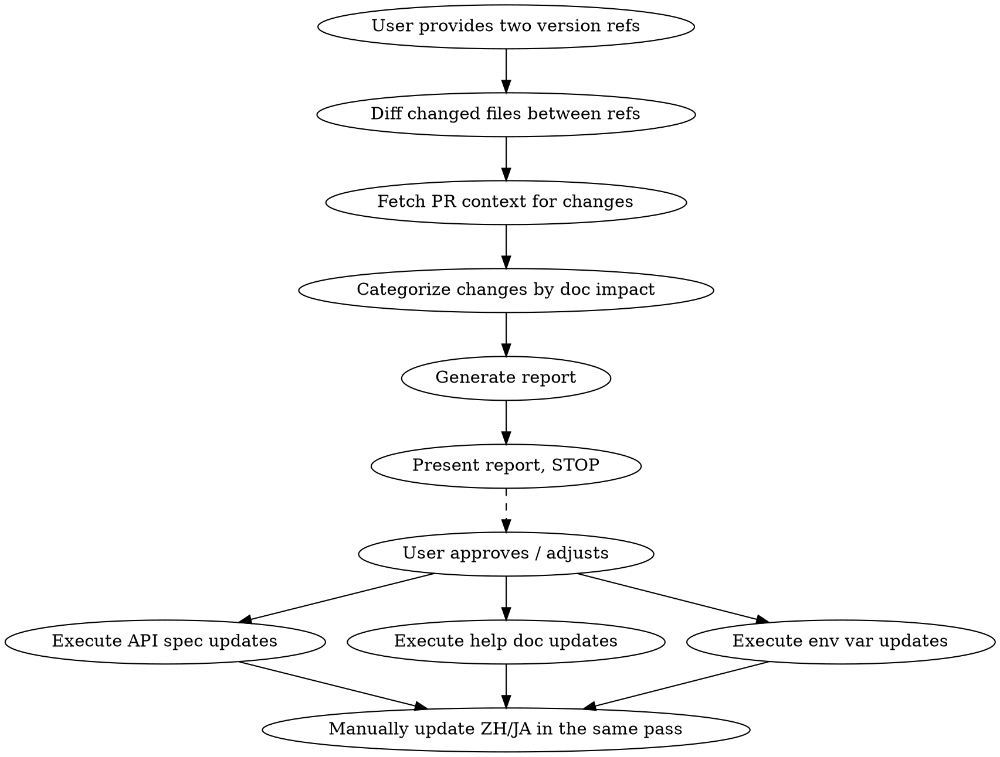

# Dify Release Documentation Sync

## Overview

Compares code changes between two Dify releases (or a release and current HEAD), identifies documentation impact, generates a structured report, then executes updates after user approval. Three tracks: API reference (-> `dify-docs-api-reference`), help documentation (-> `dify-docs-guides`), and environment variables (-> `dify-docs-env-vars`).

**Input**: Two version references, provided by the user. Always ask if not provided.
- Post-release: `v1.13.2` and `v1.13.3` (both tags)
- Pre-release, on staging: `v1.13.2` and the shipped commit — prefer the `saas-deploy` staging SHA over `main` (see 1.0)
- Pre-release, NOT yet on staging (the usual first pass): `v1.13.2` and a pinned `main` SHA, scoped with the release milestone (see 1.0a) — provisional, re-swept later

## Critical: pin to what ships

**Merged to `main` is NOT released.** `main` carries post-release and future-version commits, and merged code may be gated off by a feature flag. Pin the upper diff ref to the **shipped commit** (the `saas-deploy` staging image SHA), not `..main`, and treat flag-gating as part of scope: a feature flagged off in staging `env.properties` ships dark and is out of scope. See 1.0 for the exact signals and commands.

## Workflow



## Phase 1: Analysis

### 1.0 Pin the comparison to what actually ships

Apply the "pin to what ships" rule above. Operationally:

**Upper ref (CE / cloud)** is the dify image SHA that staging runs, from the `saas-deploy` GitOps repo. Staging is the cloud release candidate: the team merges each release's functional updates there before cutting it.

```bash
# authoritative upper ref -> diff <last-release-tag>..<SHA>, not ..main
grep newTag saas-deploy/environments/staging/dify/api/kustomization.yaml
```

Scope signals, in order of authority:

| Signal | Tells you |
|---|---|
| `saas-deploy` staging image SHA | what code ships |
| flags in `saas-deploy/environments/staging/dify/{api,web}/env.properties` | whether shipped code is **enabled** |
| milestone **tagged PRs** | confirmed in the release |
| milestone **description text** | aspirational only: named features may slip; never scope from it alone |

**Merged is not released.** Commit ancestry proves code is in the build, not that the feature is on. A flag set off in staging `env.properties` (e.g. `ENABLE_AGENT_V2=false`, `NEXT_PUBLIC_ENABLE_FEATURE_PREVIEW=false`, `AGENT_SHELL_ENABLED=false`) means it ships dark, so exclude it.

**CE vs EE.** The numbered release (e.g. `1.15.0`) is Community Edition; Enterprise ships separately, often weeks later. Features needing EE infrastructure (RBAC, SSO-gated MCP identity forwarding) belong to the EE doc effort, not the CE sync.

### 1.0a Release passes: prep early, re-sweep until release

Docs prep usually starts before the version reaches staging — and some versions never deploy to staging at all. Run multiple passes; record each pass's upper SHA and date in the report so the next pass diffs only the delta.

| Pass | When | Upper ref | Notes |
|---|---|---|---|
| Early | no staging build yet | pinned `main` SHA | scope from the milestone AND the merged-PR range (1.1b); flags unknown, milestone items may slip — everything provisional |
| Staging | staging runs the version | staging image SHA | diff `<last-swept-SHA>..<staging-SHA>`; re-check feature flags; confirm early-pass items are in and enabled |
| Release | tag or release branch cut (also the path for versions that skip staging) | release tag, or a pinned SHA of the dify release branch until the tag is cut | diff `<last-swept-SHA>..<tag-or-SHA>`; final sweep |

**Slippage check, every re-sweep**: anything documented in an earlier pass whose PR is no longer in scope (reverted, retargeted to a later milestone, or flagged off) must be pulled from dify-docs' `release/<version>` integration branch — docs must not describe what doesn't ship.

### 1.1 Diff Between Versions

In the Dify codebase (configured as an additional working directory):

```bash
git fetch --tags origin
# All changed files between the two versions
git diff <from>..<to> --stat
# Commit log with PR references for context
git log <from>..<to> --oneline --grep="(#"
```

This captures every change between the two versions, regardless of whether PRs were tagged to a milestone.

**Do not pre-filter the diff to a hand-picked path list.** Run `git diff --stat` over the full change set, then categorize in 1.2. Pre-filtering hides files like new `docker/dify-compose*` scripts, `docker/.env.default`, `docker/README.md`, or root `README.md` that drive deployment-doc updates.

### 1.1a Cross-check existing docs PRs

Before generating the report, check whether dify-docs already has open or recently-merged PRs covering the same source PRs. This prevents duplicate work and reveals doc paths you might miss:

```bash
# Search by source-PR number(s) you plan to flag
gh pr list --repo langgenius/dify-docs --state all --search "#<dify-PR-number>" \
  --json number,title,state,files
# Or scan recent docs PRs for the release window
gh pr list --repo langgenius/dify-docs --state all --limit 30 \
  --json number,title,state,mergedAt,files
```

If a docs PR already covers an item, mark it **Already addressed (PR #N)** in the report and exclude it from execution.

For context on specific changes, fetch the relevant PR details:
```bash
# Extract PR numbers from commit messages
git log <from>..<to> --oneline | grep -oE '#[0-9]+' | sort -u
# Then for each PR
gh pr view PR_NUMBER --repo langgenius/dify --json number,title,body,labels,files
```

### 1.1b Milestone + PR-list cross-check

The release milestone in `langgenius/dify` (titled like the version, e.g. `1.16.0`) tracks the features planned for the release — but it is maintained for internally-initiated work, and community PRs often merge without a milestone tag. Scope from BOTH sources and cross-check; neither alone is complete.

```bash
MILESTONE_NUM=$(gh api "repos/langgenius/dify/milestones?state=all" --paginate \
  --jq '.[] | select(.title=="MILESTONE_NAME") | .number')
gh api "repos/langgenius/dify/issues?milestone=$MILESTONE_NUM&state=all&per_page=100" \
  --paginate --jq '.[] | {number, title, state, pr: (.pull_request != null)}'
# the other half of the cross-check is the merged-PR range: use the git log command from 1.1 verbatim
```

- **Only milestone PRs (`pr: true`) join the range cross-check.** Plain issues (`pr: false`) are planned-feature signals, not range candidates: find each one's closing/linked PR (issue timeline, `Fixes #N` references) and track that PR instead.
- In the range but **not in the milestone** → usually community contributions: assess doc impact normally — these are the easiest changes to miss.
- Milestone PRs **not in the range** → check the PR itself: `gh pr view <n> --repo langgenius/dify --json state,mergedAt` — a PR is merged only when `mergedAt` is non-null (a closed PR may be closed WITHOUT merging). Open → not merged yet, carry to the next sweep; closed and unmerged → dropped from the release, apply the slippage check from 1.0a.
- Milestone **description text** stays aspirational (see 1.0): scope from tracked items, never from the prose alone.

### 1.2 Categorize PRs

For each PR, check changed files. Look up the affected target in `references/detection-tables.md`, which holds the deterministic API-Reference path-to-spec table, the heuristic Help-Doc source-to-doc-area mapping, the deterministic Env-Var path-to-impact table, and the i18n source-file list.

**Skip** (no doc impact): PRs that only touch `tests/`, `.github/`, `dev/`, or are pure refactoring with no behavior change (confirm from PR description). Do not treat a `chore:` or `fix:` prefix as a no-doc-impact signal; the prefix is not a category. Read the PR title and body ("chore: easier and simpler deploy" is a deployment workflow change).

#### API Reference Detection (Deterministic)

Use the API-Reference table in `references/detection-tables.md`: any matching source path means the listed spec(s) are affected. Also check Pydantic models and `fields/` serializers used by Service API controllers; if a PR modifies a model or serializer referenced by a Service API endpoint, that spec is affected.

#### Help Documentation Detection (Heuristic)

Read the PR description for context, then map changed source paths via the Help-Documentation table in `references/detection-tables.md`. `use-dify` content exists in two product copies (`en/cloud/...` and `en/self-host/...`); apply changes to both, then mirror zh/ja. When checking dify PRs, also scan recent merges in `langgenius/graphon` for the same release window: a user-visible workflow change may ship as a graphon release plus a dify pin bump (look for changes to `api/pyproject.toml` and `api/uv.lock`).

**Important**: These mappings are heuristic. For every candidate match:

1. **Read the PR title and description** to confirm the change is user-facing (not purely internal).
2. **Read the existing doc page** to check whether the current documentation covers the affected area at a level of detail that warrants an update. If the doc doesn't cover the topic (e.g., a node doc that mentions model selection but never discusses model parameters), a PR that changes model parameter behavior may not require a doc update.
3. **Assess priority**:
   - **High**: PR changes behavior that the doc explicitly describes -> doc is now inaccurate
   - **Medium**: PR adds a new capability in an area the doc covers at a general level -> doc could be enhanced
   - **Low / Skip**: PR changes something the doc doesn't cover at all -> no update needed unless the feature is significant enough to warrant a new section

**Also watch for**:
- "Breaking change" labels -> high priority
- New feature PRs -> may need new doc pages
- Deprecation notices -> update existing docs
- Behavior changes -> verify current docs are still accurate

#### Environment Variable Detection (Deterministic)

Use the Env-Var table in `references/detection-tables.md`: any matching source path means env var documentation is affected. When detected, the report should list which variables were added, removed, or had defaults changed, which config file(s) were modified, and priority (High if new/removed vars, Medium if default changes only).

#### UI i18n Change Detection

Check PRs that touch `web/i18n/en-US/` files (full source-file list in `references/detection-tables.md`):
1. Compare changed i18n keys against the UI Labels section of `writing-guides/glossary.md`
2. If a changed key exists in the glossary -> flag for glossary update (value may have changed)
3. If a changed key is new and falls within terminology scope (feature names, field labels, menu names, button names, status labels) -> flag as candidate for glossary addition
4. Report as a separate section in Phase 2 with: key, old value, new value, glossary status

### 1.3 Check Documentation Status

Before generating the report, verify each identified change against the **current documentation** in this repository branch. For each item:

1. Read the affected doc page(s) in the docs repo
2. Check whether the code change is already reflected in the documentation
3. Assign a doc status:
   - **Already documented**: The current docs accurately describe the new behavior. No update needed.
   - **Partially documented**: The docs cover the area but are missing or inaccurate on the specific change.
   - **Not yet documented**: The docs don't reflect this change at all.

This step prevents the report from listing changes that have already been addressed in previous documentation updates.

## Phase 2: Report

Generate the report and **STOP**. Do not execute until the user reviews and approves.

Use the report skeleton in `references/report-template.md`: a summary block (per-track PR/file counts plus already-documented vs. need-updates splits) followed by per-track tables for API Reference, Help Documentation, Environment Variable, UI i18n (glossary impact), and No Documentation Impact changes.

## Phase 3: Execution

After user approval (they may add, remove, or adjust items):

### Docs Branch

Docs for an upcoming release integrate on that release's branch in dify-docs (`release/<version>`, cut from `main` when prep starts) — release doc PRs target it, never `main`; the branch merges into `main` when the release ships. Fixes to currently published docs still target `main` directly.

### Codebase Preparation

Checkout the target version in the Dify codebase (configured as an additional working directory) before auditing:
```bash
git fetch --tags origin
git checkout <to>  # the target release tag or branch
```

### API Reference Updates

For each affected spec, dispatch a parallel audit agent with `dify-docs-api-reference` skill:
1. Audit the spec against the code, focusing on changes from the report (but audit fully — PRs may have side effects)
2. Fix the EN spec
3. Validate all modified JSON files

**Cross-spec propagation**: Shared endpoints (file upload, audio, feedback, app info) appear in all 4 app specs. When fixing one, propagate to siblings.

Translate the spec changes into the `zh` and `ja` specs in the same pass (wire strings verbatim; run the parity check where available).

### Help Documentation Updates

For each affected doc page, use `dify-docs-guides` skill:
1. Read the current doc and the relevant PR(s) for context
2. Update content to reflect changes
3. Update the zh and ja pages manually in the same pass (read `tools/translate/formatting-{zh,ja}.md` and the glossary first)

### Environment Variable Updates

For each affected variable group, use `dify-docs-env-vars` skill:
1. Trace the variable in the release codebase
2. Update `en/self-host/deploy/configuration/environments.mdx`
3. Run the verification script to confirm zero mismatches
4. Update `zh/self-host/deploy/configuration/environments.mdx` and `ja/self-host/deploy/configuration/environments.mdx` with the same changes

**Important**: update the ZH and JA env var docs in the same pass, like all pages.

### Parallel Execution

- API spec audits: one agent per spec (parallel)
- Help doc updates: one agent per doc page (parallel)
- Env var updates: sequential (single target file)
- API, help doc, and env var tracks: can run in parallel

## Key Paths

| What | Path |
|---|---|
| Dify codebase | Configured as an additional working directory |
| OpenAPI specs | `dify-docs/{en,zh,ja}/api-reference/openapi_*.json` |
| GitHub repo | `langgenius/dify` |
| `saas-deploy` repo | GitOps repo; staging = cloud release candidate |
| Shipped dify SHA | `saas-deploy/environments/staging/dify/api/kustomization.yaml` (`newTag`) |
| Staging feature flags | `saas-deploy/environments/staging/dify/{api,web}/env.properties` |
