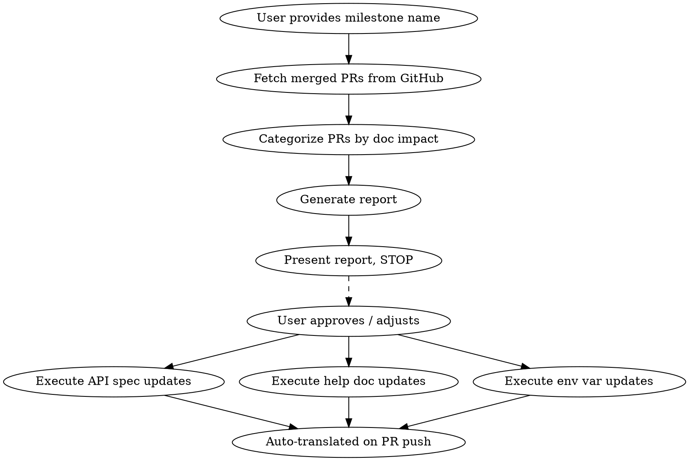

# Dify Release Documentation Sync

## Overview

Analyzes a GitHub milestone's merged PRs to identify documentation impact, generates a structured report, then executes updates after user approval. Three tracks: API reference (→ `dify-docs-api-reference`), help documentation (→ `dify-docs-guides`), and environment variables (→ `dify-docs-env-vars`).

**Input**: Milestone name, provided by the user exactly as it appears on GitHub (e.g., `v1.14.0`). Never auto-detect — always ask if not provided.

## Workflow



## Phase 1: Analysis

### 1.1 Fetch Milestone PRs

```bash
# Get milestone number from name
MILESTONE_NUM=$(gh api repos/langgenius/dify/milestones --paginate \
  --jq '.[] | select(.title=="MILESTONE_NAME") | .number')

# List closed issues/PRs for that milestone
gh api "repos/langgenius/dify/issues?milestone=$MILESTONE_NUM&state=closed&per_page=100" \
  --paginate --jq '.[] | select(.pull_request) | {number, title}'
```

For each PR, fetch changed files and description:
```bash
gh pr view PR_NUMBER --repo langgenius/dify --json number,title,body,labels,files
```

### 1.2 Categorize PRs

For each PR, check changed files against these mappings.

**Skip** (no doc impact): PRs that only touch `tests/`, `.github/`, `dev/`, or are pure refactoring with no behavior change (confirm from PR description).

#### API Reference Detection (Deterministic)

Any file matching these patterns means the corresponding spec is affected:

| Source path | Affected spec(s) |
|---|---|
| `controllers/service_api/app/chat.py` | chat, chatflow |
| `controllers/service_api/app/completion.py` | completion |
| `controllers/service_api/app/workflow.py` | workflow, chatflow |
| `controllers/service_api/app/audio.py`, `file.py`, `site.py`, `app.py` | all 4 app specs |
| `controllers/service_api/app/message.py` | chat, chatflow, completion |
| `controllers/service_api/app/conversation.py` | chat, chatflow |
| `controllers/service_api/app/annotation.py` | chat, chatflow |
| `controllers/service_api/dataset/` | knowledge |
| `controllers/service_api/app/error.py` | all 4 app specs |
| `controllers/service_api/dataset/error.py` | knowledge |
| `controllers/service_api/wraps.py` | all 5 specs |
| `controllers/service_api/__init__.py` | all 5 specs (route changes) |
| `libs/external_api.py` | all 5 specs |

Also check: Pydantic models and `fields/` serializers used by Service API controllers. If a PR modifies a model or serializer referenced by a Service API endpoint, that spec is affected.

#### Help Documentation Detection (Heuristic)

Read the PR description for context. Map changed source paths to likely doc areas:

| Source path pattern | Likely doc area |
|---|---|
| `api/core/workflow/nodes/` | `en/use-dify/workflow/nodes/` |
| `api/core/rag/` | `en/use-dify/knowledge/` |
| `api/core/model_runtime/` | `en/use-dify/model-providers/` |
| `api/core/tools/` | `en/use-dify/tools/` or workflow tool node docs |
| `api/core/agent/` | `en/use-dify/build-apps/agent.mdx` |
| `api/core/app/` | `en/use-dify/build-apps/` |
| `web/app/components/` | UI-related docs (check PR description for specifics) |
| `docker/`, deployment configs | `en/getting-started/install/` |
| `api/configs/` | Configuration/environment variable docs |

**Important**: These mappings are heuristic. For every candidate match:

1. **Read the PR title and description** to confirm the change is user-facing (not purely internal).
2. **Read the existing doc page** to check whether the current documentation covers the affected area at a level of detail that warrants an update. If the doc doesn't cover the topic (e.g., a node doc that mentions model selection but never discusses model parameters), a PR that changes model parameter behavior may not require a doc update.
3. **Assess priority**:
   - **High**: PR changes behavior that the doc explicitly describes → doc is now inaccurate
   - **Medium**: PR adds a new capability in an area the doc covers at a general level → doc could be enhanced
   - **Low / Skip**: PR changes something the doc doesn't cover at all → no update needed unless the feature is significant enough to warrant a new section

**Also watch for**:
- "Breaking change" labels → high priority
- New feature PRs → may need new doc pages
- Deprecation notices → update existing docs
- Behavior changes → verify current docs are still accurate

#### Environment Variable Detection (Deterministic)

Any file matching these patterns means env var documentation is affected:

| Source path | Impact |
|---|---|
| `docker/.env.example` | New vars, changed defaults, removed vars |
| `api/configs/**/*.py` | Pydantic config models define backend vars |
| `web/docker/entrypoint.sh` | Frontend Docker-to-NEXT_PUBLIC mapping |
| `docker-compose.yaml` | Infrastructure/container vars |

When detected, the report should list which variables were added, removed, or had defaults changed, which config file(s) were modified, and priority (High if new/removed vars, Medium if default changes only).

#### UI i18n Change Detection

Check PRs that touch `web/i18n/en-US/` files:
1. Compare changed i18n keys against the UI Labels section of `writing-guides/glossary.md`
2. If a changed key exists in the glossary → flag for glossary update (value may have changed)
3. If a changed key is new and falls within terminology scope (feature names, field labels, menu names, button names, status labels) → flag as candidate for glossary addition
4. Report as a separate section in Phase 2 with: key, old value, new value, glossary status

i18n source files: `web/i18n/{en-US,zh-Hans,ja-JP}/` (~30 JSON files each, ~4,875 keys total). Focus on: `common.json`, `app.json`, `workflow.json`, `dataset.json`, `dataset-creation.json`, `dataset-documents.json`—these contain the most documentation-relevant UI labels.

## Phase 2: Report

Generate the report and **STOP**. Do not execute until the user reviews and approves.

### Report Template

```markdown
# Pre-Release Doc Sync Report: [milestone]

## Summary
- **PRs analyzed**: X merged PRs in milestone
- **API reference impact**: Y PRs → Z spec files
- **Help documentation impact**: W PRs → V doc pages
- **Environment variable impact**: E PRs → F variables
- **UI i18n changes**: G PRs → H glossary entries affected
- **No doc impact**: N PRs

## API Reference Changes

### openapi_chat.json / openapi_chatflow.json

| PR | Title | Change Type | Details |
|---|---|---|---|
| #1234 | Add streaming retry | New parameter | `retry_count` on `/chat-messages` |
| #1235 | Fix error handling | Error codes | New `rate_limit_exceeded` on `/chat-messages` |

### openapi_knowledge.json
| PR | Title | Change Type | Details |
|---|---|---|---|
| #1240 | Add metadata filter | New parameter | `metadata_filter` on list segments |

## Help Documentation Changes

| PR | Title | Affected Doc(s) | Priority | Change Needed |
|---|---|---|---|---|
| #1250 | Add semantic chunking | `knowledge/chunking.mdx` | High | Doc describes chunking strategies — new option must be added |
| #1251 | New HTTP node timeout | `workflow/nodes/http.mdx` | Low | Doc doesn't cover timeout config at this level of detail |

## Environment Variable Changes

| PR | Title | Variables | Change Type | Priority |
|---|---|---|---|---|
| #1270 | Add Redis sentinel | `REDIS_SENTINEL_*` (3 new) | New variables | High |
| #1271 | Change default log level | `LOG_LEVEL` default INFO→WARNING | Default change | Medium |

## UI i18n Changes (Glossary Impact)

| PR | Key | Old Value | New Value | Glossary Status |
|---|---|---|---|---|
| #1280 | `dataset.indexMethod` | Index Method | Indexing Method | Exists — update needed |
| #1281 | `workflow.nodeGroup` | (new) | Node Group | Candidate for addition |

## No Documentation Impact

| PR | Title | Reason |
|---|---|---|
| #1260 | Refactor internal cache | Internal only |
| #1261 | Update CI pipeline | Infrastructure |
```

## Phase 3: Execution

After user approval (they may add, remove, or adjust items):

### Codebase Preparation

Checkout the release tag/branch in the Dify codebase (configured as an additional working directory) before auditing:
```bash
git fetch --tags
git checkout v1.14.0  # or the release branch
```

### API Reference Updates

For each affected spec, dispatch a parallel audit agent with `dify-docs-api-reference` skill:
1. Audit the spec against the code, focusing on changes from the report (but audit fully — PRs may have side effects)
2. Fix the EN spec
3. Validate all modified JSON files

**Cross-spec propagation**: Shared endpoints (file upload, audio, feedback, app info) appear in all 4 app specs. When fixing one, propagate to siblings.

Translation of API specs is handled automatically by the workflow when changes are pushed — no manual translation step needed.

### Help Documentation Updates

For each affected doc page, use `dify-docs-guides` skill:
1. Read the current doc and the relevant PR(s) for context
2. Update content to reflect changes
3. Translation is handled automatically by the Dify workflow on PR push — no manual translation needed

### Environment Variable Updates

For each affected variable group, use `dify-docs-env-vars` skill:
1. Trace the variable in the release codebase
2. Update `en/self-host/configuration/environments.mdx`
3. Run the verification script to confirm zero mismatches
4. Translation is handled automatically by the Dify workflow on PR push

### Parallel Execution

- API spec audits: one agent per spec (parallel)
- Help doc updates: one agent per doc page (parallel)
- Env var updates: sequential (single target file)
- API, help doc, and env var tracks: can run in parallel

## Key Paths

| What | Path |
|---|---|
| Dify codebase | Configured as an additional working directory |
| OpenAPI specs | `dify-docs/{en,zh,ja}/api-reference/openapi_*.json` |
| GitHub repo | `langgenius/dify` |

## Common Mistakes

| Mistake | Fix |
|---|---|
| Auto-detecting milestone name | Always ask the user — naming is non-standard |
| Executing before report approval | STOP after report — user must review |
| Missing shared endpoint propagation | Fix in one spec → check all 4 app specs |
| Ignoring PR description | File paths are heuristic for non-API — description has the real context |
| Skipping Pydantic model changes | A model change may affect multiple endpoints — trace which controllers use it |
| Forgetting to checkout release tag | Audit against the release code, not main HEAD |
| Manually translating after EN fixes | Translation is automatic on PR push — never run manual translation scripts |
