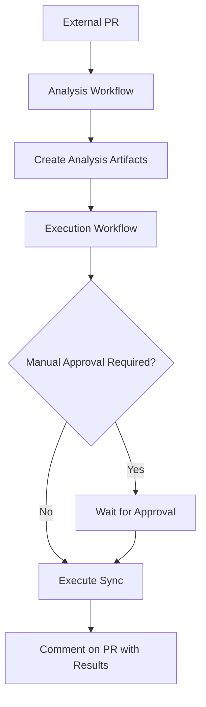

# Secure Documentation Workflow Guide

This guide explains how the secure two-workflow pattern works for handling documentation synchronization from external PRs (forked repositories).

## Overview

The secure workflow system uses a **two-workflow pattern** to safely handle documentation changes from external contributors while maintaining security:

1. **Analysis Workflow** (`sync_docs_analyze.yml`) - Analyzes changes in an unprivileged environment
2. **Execution Workflow** (`sync_docs_execute.yml`) - Executes translations with full permissions after validation

## Security Architecture

### Two-Workflow Pattern



### Security Principles

1. **Isolation**: Untrusted code runs in `pull_request` context (no secrets)
2. **Validation**: All inputs are validated before processing
3. **Least Privilege**: Each workflow has minimal required permissions
4. **Manual Approval**: External PRs require maintainer approval
5. **Rate Limiting**: API calls and file operations are limited

## Workflow Details

### 1. Analysis Workflow (`sync_docs_analyze.yml`)

**Trigger**: `pull_request` events for `docs.json` and `en/**/*.{md,mdx}` files

**Permissions**: `contents: read`, `pull-requests: read`

**Security Features**:
- No access to secrets or API keys
- Validates file paths for directory traversal
- Limits file count and size
- Creates artifacts with analysis results
- Comments on PR with preview

**Process**:
1. Checkout PR code (safe - no secrets available)
2. Analyze changed files
3. Validate file paths and extensions
4. Create sync plan
5. Upload artifacts
6. Comment on PR with analysis

### 2. Execution Workflow (`sync_docs_execute.yml`)

**Trigger**: `workflow_run` completion of analysis workflow

**Permissions**: `contents: write`, `pull-requests: write`, `actions: read`

**Security Features**:
- Downloads and validates artifacts
- Checks contributor trust level
- Requires manual approval for external PRs
- Limits translation operations
- Creates isolated branch for results

**Process**:
1. Download analysis artifacts
2. Validate artifact integrity
3. Check approval requirements
4. Execute secure synchronization
5. Create sync branch with results
6. Comment on PR with links

## Security Features

### Input Validation

All file paths are validated against:
- Directory traversal patterns (`../`, absolute paths)
- Allowed file extensions (`.md`, `.mdx`, `.json`)
- Allowed directories (`en/`, `zh-hans/`, `ja-jp/`)
- File size limits (10MB per file)
- File count limits (50 files per PR)

### Contributor Trust Levels

1. **Trusted**: OWNER, MEMBER, COLLABORATOR - Auto-approved
2. **Listed**: Users in `TRUSTED_CONTRIBUTORS` - Auto-approved
3. **External**: Fork contributors - Requires manual approval

### Rate Limiting

- Maximum 10 files translated per operation
- API call limits enforced
- Artifact size limits (50MB)
- Processing timeouts (5 minutes)

## Configuration

### Environment Variables

```yaml
DIFY_API_KEY: ${{ secrets.DIFY_API_KEY }}  # Translation API key
TRUSTED_CONTRIBUTORS: "user1,user2,user3"  # Comma-separated trusted users
```

### Workflow Configuration

Edit `.github/workflow-config.yml` to customize:

```yaml
security:
  require_approval_for_forks: true
  max_files_per_pr: 50
  max_file_size_mb: 10
  trusted_contributors:
    - your-trusted-user

translation:
  max_files_per_batch: 10
  translation_timeout: 300
```

## Usage for Maintainers

### Approving External PRs

1. External contributor creates PR
2. Analysis workflow runs automatically
3. PR gets comment with analysis results
4. **Maintainer reviews the analysis**
5. **Maintainer approves the PR** (GitHub review system)
6. Execution workflow runs automatically
7. Results are posted to sync branch

### Manual Workflow Dispatch

For internal changes, you can trigger manually:

```bash
# Via GitHub UI: Actions > Sync Documentation Structure > Run workflow
# Or via CLI:
gh workflow run sync_docs.yml -f since_commit=HEAD~5
```

### Emergency Controls

In `.github/workflow-config.yml`:

```yaml
emergency:
  disable_workflows: true        # Disable all workflows
  disable_external_prs: true    # Disable only external PR processing
```

## Development and Testing

### Local Testing

Test security features locally:

```bash
cd tools/translate
python test_security.py
```

### Validation Tools

- `security_validator.py` - Input validation and sanitization
- `test_security.py` - Security test suite
- `sync_and_translate.py` - Enhanced with security checks

### Adding New Security Rules

1. Update `security_validator.py` with new validation rules
2. Add test cases to `test_security.py`
3. Update workflow configuration if needed
4. Test locally before deploying

## Monitoring and Alerts

### What to Monitor

- Failed approvals or validations
- Unusual file patterns or sizes
- API rate limit hits
- Security validation failures

### Log Analysis

Check GitHub Actions logs for:
- `Security error:` messages
- `Validation error:` messages
- Failed artifact downloads
- Approval requirement triggers

## Troubleshooting

### Common Issues

1. **"Needs Approval" Status**
   - External PRs require maintainer approval
   - Add contributor to trusted list or approve PR

2. **"Security Validation Failed"**
   - Check file paths for dangerous patterns
   - Verify file extensions are allowed
   - Check file size limits

3. **"Artifact Not Found"**
   - Analysis workflow may have failed
   - Check analysis workflow logs
   - Re-run analysis if needed

4. **Translation Failures**
   - Check DIFY_API_KEY configuration
   - Verify API rate limits
   - Check file content for issues

### Getting Help

- Check workflow logs in GitHub Actions
- Review security test results locally
- Contact repository maintainers
- Open GitHub issue with details

## Best Practices

### For Contributors

1. **Keep PRs focused** - Limit to necessary documentation changes
2. **Use standard paths** - Follow existing directory structure  
3. **Test locally** - Verify markdown renders correctly
4. **Be patient** - External PRs require approval

### For Maintainers

1. **Review analysis carefully** - Check file changes before approval
2. **Monitor for abuse** - Watch for suspicious patterns
3. **Keep trusted list updated** - Add regular contributors
4. **Test configuration changes** - Validate workflow updates

### Security Checklist

- [ ] Workflows use minimal required permissions
- [ ] External PRs require approval
- [ ] File validation is comprehensive
- [ ] API keys are properly secured
- [ ] Rate limits are enforced
- [ ] Artifacts are validated
- [ ] Emergency controls are in place

## Updates and Maintenance

### Regular Tasks

- Review and update trusted contributors list
- Monitor security logs for patterns
- Update validation rules as needed
- Test workflows after GitHub Actions updates
- Review and rotate API keys

### Version Updates

When updating the workflow:

1. Test changes in a fork first
2. Update version in `workflow-config.yml`
3. Update documentation
4. Notify team of changes
5. Monitor first few PRs carefully

---

For questions or issues, contact the repository maintainers or open a GitHub issue.