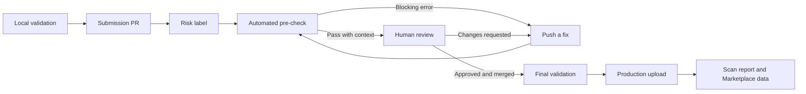

---
dimensions:
  type:
    primary: operational
    detail: deployment
  level: intermediate
standard_title: Dify Marketplace Review and Release
language: en
title: Checks, Review, and Marketplace Release
description: Understand Dify Marketplace CI findings, respond to reviewer feedback, and follow the post-merge validation and publishing pipeline
---

Marketplace publication is a trust pipeline, not a single approval checkbox. Your package is inspected locally, checked again in the PR, reviewed by a maintainer, and validated once more before the merged artifact is uploaded.

## Automated PR checks

The `Pre Check Plugin` workflow runs when a PR to `main` or `dev` is opened, updated, or marked ready for review. It clones the current [Dify Marketplace Toolkit](https://github.com/langgenius/dify-marketplace-toolkit) and downloads the current plugin daemon, so the rules can evolve without contributors copying a workflow into every plugin repository.

<Tabs>
  <Tab title="Package integrity">
    - Exactly one `.difypkg` changed and its repository path is valid.
    - The archive extracts safely and stays within package size and file-count limits.
    - Development artifacts, secrets, suspicious assignments, executables, bundled binaries, and default template icons are detected.
  </Tab>
  <Tab title="Metadata and disclosure">
    - Manifest fields, source repository, contact, privacy declaration, icon, and version are validated.
    - README metadata and English primary content are checked.
    - The PR template, risk selection, review notes, version update, and sensitive-capability disclosure are compared with the package.
  </Tab>
  <Tab title="Dependencies and code">
    - Dependency policy and installation are checked.
    - Python source is compiled and scanned for safety warnings.
    - Known dependency vulnerabilities, prohibited financial activity, and other review signals are surfaced.
  </Tab>
  <Tab title="Runtime and packaging">
    - Dependencies are installed in a clean environment when applicable.
    - The plugin is installed using the compatible daemon flow.
    - The Marketplace uploader runs in test mode to confirm the package can be processed without publishing it.
  </Tab>
</Tabs>

<Note>
The repository workflow is the source of truth for the current check set. A fixed numbered checklist becomes stale whenever a validator is added or promoted, so use the check categories above and read the workflow report for exact findings.
</Note>

## Errors and warnings mean different things

The workflow runs individual validators to completion and then aggregates their findings into a step summary.

| Result | Meaning | Action |
| :--- | :--- | :--- |
| **Blocking error** | A deterministic requirement failed, such as a secret in the package, invalid metadata, an incomplete PR body, a duplicate version, or failed install/package processing. | Fix the package or PR, rebuild if needed, and push to the same branch. |
| **Warning** | The validator found behavior or evidence that requires judgment, such as a sensitive capability, binary exception, safety pattern, financial activity, or incomplete contextual signal. | Explain or remediate it. Warnings alone do not fail the workflow, but reviewers can request changes. |
| **Pass** | No blocking findings were found by the automated checks. | Wait for human review; a green workflow is not automatic approval. |

<Warning>
Do not silence a warning by removing accurate disclosure. Reviewers compare package behavior, documentation, privacy terms, source code, and PR claims; inconsistencies are themselves a reason to request changes.
</Warning>

## Human review

After automated checks, a maintainer reviews areas that automation cannot decide reliably:

- Whether the package contents match the stated purpose.
- Whether the README gives users enough setup, credential, API, and connection guidance.
- Whether the privacy policy matches real data flows and third-party services.
- Whether the selected risk level and sensitive-capability notes match plugin behavior.
- Whether dependencies and binaries are necessary and reasonably constrained.
- Whether high-risk inputs, network requests, credentials, and errors have appropriate safeguards.

<Steps>
  <Step title="Read the full report">
    Start with the GitHub Actions summary, then expand the relevant error and warning details. Fix causes rather than only the first visible symptom.
  </Step>
  <Step title="Update the source package">
    Make changes in the plugin source repository, increment the version when required, rebuild the `.difypkg`, and replace or add the package according to maintainer guidance.
  </Step>
  <Step title="Push to the same PR branch">
    Each push reruns the pre-check workflow. Reply to reviewer threads with what changed and where the new evidence appears.
  </Step>
  <Step title="Request another review">
    When all requested changes are addressed and checks are current, mark the PR ready or re-request review instead of opening a duplicate submission.
  </Step>
</Steps>

## What happens after merge

Merging does not bypass validation. A push to `main` starts the `Upload Merged Plugin` workflow:

<Steps>
  <Step title="Identify one merged package">
    The workflow computes changed files and validates that the push contains one publishable `.difypkg` path.
  </Step>
  <Step title="Run final package checks">
    The merged archive is unpacked and checked again for package contents, secrets, binaries, manifest metadata, README metadata, dependency policy, and prohibited financial activity signals.
  </Step>
  <Step title="Extract release notes">
    The workflow finds the associated PR and derives changelog content from its body. This is why a precise **What changed** section matters for version updates.
  </Step>
  <Step title="Upload to production">
    The Marketplace uploader validates and uploads the package to the production Marketplace. Production upload failures stop the workflow.
  </Step>
  <Step title="Attach scan evidence">
    The uploader scans the packaged artifact and submits a version-specific scan report. This report supplies data used by Marketplace access-domain and security surfaces. A new plugin version is scanned as new evidence; it does not inherit trust from an older package.
  </Step>
</Steps>

The workflow can also mirror the package to staging. Staging upload is best-effort and does not roll back a successful production publication.

<Check>
When the production upload succeeds, the merged package has completed the repository publishing pipeline. No separate contributor-side upload command is required.
</Check>

## Manage Published Plugins in Creator Center

After your plugin is published, use [Creator Center](https://creators.dify.ai/) to check its performance, read user responses, or share access with teammates.

### Find the Plugins You Maintain

- **Personal account**: Connect your GitHub account. If you have connected multiple accounts, select one to view the plugins linked to it. Sync the account to add newly published plugins to the list.
- **Organization**: Switch to an existing organization to access its shared plugin data and feedback.

### Manage Plugins With Your Team

If your team is setting up shared management for the first time, create a Creator Center organization.

1. In the Creator Center account menu, select **Create an organization**.
2. In Marketplace, find the plugin you want to manage with your teammates. On the plugin card, enter the name shown after *by* as the organization's **Unique handle**.
3. Continue to the invitation step and invite your teammates.

After accepting the invitation, teammates can switch to the organization from the account menu to access the same plugin data and feedback without connecting their own GitHub accounts.

### Claim Missing Organization Plugins

If an organization plugin still does not appear after syncing, use **Claim plugin** to provide its Plugin ID and original publication PR for review.

1. In the account menu, select your personal account. Open **Plugin**, then select **Claim plugin**.
2. For each plugin you want to claim, copy its Plugin ID from its Marketplace details page and enter it under **Plugin IDs**. Add the PR that originally published the plugin under **PR Links**.
3. Confirm the **Contact email** and add **Notes** describing your role in maintaining the plugins. If a different GitHub account opened the PRs, explain why.
4. Select **Submit claim**.

Track the request in **Claim history**. After approval, open the organization from the account menu to manage the plugins included in the claim. If the claim is rejected, review the reason and select **New Claim** to update the evidence and resubmit it.

### Review Performance and Feedback

Each plugin card shows its downloads, overall rating, rating count, and likes. Open **Inbox** to read individual ratings, likes, and private feedback.

## Maintain the published plugin

Publication starts an ongoing responsibility:

- Monitor the source repository and contact channel listed in the submission.
- Fix security issues and dependency vulnerabilities promptly.
- Keep behavior, outbound domains, README instructions, and privacy disclosures synchronized.
- Use a new version and a new PR for every update; never replace an already published version in place.
- Document migrations and breaking changes before users upgrade.

<AccordionGroup>
  <Accordion title="Why did CI fail after local validation passed?">
    Local validation covers evidence inside the package. CI also has PR and Marketplace context, including template completeness, risk labeling, duplicate versions, clean dependency installation, daemon install tests, and uploader test mode.
  </Accordion>
  <Accordion title="Should I open a new PR after a failed check?">
    Usually no. Push a corrected package or PR-body update to the existing branch. This preserves reviewer context and automatically reruns checks.
  </Accordion>
  <Accordion title="Does a warning block publication?">
    Not by itself. A warning routes ambiguous or sensitive behavior to human review. A reviewer may accept the explanation, ask for stronger safeguards, or require a change.
  </Accordion>
  <Accordion title="Does a green workflow guarantee approval?">
    No. Automation verifies defined rules; maintainers still judge purpose, documentation, privacy, security boundaries, dependency necessity, and consistency between the package and its claims.
  </Accordion>
</AccordionGroup>

<CardGroup cols={2}>
  <Card title="Prepare and validate" icon="shield-check" href="/en/develop-plugin/publishing/marketplace-listing/prepare-plugin-for-marketplace">
    Return to package hygiene, risk classification, and local validation.
  </Card>
  <Card title="Submit a PR" icon="code-pull-request" href="/en/develop-plugin/publishing/marketplace-listing/submit-plugin-to-marketplace">
    Review the package path and required PR evidence.
  </Card>
</CardGroup>
