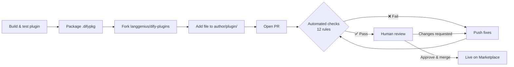

---
dimensions:
  type:
    primary: operational
    detail: deployment
  level: intermediate
standard_title: Release to Dify Marketplace
language: en
title: Publish to Dify Marketplace
description: Submit a plugin to the Dify Marketplace, from the pre-submission checklist and the 12 reviewer checks through the PR flow and what happens after approval
---

The Marketplace is the official catalog of community-built and partner-built Dify plugins. Submitting your plugin here puts it one click away from every Dify user.

Plugins are published by opening a Pull Request against [`langgenius/dify-plugins`](https://github.com/langgenius/dify-plugins). A reviewer (and a set of automated checks) walks through the PR, and on approval the plugin goes live on [marketplace.dify.ai](https://marketplace.dify.ai/) automatically.

If you have not built a plugin yet, start with the [Tool Plugin walkthrough](/en/develop-plugin/dev-guides-and-walkthroughs/tool-plugin).

## Before You Submit

The Dify reviewer runs an automated 12-check pre-flight on every PR. Most rejections are mechanical, and fixing them up front saves a review cycle.

<Tabs>
  <Tab title="Project files">
    Every plugin directory must contain:

    | File / Folder | Purpose |
    | :--- | :--- |
    | `manifest.yaml` | Plugin metadata (name, author, version, etc.) |
    | `README.md` | English-only description, setup, usage |
    | `PRIVACY.md` | Privacy policy (required, non-empty) |
    | `_assets/` | Plugin icon and any other static assets |

    See [General Specifications](/en/develop-plugin/features-and-specs/plugin-types/general-specifications) for manifest fields and [Privacy Guidelines](/en/develop-plugin/publishing/standards/privacy-protection-guidelines) for the privacy policy.
  </Tab>
  <Tab title="Manifest rules">
    - **Author** in `manifest.yaml` must not contain `langgenius` or `dify`; those are reserved for first-party plugins. Use your own GitHub handle.
    - **Version** must be a new value. Submitting an already-published version is rejected.
    - **Icon** must be an actual icon in `_assets/`, not a leftover template default.
  </Tab>
  <Tab title="Dependencies">
    - `pip install -r requirements.txt` must succeed cleanly.
    - The plugin SDK pin must be at least `dify_plugin>=0.5.0`.
    - The plugin must install and package without errors against the current daemon (the reviewer runs `test-plugin-install.py` and `upload-package.py --test`).
  </Tab>
  <Tab title="Language">
    - **PR title and body** must be in English. The bilingual notice line `【中文用户 & Non English User】请使用英语提交，否则会被关闭 ：）` is the only allowlisted exception.
    - **`README.md`** must contain no Chinese characters. Add translations as `readme/README_<lang>.md` instead. See [Multilingual README](/en/develop-plugin/features-and-specs/plugin-types/multilingual-readme).
  </Tab>
</Tabs>

## Reviewer Checklist

These are the exact checks the reviewer runs, in order. Treat this as your pre-flight before opening the PR.

| # | Check | Common cause of failure |
| :--- | :--- | :--- |
| 1 | **Single `.difypkg`** | PR includes more than one packaged file, or none |
| 2 | **PR language** | CJK characters in title or body outside the allowlisted notice |
| 3 | **Project structure** | Missing `manifest.yaml`, `README.md`, `PRIVACY.md`, or `_assets/` |
| 4 | **Manifest author** | Author contains `langgenius` or `dify` |
| 5 | **Icon** | Default template icon left in place, or icon missing |
| 6 | **Version** | This version is already on the Marketplace |
| 7 | **README language** | Chinese characters in `README.md` (use `readme/README_zh_Hans.md` instead) |
| 8 | **PRIVACY.md** | Missing or empty |
| 9 | **Dependencies install** | `pip install -r requirements.txt` errors |
| 10 | **SDK version** | `dify_plugin` pinned below `0.5.0` |
| 11 | **Install test** | Plugin fails to install via the daemon |
| 12 | **Packaging test** | Plugin fails to repackage cleanly |

A failing check stops the review and posts a status table with `❌ Fail` rows and required fixes; you address them and push again.

## Submit the PR

<Steps>
  <Step title="Read the Plugin Development Guidelines">
    Skim the [Plugin Development Guidelines](/en/develop-plugin/publishing/standards/contributor-covenant-code-of-conduct). Reviewers use them to judge non-mechanical concerns: uniqueness, brand alignment, content quality, IP, and maintenance commitment.
  </Step>
  <Step title="Write your privacy policy">
    Create `PRIVACY.md` in the plugin root (or host it and put the URL in the manifest). Follow [Privacy Guidelines](/en/develop-plugin/publishing/standards/privacy-protection-guidelines): declare what data the plugin and any third-party services it calls collect.
  </Step>
  <Step title="Package the plugin">
    From the directory above your plugin project:

    ```bash
    dify plugin package ./your_plugin_project
    ```

    This produces `your_plugin_project.difypkg`.
  </Step>
  <Step title="Fork and add your file">
    Fork [`langgenius/dify-plugins`](https://github.com/langgenius/dify-plugins). Create a folder at `<your-author-name>/<your-plugin-name>/` and drop the `.difypkg` inside.
  </Step>
  <Step title="Open the PR">
    Push to your fork, then open a PR against `main` using the repository's PR template. Title and body in English.
  </Step>
  <Step title="Respond to the review">
    The automated checks post first, then a human reviewer follows up. Address feedback by pushing new commits; the checks rerun on each push.
  </Step>
</Steps>



<Tip>
The first review usually lands within a week. If it takes longer, the reviewer leaves a comment explaining the delay.
</Tip>

<Check>
Once merged to `main`, the plugin appears on [marketplace.dify.ai](https://marketplace.dify.ai/) automatically, with no separate publishing step.
</Check>

## After Approval

You own the plugin from the merge onward:

- **Bug fixes and feature requests.** Triage issues from your users.
- **Compatibility updates.** When Dify ships a breaking API change, the team publishes migration notes; you update the plugin. Dify engineers can help if needed.
- **Versioning.** Bump `version` in `manifest.yaml`, repackage, open a new PR with the new `.difypkg`. The [Auto-publish PR workflow](/en/develop-plugin/publishing/marketplace-listing/plugin-auto-publish-pr) automates this from a GitHub Action.

<Warning>
While the Marketplace is in public beta, avoid breaking changes to plugins already in use. Add new fields instead of renaming existing ones; deprecate before removing.
</Warning>

## PR Lifecycle

| Status | What it means | What to do |
| :--- | :--- | :--- |
| **Open, awaiting review** | Within the first ~7 days, no action needed | Wait |
| **Changes requested** | A check failed, or the reviewer left feedback | Push fixes; checks rerun automatically |
| **Stale (14 days idle)** | No response from you in two weeks | Reply on the PR to reset the timer; it can be reopened |
| **Closed (30 days idle)** | Closed for inactivity | Open a fresh PR; the closed one can't be reopened |

## Frequently Asked Questions

<AccordionGroup>
  <Accordion title="How do I know if my plugin is too similar to an existing one?">
    The Marketplace deduplicates by *function*, not by *integration*. A second Google-search plugin that only adds new translations is a duplicate. A Google-search plugin that adds batched queries, better error handling, or a meaningful new capability is fine; say so in the PR description.
  </Accordion>
  <Accordion title="My PR was marked stale or closed. What now?">
    **Stale** PRs (14 days idle) can be reopened; reply on the PR or push a fix to restart the clock. **Closed** PRs (30 days idle) cannot be reopened; fix the feedback and open a fresh PR with the same package.
  </Accordion>
  <Accordion title="Can I update plugins during the public beta?">
    Yes. Avoid breaking changes: add fields rather than rename, deprecate before removing.
  </Accordion>
  <Accordion title="Can I publish a paid plugin?">
    Not currently. The Marketplace accepts free plugins only; monetization policies will be announced separately.
  </Accordion>
  <Accordion title="The PR body needs both English and Chinese for our team. Is that allowed?">
    No. Only the single allowlisted bilingual notice line is permitted in the PR title/body. Put internal multilingual notes elsewhere (commit messages, internal docs).
  </Accordion>
</AccordionGroup>

## Related Resources

<CardGroup cols={2}>
  <Card title="Publishing Overview" icon="signs-post" href="/en/develop-plugin/publishing/marketplace-listing/release-overview">
    Compare Marketplace, GitHub, and local-file distribution.
  </Card>
  <Card title="Plugin Development Guidelines" icon="clipboard-check" href="/en/develop-plugin/publishing/standards/contributor-covenant-code-of-conduct">
    The full content and quality bar reviewers apply.
  </Card>
  <Card title="Privacy Guidelines" icon="shield-halved" href="/en/develop-plugin/publishing/standards/privacy-protection-guidelines">
    How to write a `PRIVACY.md` that passes review.
  </Card>
  <Card title="Auto-publish PR Workflow" icon="robot" href="/en/develop-plugin/publishing/marketplace-listing/plugin-auto-publish-pr">
    GitHub Action that packages and opens the PR for you on every push.
  </Card>
  <Card title="Multilingual README" icon="language" href="/en/develop-plugin/features-and-specs/plugin-types/multilingual-readme">
    Add `readme/README_<lang>.md` files for non-English users.
  </Card>
  <Card title="General Specifications" icon="file-code" href="/en/develop-plugin/features-and-specs/plugin-types/general-specifications">
    Manifest field reference.
  </Card>
</CardGroup>
