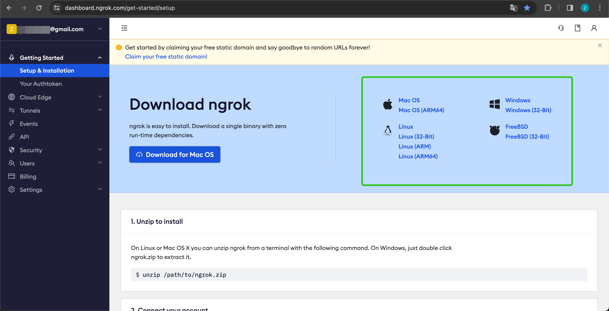

Developers can extend module capabilities through the API extension module. Currently supported module extensions include:

* `moderation`
* `external_data_tool`

Before extending module capabilities, prepare an API and an API Key for authentication, which can also be automatically generated by Dify. In addition to developing the corresponding module capabilities, follow the specifications below so that Dify can invoke the API correctly.


## API Specifications

Dify will invoke your API according to the following specifications:

```
POST {Your-API-Endpoint}
```

### Header

<table>
  <thead>
    <tr>
      <th>Header</th>
      <th>Value</th>
      <th>Desc</th>
    </tr>
  </thead>
  <tbody>
    <tr>
      <td>`Content-Type`</td>
      <td>application/json</td>
      <td>The request content is in JSON format.</td>
    </tr>
    <tr>
      <td>`Authorization`</td>
      <td>Bearer {api\_key}</td>
      <td>The API Key is transmitted as a token. You need to parse the `api_key` and verify if it matches the provided API Key to ensure API security.</td>
    </tr>
  </tbody>
</table>
### Request Body

```JSON
{
    "point":  string, // Extension point, different modules may contain multiple extension points
    "params": {
        ...  // Parameters passed to each module's extension point
    }
}
```

### API Response

```JSON
{
    ...  // For the content returned by the API, see the specific module's design specifications for different extension points.
}

```

## Check

When configuring API-based Extension in Dify, Dify will send a request to the API Endpoint to verify the availability of the API. When the API Endpoint receives `point=ping`, the API should return `result=pong`, as follows:

### Header

```JSON
Content-Type: application/json
Authorization: Bearer {api_key}
```

### Request Body

```JSON
{
    "point": "ping"
}
```

### Expected API response

```JSON
{
    "result": "pong"
}
```

\\

## For Example

Here we take the external data tool as an example, where the scenario is to retrieve external weather information based on the region as context.

### API Specifications

`POST https://fake-domain.com/api/dify/receive`

### **Header**

```JSON
Content-Type: application/json
Authorization: Bearer 123456
```

### **Request Body**

```JSON
{
    "point": "app.external_data_tool.query",
    "params": {
        "app_id": "61248ab4-1125-45be-ae32-0ce91334d021",
        "tool_variable": "weather_retrieve",
        "inputs": {
            "location": "London"
        },
        "query": "How's the weather today?"
    }
}
```

### **API Response**

```JSON
{
    "result": "City: London\nTemperature: 10°C\nRealFeel®: 8°C\nAir Quality: Poor\nWind Direction: ENE\nWind Speed: 8 km/h\nWind Gusts: 14 km/h\nPrecipitation: Light rain"
}
```

### Code demo

The code is based on the Python FastAPI framework.

#### **Install dependencies.**

<pre><code><strong>pip install 'fastapi[all]' uvicorn
</strong></code></pre>

#### Write code according to the interface specifications.

<pre><code>from fastapi import FastAPI, Body, HTTPException, Header
<strong>from pydantic import BaseModel
</strong>
app = FastAPI()


class InputData(BaseModel):
    point: str
    params: dict


@app.post("/api/dify/receive")
async def dify_receive(data: InputData = Body(...), authorization: str = Header(None)):
    """
    Receive API query data from Dify.
    """
    expected_api_key = "123456"  # TODO Your API key of this API
    auth_scheme, _, api_key = authorization.partition(' ')

    if auth_scheme.lower() != "bearer" or api_key != expected_api_key:
        raise HTTPException(status_code=401, detail="Unauthorized")

    point = data.point

    # for debug
    print(f"point: {point}")

    if point == "ping":
        return {
            "result": "pong"
        }
    if point == "app.external_data_tool.query":
        return handle_app_external_data_tool_query(params=data.params)
    # elif point == "{point name}":
        # TODO other point implementation here

    raise HTTPException(status_code=400, detail="Not implemented")


def handle_app_external_data_tool_query(params: dict):
    app_id = params.get("app_id")
    tool_variable = params.get("tool_variable")
    inputs = params.get("inputs")
    query = params.get("query")

    # for debug
    print(f"app_id: {app_id}")
    print(f"tool_variable: {tool_variable}")
    print(f"inputs: {inputs}")
    print(f"query: {query}")

    # TODO your external data tool query implementation here, 
    #  return must be a dict with key "result", and the value is the query result
    if inputs.get("location") == "London":
        return {
            "result": "City: London\nTemperature: 10°C\nRealFeel®: 8°C\nAir Quality: Poor\nWind Direction: ENE\nWind "
                      "Speed: 8 km/h\nWind Gusts: 14 km/h\nPrecipitation: Light rain"
        }
    else:
        return {"result": "Unknown city"}
</code></pre>

#### Launch the API service.

The default port is 8000. The complete address of the API is: `http://127.0.0.1:8000/api/dify/receive`with the configured API Key '123456'.

<pre><code><strong>uvicorn main:app --reload --host 0.0.0.0
</strong></code></pre>

#### Configure this API in Dify.


#### Select this API extension in the App.


When debugging the App, Dify will request the configured API and send the following content (example):

```JSON
{
    "point": "app.external_data_tool.query",
    "params": {
        "app_id": "61248ab4-1125-45be-ae32-0ce91334d021",
        "tool_variable": "weather_retrieve",
        "inputs": {
            "location": "London"
        },
        "query": "How's the weather today?"
    }
}
```

API Response：

```JSON
{
    "result": "City: London\nTemperature: 10°C\nRealFeel®: 8°C\nAir Quality: Poor\nWind Direction: ENE\nWind Speed: 8 km/h\nWind Gusts: 14 km/h\nPrecipitation: Light rain"
}
```

### Local debugging

Since Dify's cloud version can't access internal network API services, you can use Ngrok to expose your local API service endpoint to the public internet for cloud-based debugging of local code. The steps are:

1. Visit the Ngrok official website at [https://ngrok.com](https://ngrok.com/), register, and download the Ngrok file.



2. After downloading, go to the download directory. Unzip the package and run the initialization script as instructed:

```
$ unzip /path/to/ngrok.zip
$ ./ngrok config add-authtoken 你的Token
```

3. Check the port of your local API service.


Run the following command to start:

```
$ ./ngrok http [port number]
```

Upon successful startup, you'll see something like the following:


4. Find the 'Forwarding' address, like the sample domain `https://177e-159-223-41-52.ngrok-free.app`, and use it as your public domain.

* For example, to expose your locally running service, replace the example URL `http://127.0.0.1:8000/api/dify/receive` with `https://177e-159-223-41-52.ngrok-free.app/api/dify/receive`.

Now, this API endpoint is accessible publicly. You can configure this endpoint in Dify for local debugging. For the configuration steps, consult the appropriate documentation or guide.

### Deploy API extension with Cloudflare Workers

We recommend that you use Cloudflare Workers to deploy your API extension, because Cloudflare Workers can easily provide a public address and can be used for free.

[cloudflare-workers.md](cloudflare-workers.md "mention")
