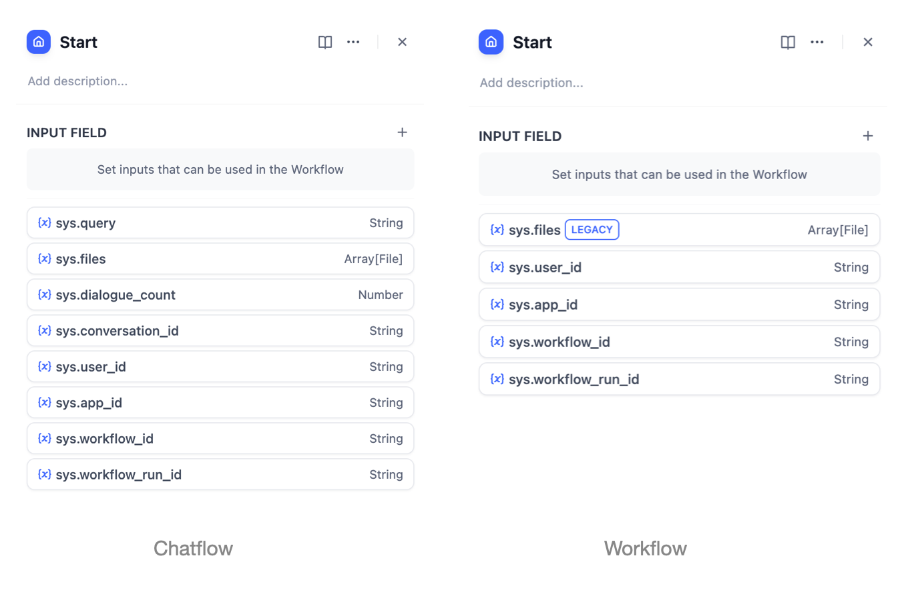

# Personal Account Management

## Login Methods

The login methods supported by different versions of Dify are as follows:

<table><thead><tr><th width="166">Version</th><th>Login Method</th></tr></thead><tbody><tr><td>Community</td><td>Email and password</td></tr><tr><td>Cloud</td><td>GitHub account authorization, Google account authorization, email and verification code</td></tr></tbody></table>

> Note: For Dify Cloud Service, if the email associated with a GitHub or Google account is the same as the email used to log in with a verification code, the system will automatically link them as the same account, avoiding the need for manual binding and preventing duplicate registrations.

<figure><figcaption></figcaption></figure>

## Modifying Personal Information

To update your personal account information:

1. Navigate to the Dify team homepage
2. Click on your avatar in the upper right corner
3. Select **"My Account"**

You can modify the following details:

* Avatar
* Username
* Email
* Password

> Note: The password reset feature is only available in the Community Version.

<figure><figcaption></figcaption></figure>

### Login Methods

Supports 3 login methods: email + verification code, Google authentication, and GitHub authentication. The same Dify account can log in directly using email + verification code or through Google/GitHub authentication linked to the same email, without the need for additional binding.

### Changing Display Language

To change the display language, click on your avatar in the upper right corner of the Dify team homepage, then click **"Language"**. Dify supports the following languages:

* English
* Simplified Chinese
* Traditional Chinese
* Portuguese (Brazil)
* French (France)
* Japanese (Japan)
* Korean (South Korea)
* Russian (Russia)
* Italian (Italy)
* Thai (Thailand)
* Indonesian
* Ukrainian (Ukraine)

Dify welcomes community volunteers to contribute additional language versions. Visit the [GitHub repository](https://github.com/langgenius/dify/blob/main/CONTRIBUTING.md) to contribute!

### Delete Personal Account

⚠️ Dangerous Operation. Please proceed with caution.

To confirm the deletion of your Dify SaaS account, click on your avatar in the top right corner, select **“Account”** from the dropdown menu, and then click the **“Delete Account”** button. 

Deleting your account is irreversible, and the same email address cannot be re-registered within 30 days. All workspaces owned by the account will also be deleted, and it will be automatically removed from all shared workspaces.

Enter the email address you want to delete and the confirmation verification code. Afterward, the system will permanently delete all information related to the account.

<figure><figcaption>
Delete Personal Account
</figcaption></figure>
