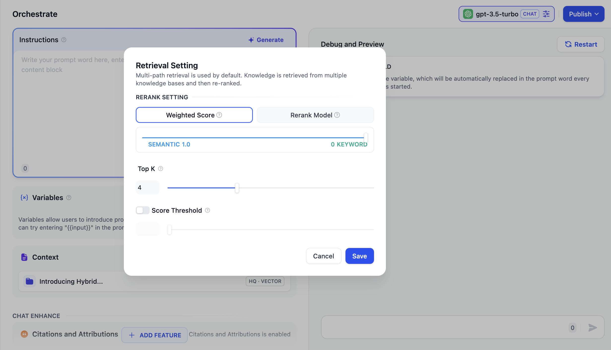

# Retrieval Modes

When users build AI applications with multiple knowledge bases, Dify's retrieval strategy will determine which content will be retrieved.

<figure><figcaption>
retrieval Mode Settings
</figcaption></figure>

### Retrieval Setting

Matches all datasets based on user intent, querying related text fragments from multiple datasets simultaneously. After a re-ranking step, the best results matching the user query are selected from the multi-path query results, requiring a configured Rerank model API. In multi-path retrieval mode, the retriever searches for text content related to the user query across all datasets associated with the application merge the relevant document results from multi-path retrieval and re-ranks the retrieved documents semantically using the Rerank model.

In multi-path retrieval mode, it's recommended that the Rerank model be configured.

Below is the technical flowchart for the multi-path retrieval mode:

<figure><figcaption>
Multi-Path retrieval
</figcaption></figure>

Since multi-path retrieval mode does not rely on the model's inference capability or dataset descriptions, it can achieve higher-quality retrieval results when retrieving across multiple datasets. Additionally, incorporating a re-ranking step can effectively improve document retrieval effectiveness. Therefore, when creating knowledge base Q\&A applications associated with multiple datasets, we recommend configuring the retrieval mode as multi-path retrieval.
