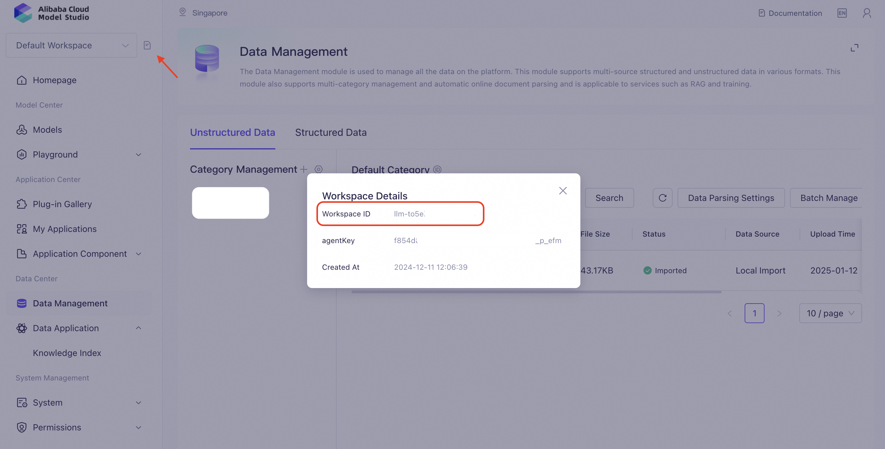
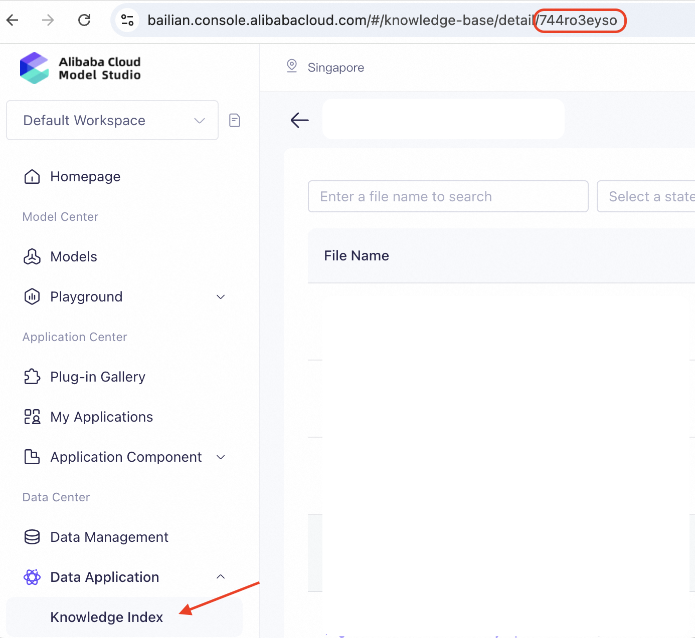
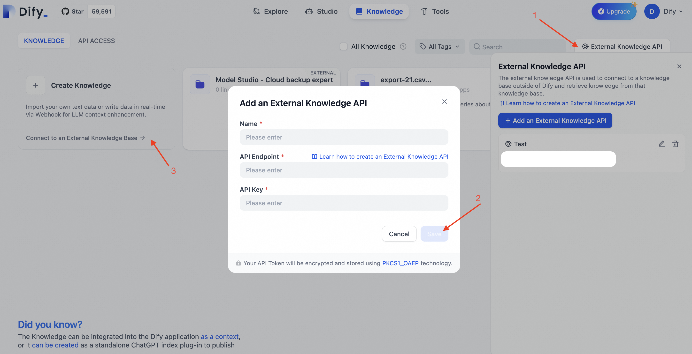
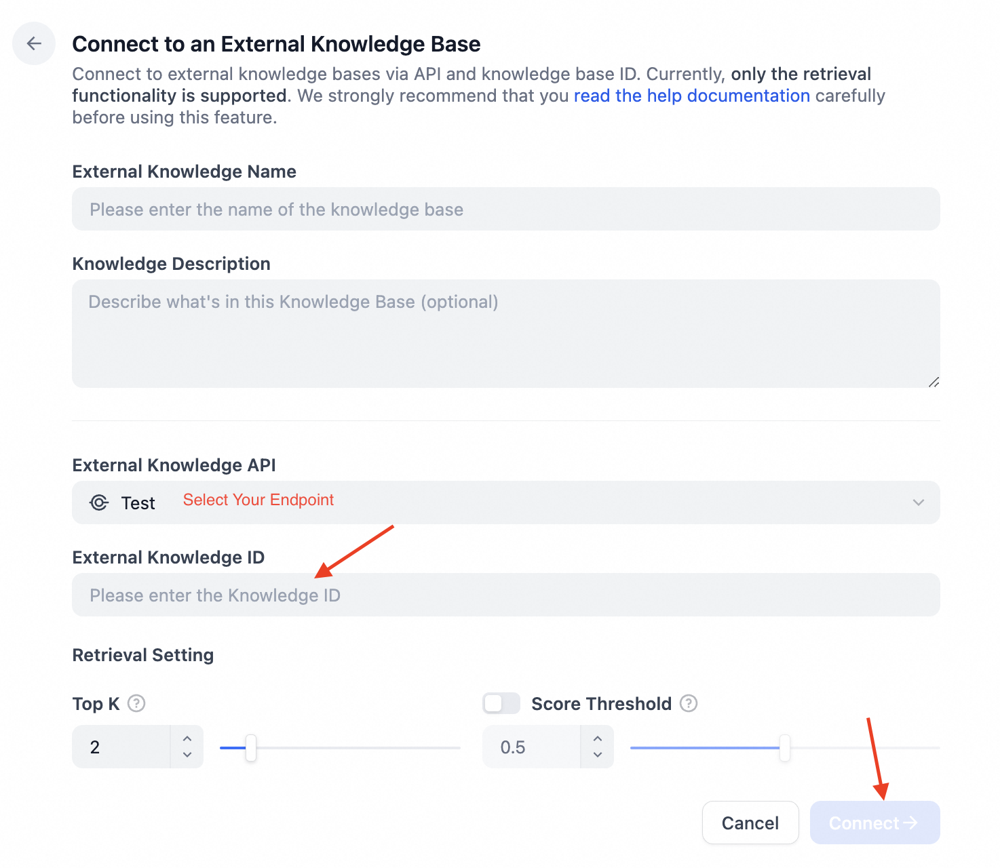
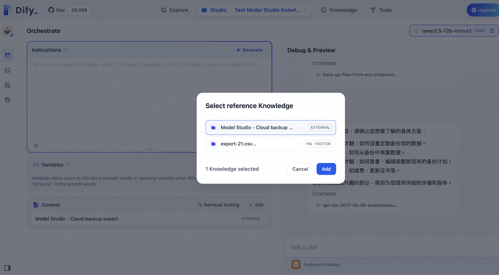

# How to connect with Alibaba Cloud Model Studio Knowledge Base？

This article will briefly introduce how to connect the Dify platform with the Alibaba Cloud Model Studio knowledge base through the [external knowledge base API](https://docs.dify.ai/guides/knowledge-base/external-knowledge-api-documentation), so that AI applications in the Dify platform can directly obtain content stored in the Alibaba Cloud Model Studio knowledge base and expand new information source channels.

### Pre-preparation

* Alibaba Cloud Model Studio Activated
* Alibaba Cloud Model Studio RAM user (Optional but Recommended)
* Dify SaaS Service / Dify Community Version
* Backend API Development Basics

### 1. Register and Create Alibaba Cloud Model Studio Knowledge Base

Visit [Alibaba Cloud Model Studio](https://bailian.console.alibabacloud.com/) and create the Knowledge Index.

[Click to check how to create Alibaba Cloud Model Studio Knowledge Index](https://www.alibabacloud.com/help/en/model-studio/use-cases/quickly-build-rag-applications-with-low-code?spm=a2c63.p38356.help-menu-2400256.d_2_1.1d2927c18ode39#xTtOH)

### 1.1 (Recommended) Create RAM User / RAM Role for Model Studio API call

[Click to check how to create ram user and assign to workspace](https://www.alibabacloud.com/help/en/model-studio/user-guide/user-management?spm=a2c63.p38356.help-menu-2400256.d_1_5_1_0.710e6c32r7yPOO)

and create AccessKey AccessSecret for later API use.

### 2. Build the Backend API Service

The Dify platform cannot directly connect to Alibaba Cloud Model Studio Knowledge Base. The developer needs to refer to Dify's [API definition](../../guides/knowledge-base/external-knowledge-api-documentation.md) on external knowledge base connection, manually create the backend API service, and establish a connection with Alibaba Cloud Model Studio.

You can refer to the following 2 demo code or check out
[Model studio Retrieve API definition](https://www.alibabacloud.com/help/en/model-studio/developer-reference/api-bailian-2023-12-29-retrieve?spm=a2c63.p38356.help-menu-search-2400256.d_0)

`app.py`

```python
from flask import Flask
from flask import request
from flask_restful import Resource, reqparse

from bailian_client import make_open_api_query

app = Flask(__name__)

@app.route('/retrieval', methods=['POST'])
def post():
        parser = reqparse.RequestParser()
        parser.add_argument("retrieval_setting", nullable=False, required=True, type=dict, location="json")
        parser.add_argument("query", nullable=False, required=True, type=str,)
        parser.add_argument("knowledge_id", nullable=False, required=True, type=str)
        args = parser.parse_args()

        # add your parameter validation check here
        # add your auth here

        return make_open_api_query(args["retrieval_setting"], args["query"], args["knowledge_id"])
```

`bailian_client.py`

```python
import os

from alibabacloud_tea_openapi import models as open_api_models
from alibabacloud_tea_openapi.client import Client as OpenApiClient
from alibabacloud_tea_util import models as util_models
from alibabacloud_tea_util.client import Client as UtilClient
from alibabacloud_openapi_util.client import Client as OpenApiUtilClient

def create_open_api_client() -> OpenApiClient:
    config = open_api_models.Config(
        access_key_id=os.environ['ALIBABA_CLOUD_ACCESS_KEY_ID'],
        access_key_secret=os.environ['ALIBABA_CLOUD_ACCESS_KEY_SECRET']
    )
    config.endpoint = os.environ['ENDPOINT']
    return OpenApiClient(config)


def create_api_info(
    workspace_id: str,
) -> open_api_models.Params:
    params = open_api_models.Params(
        action='Retrieve',
        version='2023-12-29',
        protocol='HTTPS',
        method='POST',
        auth_type='AK',
        style='ROA',
        pathname=f'/{workspace_id}/index/retrieve',
        req_body_type='json',
        body_type='json'
    )
    return params

def make_open_api_query(retrieval_setting: dict, query: str, knowledge_id: str):
    client = create_open_api_client()
    params = create_api_info(os.environ["MODEL_STUDIO_WORKSPACE_ID"])
    queries = {}
    if retrieval_setting.get("top_k", None) != None:
        queries['DenseSimilarityTopK'] = retrieval_setting.get("top_k")
    queries['Query'] = query
    queries['IndexId'] = knowledge_id
    runtime = util_models.RuntimeOptions()
    request = open_api_models.OpenApiRequest(
        query=OpenApiUtilClient.query(queries)
    )
    response = client.call_api(params, request, runtime)
    nodes = response["body"]["Data"]["Nodes"]
    results = []
    for node in nodes:
        if node.get("Score") > retrieval_setting.get("score_threshold", .0):
            result = {
                "metadata": node.get("Metadata"),
                "score": node.get("Score"),
                "title": node.get("Metadata").get("doc_name"),
                "content": node.get("Text"),
            }
            results.append(result)
    return {
        "records": results
    }
```

During the process, you can construct the API endpoint address and the API Key for authentication and use them for the next connections.

### 3. Get the Alibaba Cloud Model Studio Workspace ID & Knowledge Base ID

After log in to the Alibaba Cloud Model Studio, you will find the workspace ID on the left top document icon button. And the knowledge base ID can be found on the url after you click DataManagement -> Knowledge Base.

<figure><figcaption><p>Get the Alibaba Cloud Model Studio Workspace ID</p></figcaption></figure>

<figure><figcaption><p>Get the Alibaba Cloud Model Studio Knowledge Base ID</p></figcaption></figure>

### 4. Associate the External Knowledge API

Go to the **"Knowledge"** page in the Dify platform, click **"External Knowledge API"** in the upper right corner, and tap **"Add an External Knowledge API"**.

Follow the prompts on the page and fill in the following information:

* The name of the knowledge base. Custom names are allowed to distinguish different external knowledge APIs connected to the Dify platform;
* API endpoint address, the connection address of the external knowledge base, which can be customized in [Step 2](how-to-connect-aws-bedrock.md#id-2.build-the-backend-api-service). Example: `api-endpoint/retrieval`;
* API Key, the external knowledge base connection key, which can be customized in [Step 2](how-to-connect-aws-bedrock.md#id-2.build-the-backend-api-service).

<figure><figcaption></figcaption></figure>

### 5. Connect to External Knowledge Base

Go to the **“Knowledge** page, click **“Connect to an External Knowledge Base”** below the add knowledge base card to jump to the parameter configuration page.

Fill in the following parameters:

* **Knowledge base name and description**
* **External knowledge base API**

Select the external knowledge base API associated in Step 4.
* **External knowledge base ID**

Fill in the Alibaba Cloud Model Studio knowledge base ID obtained in Step 3.
* **Adjust recall settings**

**Top K:** When a user asks a question, the external knowledge API will be requested to obtain the most relevant content chunks. This parameter is used to filter text chunks with high similarity to user questions. The default value is 3. The higher the value, the more relevant text chunks will be recalled.

**Score threshold:** The similarity threshold for text chunk filtering. Only text chunks with a score exceeding the set score will be recalled. The default value is 0.5. The higher the value, the higher the similarity required between the text and the question, the smaller the number of texts expected to be recalled, and the more accurate the result will be.

<figure><figcaption></figcaption></figure>

After the settings are completed, you can establish a connection with the external knowledge base API.

### 6. Test External Knowledge Base Connection and Retrieval

After establishing a connection with an external knowledge base, user can select the external knowledge after create an application. Select Context and add the new knowledge base to the context.

<figure><figcaption><p>Test the connection and retrieval of the external knowledge base</p></figcaption></figure>
