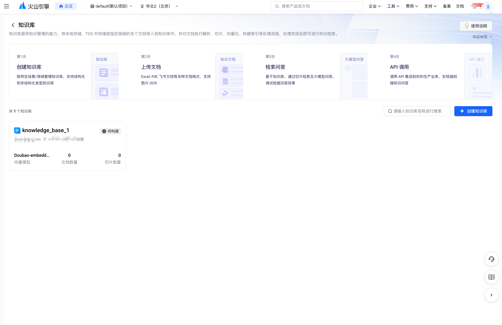
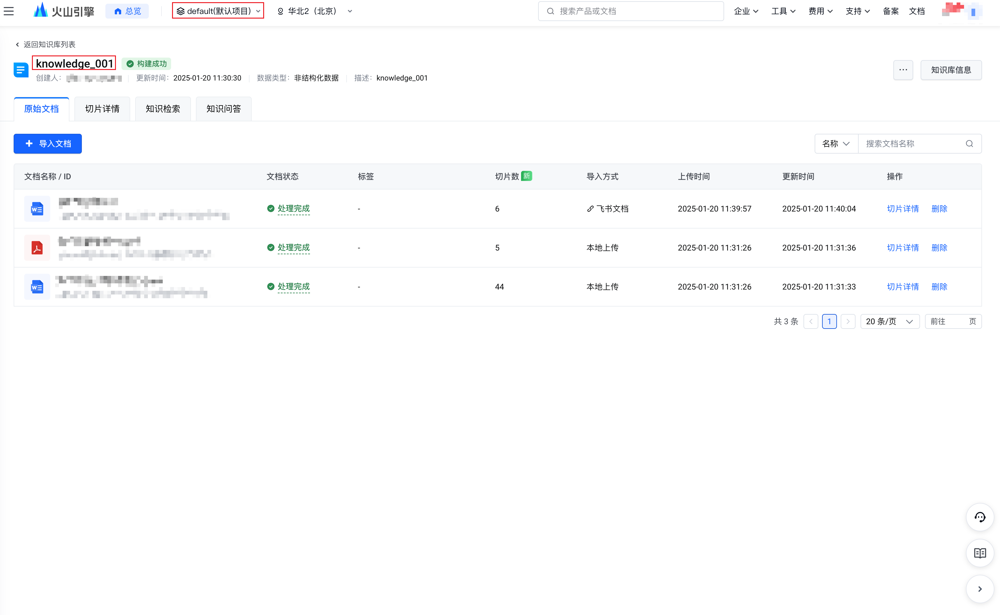
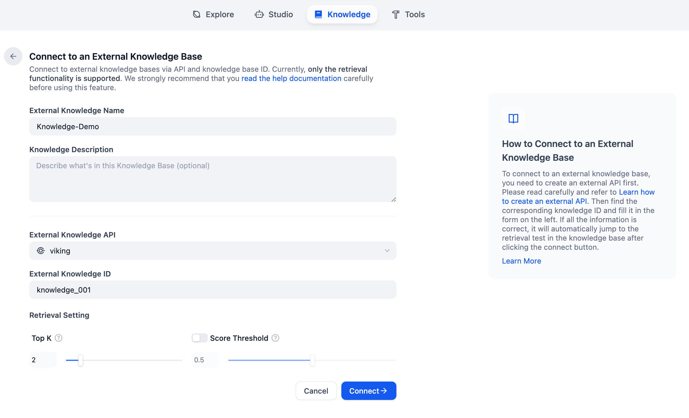
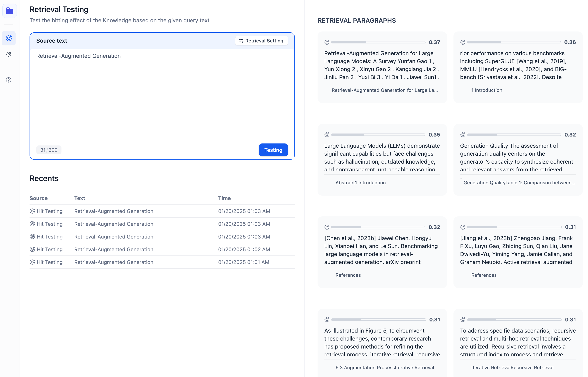
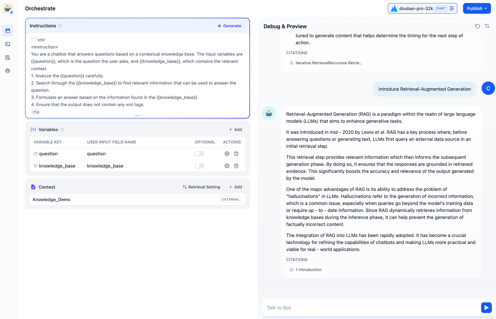

# How to connect to the Volcano VikingDB knowledge base?

In the digital era, data integration is crucial for enhancing the effectiveness of AI applications. This article will detail how to use external knowledge base APIs to connect the Dify platform and the Volcano VikingDB knowledge base. After the connection is completed, the Dify platform's AI applications can quickly access the rich content in the Volcano VikingDB knowledge base, broaden their information sources, and help them achieve significant improvements in smart services.

### Preparation

### 1. Register and Create VikingDB Knowledge Base
Visit [VolcanoEngine](https://www.volcengine.com/) and login，enter the [VikingDB Knowledge](https://console.volcengine.com/vikingdb/knowledge/region:vdb-knowledge+cn-beijing)
<figure><figcaption><p>Create Volcano VikingDB Knowledge</p></figcaption></figure>

### 2. Build the Backend API Service

The [search interface](https://www.volcengine.com/docs/84313/1350012) provided by the Volcano VikingDB knowledge base and the [external database API definition](../../guides/knowledge-base/external-knowledge-api-documentation.md) defined by Dify are not fully compatible. The development team needs to manually maintain the API service, wrap the search interface provided by the Volcano VikingDB knowledge base, and then establish a connection with Dify.

##### API Comparison and Mapping
###### Request Body Elements

| Dify Property | VikingDB Property | Required | Type | Description | Example value |
|---------------|-------------------|----------|------|-------------|---------------|
| knowledge_id | name | TRUE | string | Your knowledge's unique ID | AAA-BBB-CCC |
| query | query | TRUE | string | User's query | What is Dify? |
| retrieval_setting | --- | TRUE | object | Knowledge's retrieval parameters | See below |

The `retrieval_setting` property is an object containing the following keys:

| Dify Property | VikingDB Property | Required | Type | Description | Example value |
|---------------|-------------------|----------|------|-------------|---------------|
| top_k | limit | TRUE | int | Maximum number of retrieved results | 5 |
| score_threshold | --- | TRUE | float | The score limit of relevance of the result to the query, scope: 0~1 | 0.5 |
> The VikingDB knowledge base retrieval interface does not have a score_threshold parameter. The returned slices are sorted in descending order by score. To adapt to the Dify protocol, manual filtering is required.

###### Response Elements

| Dify Property | VikingDB Property | Required | Type | Description | Example value |
|------|---|-------|------|------|--------|
| records | data.result_list | TRUE | List[Object] | A list of records from querying the knowledge base. | See below |

The `records` property is a list object containing the following keys:

| Dify Property | VikingDB Property | Required | Type | Description | Example value |
|------|---|-------|------|------|--------|
| content | content | TRUE | string | Contains a chunk of text from a data source in the knowledge base. | Dify:The Innovation Engine for GenAI Applications |
| score | score | TRUE | float | The score of relevance of the result to the query, scope: 0~1 | 0.5 |
| title | chunk_title | TRUE | string | Document title | Dify Introduction |
| metadata | doc_info | FALSE | json | Contains metadata attributes and their values for the document in the data source. | See example |
> The slice returned by the VikingDB retrieval interface contains the slice title and the original text title. The field corresponding to the slice title is chunk_title, and the field corresponding to the original document title is the title field in the doc_info metadata.

You can refer to the following 2 demo code.

`knowledge.py`

```python
from flask import request
from flask_restful import Resource, reqparse

from bedrock.knowledge_service import ExternalDatasetService


class BedrockRetrievalApi(Resource):
    # url : <your-endpoint>/retrieval
    def post(self):
        parser = reqparse.RequestParser()
        parser.add_argument("retrieval_setting", nullable=False, required=True, type=dict, location="json")
        parser.add_argument("query", nullable=False, required=True, type=str,)
        parser.add_argument("knowledge_id", nullable=False, required=True, type=str)
        args = parser.parse_args()

        # Authorization check
        auth_header = request.headers.get("Authorization")
        if " " not in auth_header:
            return {
                "error_code": 1001,
                "error_msg": "Invalid Authorization header format. Expected 'Bearer <api-key>' format."
            }, 403
        auth_scheme, auth_token = auth_header.split(None, 1)
        auth_scheme = auth_scheme.lower()
        if auth_scheme != "bearer":
            return {
                "error_code": 1001,
                "error_msg": "Invalid Authorization header format. Expected 'Bearer <api-key>' format."
            }, 403
        if auth_token:
            # process your authorization logic here
            pass

        # Call the knowledge retrieval service
        result = ExternalDatasetService.knowledge_retrieval(
            args["retrieval_setting"], args["query"], args["knowledge_id"]
        )
        return result, 200
```

`knowledge_service.py`
> Volcano VikingDB Knowledge API [Signature authentication method](https://www.volcengine.com/docs/84313/1254485)
> 
> The signature in the result of generating a signature based on the Python SDK.
> Install the Volcano Engine package.: _pip install volcengine_

```python
from volcengine.viking_knowledgebase import VikingKnowledgeBaseService


viking_knowledgebase_service = VikingKnowledgeBaseService(host="api-knowledgebase.mlp.cn-beijing.volces.com", scheme="https", connection_timeout=30, socket_timeout=30)
viking_knowledgebase_service.set_ak("your ak")
viking_knowledgebase_service.set_sk("your sk")

class ExternalDatasetService:
    @staticmethod
    def knowledge_retrieval(retrieval_setting: dict, query: str, knowledge_id: str):
        top_k = retrieval_setting.get("top_k")
        res = viking_knowledgebase_service.search_knowledge(collection_name=knowledge_id, query=query, limit=top_k)
        result_list = res["result_list"]
        if len(result_list) <= top_k:
            top_result = result_list
        else:
            top_result = result_list[:top_k]
        # parse response
        results = []

        for retrieval_result in top_result:
            # filter out results with score less than threshold
            if retrieval_result.get("score") < retrieval_setting.get("score_threshold", .0):
                continue
            result = {
                "metadata": retrieval_result.get("doc_info"),
                "score": retrieval_result.get("score"),
                "title": retrieval_result.get("chunk_title"), # chunk title
                "content": retrieval_result.get("content"),
            }
            results.append(result)
        return {
            "records": results
        }
```
> In this example, the knowledge_id passed by Dify actually serves as the name of the knowledge base in Volcano VikingDB. The default project is "default", and you can adjust the code according to your own needs.

### 3. Get the Volcano VikingDB Knowledge Base ID

Log in to the VikingDB knowledge base and get the name of the knowledge base that has been created. This parameter will be used in [subsequent steps](how-to-connect-vikingdb.md#id-5.-lian-jie-wai-bu-zhi-shi-ku) to connect to the Dify platform.

<figure><figcaption><p>Get the Volcano VikingDB Knowledge Collection Name</p></figcaption></figure>

### 4. Associate the External Knowledge API

Go to the **"Knowledge"** page in the Dify platform, click **"External Knowledge API"** in the upper right corner, and tap **"Add an External Knowledge API"**.

Follow the prompts on the page and fill in the following information:

* The name of the knowledge base. Custom names are allowed to distinguish different external knowledge APIs connected to the Dify platform;
* API endpoint address, the connection address of the external knowledge base, which can be customized in [Step 2](how-to-connect-vikingdb.md#id-2.build-the-backend-api-service). Example: `api-endpoint/retrieval`;
* API Key, the external knowledge base connection key, which can be customized in [Step 2](how-to-connect-vikingdb.md#id-2.build-the-backend-api-service).

<figure><figcaption></figcaption></figure>

### 5. Connect to External Knowledge Base

Go to the **“Knowledge** page, click **“Connect to an External Knowledge Base”** below the add knowledge base card to jump to the parameter configuration page.

<figure><figcaption></figcaption></figure>

Fill in the following parameters:

* **Knowledge base name and description**
* **External knowledge base API**

Select the external knowledge base API associated in Step 4.
* **External knowledge base ID**

Fill in the Volcano VikingDB knowledge base ID obtained in Step 3.
* **Adjust recall settings**

**Top K:** When a user asks a question, the external knowledge API will be requested to obtain the most relevant content chunks. This parameter is used to filter text chunks with high similarity to user questions. The default value is 3. The higher the value, the more relevant text chunks will be recalled.

**Score threshold:** The similarity threshold for text chunk filtering. Only text chunks with a score exceeding the set score will be recalled. The default value is 0.5. The higher the value, the higher the similarity required between the text and the question, the smaller the number of texts expected to be recalled, and the more accurate the result will be.

<figure><figcaption></figcaption></figure>

After the settings are completed, you can establish a connection with the external knowledge base API.


### 6. Test External Knowledge Base Connection and Retrieval

After establishing a connection with an external knowledge base, developers can simulate possible user's question keywords in **"Retrieval Test"** and preview the text chunks retrieval from the Volcano VikingDB Knowledge Base.

<figure><figcaption><p>Test the connection and retrieval of the external knowledge base</p></figcaption></figure>

If you are not satisfied with the recall results, you can try to modify the recall parameters in the code according to the [recall interface](https://www.volcengine.com/docs/84313/1350012). At present, the VikingDB knowledge base has not yet provided an entity concept for solidifying recall parameters (planned in the future).

### 7. Application Case：Doubao Model + VikingDB Knowledge Build a Chat Bot

After setting up the external knowledge base, you can use the Doubao model and the externally built VikingDB knowledge base to build a chatbot in the **“Studio”**.

<figure><figcaption><p>Integrated chatbot</p></figcaption></figure>