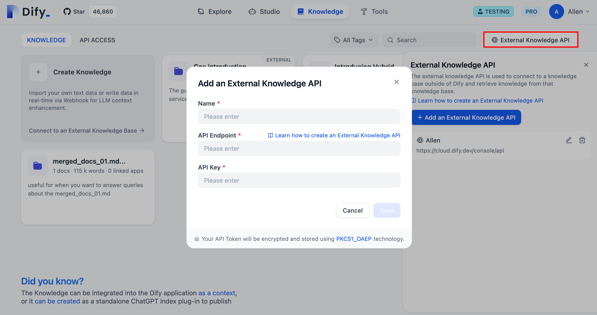
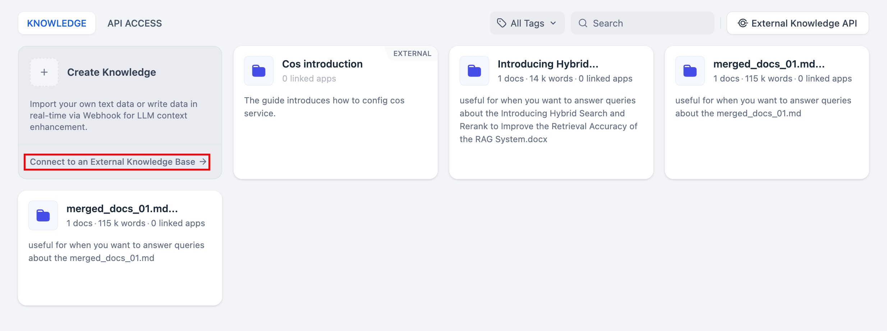
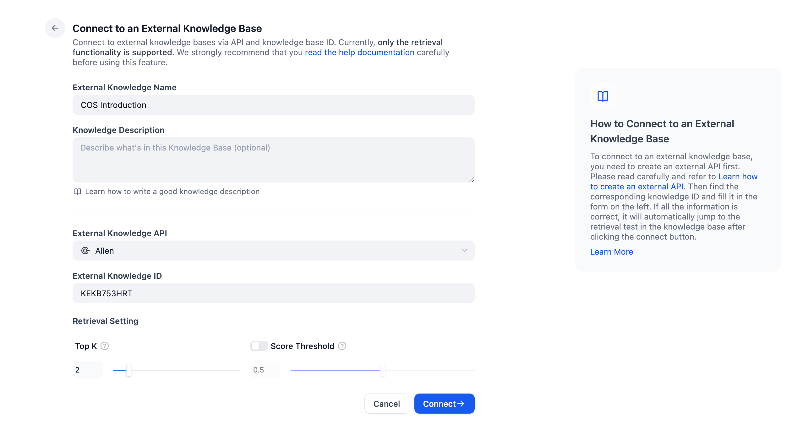
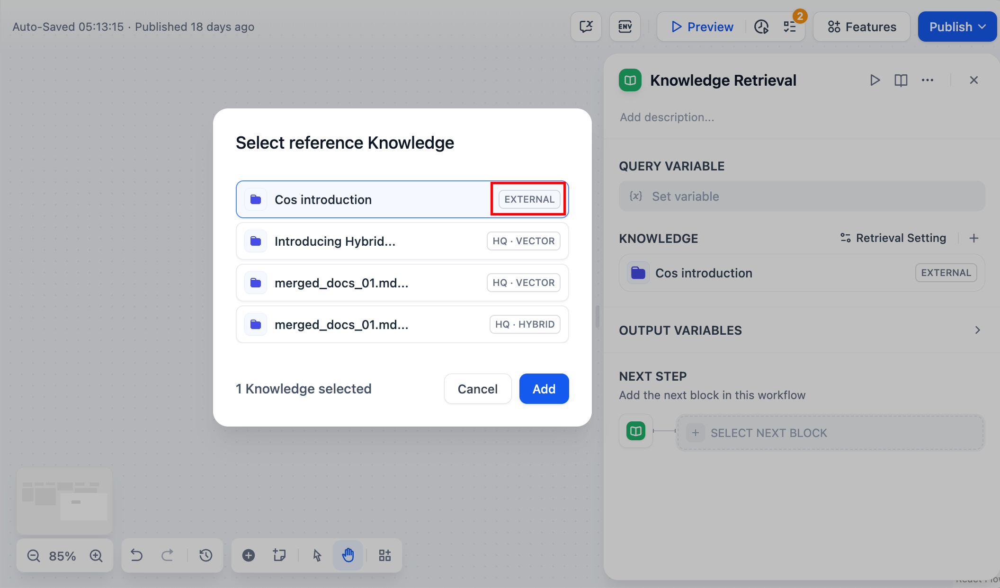
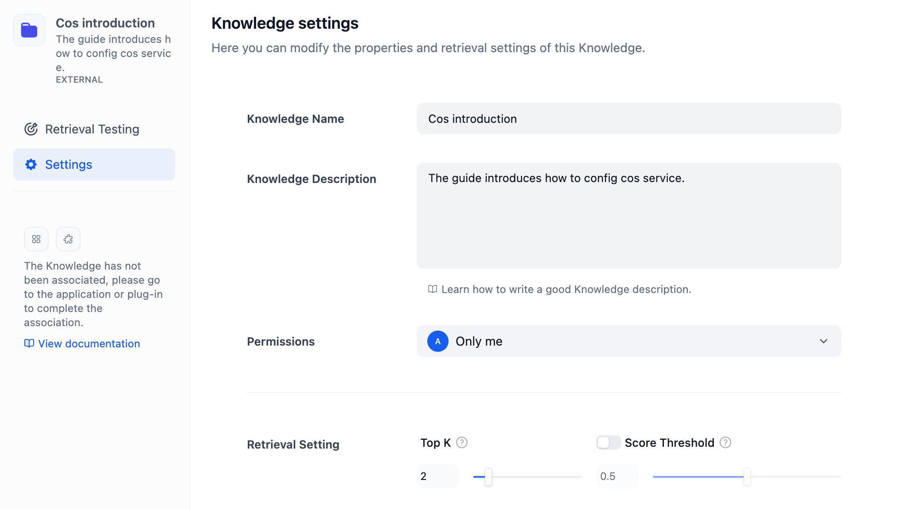

# اتصال به پایگاه دانش خارجی

> برای ایجاد تمایز، پایگاه‌های دانش مستقل از پلتفرم Dify در این مقاله به طور جمعی به عنوان "پایگاه‌های دانش خارجی" نامیده می‌شوند.

## معرفی عملکردی

برای توسعه دهندگانی که نیاز به بازیابی محتوای پیشرفته دارند، **عملکرد پایگاه دانش داخلی و مکانیزم‌های بازیابی متن پلتفرم Dify ممکن است محدودیت‌هایی داشته باشد، به‌ویژه از نظر سفارشی‌سازی نتایج بازیابی.**

به دلیل نیاز به دقت بیشتر در بازیابی و فراخوانی متن، و همچنین نیاز به مدیریت مواد داخلی، برخی از تیم‌های توسعه دهنده تصمیم می‌گیرند به طور مستقل الگوریتم‌های RAG را توسعه دهند و به طور مستقل سیستم‌های بازیابی متن را حفظ کنند، یا به طور یکپارچه محتوای خود را به خدمات پایگاه دانش ارائه دهندگان ابر (مانند [AWS Bedrock](https://aws.amazon.com/bedrock/)).

Dify، به عنوان یک پلتفرم خنثی برای توسعه برنامه‌های LLM، متعهد به ارائه طیف وسیع‌تری از گزینه‌ها به توسعه‌دهندگان است.

ویژگی **اتصال به پایگاه دانش خارجی**، ادغام بین پلتفرم Dify و پایگاه‌های دانش خارجی را امکان‌پذیر می‌سازد. از طریق خدمات API، برنامه‌های هوش مصنوعی می‌توانند به طیف وسیع‌تری از منابع اطلاعاتی دسترسی پیدا کنند. این قابلیت دو مزیت کلیدی ارائه می‌دهد:

* پلتفرم Dify می‌تواند مستقیماً محتوای متنی میزبانی شده در پایگاه دانش ارائه دهنده خدمات ابری را دریافت کند، به طوری که توسعه دهندگان نیازی به انتقال مکرر محتوا به پایگاه دانش در Dify ندارند؛

* پلتفرم Dify می‌تواند مستقیماً محتوای متنی پردازش شده توسط الگوریتم‌ها در پایگاه دانش خود ساخته را دریافت کند. توسعه‌دهندگان فقط نیاز دارند روی مکانیزم بازیابی اطلاعات پایگاه دانش خود ساخته تمرکز کنند و به طور مداوم دقت بازیابی اطلاعات را بهینه و بهبود ببخشند.

<figure><figcaption>
اصل اتصال به پایگاه دانش خارجی
</figcaption></figure>

در اینجا مراحل دقیق برای اتصال به دانش خارجی آورده شده است:

## 1. ایجاد API پایگاه دانش خارجی مطابق با استانداردها

قبل از تنظیم سرویس API، یک API پایگاه دانش خارجی مطابق با استانداردها ایجاد کنید، لطفاً برای اطمینان از ادغام موفقیت‌آمیز پایگاه دانش خارجی شما با Dify به مشخصات [API پایگاه دانش خارجی](external-knowledge-api-documentation.md) Dify مراجعه کنید.

## 2. افزودن API دانش خارجی

> در حال حاضر، هنگام اتصال به پایگاه‌های دانش خارجی، Dify فقط مجوزهای بازیابی را پشتیبانی می‌کند و پشتیبانی از بهینه‌سازی یا اصلاح پایگاه‌های دانش خارجی را پشتیبانی نمی‌کند. توسعه دهندگان باید خودشان پایگاه‌های دانش خارجی را حفظ کنند.

به صفحه **"دانش"** بروید، در گوشه بالا سمت راست روی **"API دانش خارجی"** کلیک کنید، سپس روی **"افزودن API دانش خارجی"** کلیک کنید. اطلاعات زیر را طبق راهنمایی‌های صفحه تکمیل کنید:

* نام نام قابل تنظیم برای تمایز APIهای دانش خارجی مختلف؛
* نقطه انتهایی API URL نقطه انتهایی API پایگاه دانش خارجی، مانند api-endpoint/retrieval؛ برای راهنمایی‌های دقیق به [API دانش خارجی](external-knowledge-api-documentation.md) مراجعه کنید.
* کلید API کلید اتصال برای دانش خارجی، برای راهنمایی‌های دقیق به [API دانش خارجی](external-knowledge-api-documentation.md) مراجعه کنید.

<figure><figcaption>
API دانش خارجی را مرتبط کنید
</figcaption></figure>

## 3. اتصال به پایگاه دانش خارجی

به صفحه **"دانش"** بروید، در زیر کارت افزودن پایگاه دانش، روی **"اتصال به پایگاه دانش خارجی"** کلیک کنید تا مستقیماً به صفحه پیکربندی پارامتر منتقل شوید.

<figure><figcaption>
اتصال به پایگاه دانش خارجی
</figcaption></figure>

پارامترهای زیر را پر کنید:

* **نام و توضیحات پایگاه دانش**
*   **API دانش خارجی**

    API پایگاه دانش خارجی مرتبط در مرحله 2 را انتخاب کنید. Dify محتوای متنی ذخیره شده در پایگاه دانش خارجی را از طریق روش اتصال API فراخوانی خواهد کرد.
*   **شناسه دانش خارجی**

    شناسه خاص پایگاه دانش خارجی را که باید مرتبط باشد، مشخص کنید. برای راهنمایی‌های دقیق به تعریف API پایگاه دانش خارجی مراجعه کنید.
*   **تنظیمات بازیابی**

    **Top K:**  هنگامی که کاربر سوالی می‌فرستد، API دانش خارجی را برای به دست آوردن بخش‌های محتوای بسیار مرتبط درخواست می‌کند. این پارامتر برای فیلتر کردن بخش‌های متنی با شباهت بالا به سوال کاربر استفاده می‌شود. مقدار پیش فرض 3 است. هرچه این مقدار بالاتر باشد، بخش‌های متنی با شباهت‌های مرتبط بیشتری بازیابی می‌شوند.

    **آستانه امتیاز:** آستانه شباهت برای فیلتر کردن بخش‌های متنی، فقط بخش‌های متنی که از امتیاز تنظیم شده فراتر می‌روند را بازیابی می‌کند. مقدار پیش فرض 0.5 است. مقدار بالاتر نشان دهنده الزامات بالاتر برای شباهت بین متن و سوال است، انتظار می‌رود بخش‌های متنی بازیابی شده کمتر باشد و نتایج نسبتاً دقیق‌تر خواهند بود.

<figure><figcaption></figcaption></figure>

## 4. تست پایگاه دانش خارجی و نتایج بازیابی

بعد از اتصال به پایگاه دانش خارجی، توسعه‌دهندگان می‌توانند کلمات کلیدی سوال احتمالی را در **"تست بازیابی"** شبیه‌سازی کنند تا پیش‌نمایش بخش‌های متنی که ممکن است بازیابی شوند را مشاهده کنند. اگر از نتایج بازیابی راضی نیستید، سعی کنید **تنظیمات پایگاه دانش خارجی** را تغییر دهید یا استراتژی بازیابی پایگاه دانش خارجی را تنظیم کنید.

<figure><figcaption>
تست اتصال به پایگاه دانش خارجی و بازیابی
</figcaption></figure>

## 5. ادغام پایگاه دانش خارجی در برنامه‌ها

*   برنامه نوع **چت بات / عامل**

    پایگاه دانش خارجی را در صفحه تنظیمات در برنامه‌های نوع چت بات / عامل مرتبط کنید.

<figure><figcaption>
چت بات / عامل
</figcaption></figure>

*   برنامه نوع **جریان چت / گردش کار**

    یک گره **"بازیابی دانش"** اضافه کنید و پایگاه دانش خارجی را انتخاب کنید.

<figure><figcaption>
جریان چت / گردش کار
</figcaption></figure>

## 6. مدیریت دانش خارجی

به صفحه **"دانش"** بروید، کارت‌های پایگاه دانش خارجی یک برچسب **EXTERNAL** در گوشه بالا سمت راست خواهند داشت. پایگاه دانش مورد نیاز برای تغییر را انتخاب کنید، روی **"تنظیمات"** کلیک کنید تا اطلاعات زیر را تغییر دهید:

* **نام و توضیحات پایگاه دانش**
*   **مجوزها**

    حوزه مجوز **"فقط من"**، **"همه اعضای تیم"**، و **"برخی از اعضای تیم"** را ارائه دهید. افرادی که مجوز ندارند، نمی‌توانند به پایگاه دانش دسترسی داشته باشند. اگر انتخاب می‌کنید که پایگاه دانش را برای سایر اعضا عمومی کنید، به این معنی است که سایر اعضا نیز حق مشاهده، ویرایش و حذف پایگاه دانش را دارند.
*   **تنظیمات بازیابی**

    **Top K:**  هنگامی که کاربر سوالی می‌فرستد، API دانش خارجی را برای به دست آوردن بخش‌های محتوای بسیار مرتبط درخواست می‌کند. این پارامتر برای فیلتر کردن بخش‌های متنی با شباهت بالا به سوال کاربر استفاده می‌شود. مقدار پیش فرض 3 است. هرچه این مقدار بالاتر باشد، بخش‌های متنی با شباهت‌های مرتبط بیشتری بازیابی می‌شوند.

    **آستانه امتیاز:** آستانه شباهت برای فیلتر کردن بخش‌های متنی، فقط بخش‌های متنی که از امتیاز تنظیم شده فراتر می‌روند را بازیابی می‌کند. مقدار پیش فرض 0.5 است. مقدار بالاتر نشان دهنده الزامات بالاتر برای شباهت بین متن و سوال است، انتظار می‌رود بخش‌های متنی بازیابی شده کمتر باشد و نتایج نسبتاً دقیق‌تر خواهند بود.

**"API دانش خارجی"** و **"شناسه دانش خارجی"** مرتبط با پایگاه دانش خارجی از تغییر پشتیبانی نمی‌کنند. اگر نیاز به تغییر دارید، لطفاً یک **"API دانش خارجی"** جدید را مرتبط کنید و آن را تنظیم مجدد کنید.

<figure><figcaption></figcaption></figure>

### مثال اتصال

[چگونه به پایگاه دانش AWS Bedrock متصل شویم؟](../../learn-more/use-cases/how-to-connect-aws-bedrock.md "mention")

## سوالات متداول

**چگونه خطاهایی که هنگام اتصال به API دانش خارجی رخ می‌دهند را برطرف کنیم؟**

راه حل‌های مربوط به هر کد خطا در اطلاعات برگشتی:

| کد خطا | نتیجه                              | راه حل‌ها                                                   |
| ---------- | ----------------------------------- | ----------------------------------------------------------- |
| 1001       | فرمت هدر تأیید اعتبار نامعتبر     | لطفاً فرمت هدر تأیید اعتبار درخواست را بررسی کنید        |
| 1002       | تأیید اعتبار ناموفق                | لطفاً بررسی کنید که آیا کلید API وارد شده صحیح است.    |
| 2001       | دانش وجود ندارد                     | لطفاً مخزن خارجی را بررسی کنید                         |

