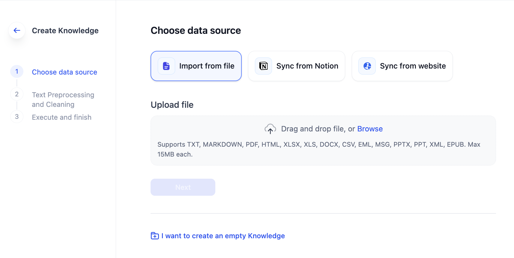
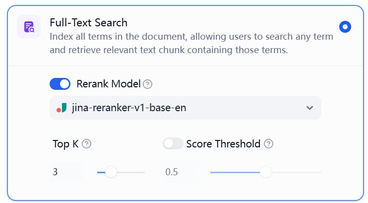

# پایگاه دانش و آپلود اسناد را ایجاد کنید

**مراحل آپلود اسناد در پایگاه دانش:**

1. سند مورد نظر خود را از فایل‌های محلی انتخاب کنید.
2. سند را قطعه بندی و پاکسازی کنید و پیش نمایش تأثیر آن را مشاهده کنید.
3. حالت نمایه سازی و تنظیمات بازیابی را انتخاب و پیکربندی کنید.
4. منتظر بمانید تا قطعات تعبیه شوند.
5. آپلود کامل شد، اکنون می‌توانید از آن در برنامه‌های خود استفاده کنید 🎉

### 1 ایجاد پایگاه دانش

در نوار ناوبری اصلی Dify، روی Knowledge کلیک کنید. در این صفحه می‌توانید پایگاه‌های دانش موجود خود را مشاهده کنید. برای ورود به راهنمای تنظیم، روی **ایجاد دانش** کلیک کنید:

*  فایل‌ها را برای آپلود بکشید و رها کنید یا آن‌ها را انتخاب کنید. تعداد فایل‌های مجاز برای آپلود دسته ای به [برنامه اشتراک](https://dify.ai/pricing) شما بستگی دارد.
* اگر هنوز هیچ سندی آماده نکرده اید، ابتدا می‌توانید یک پایگاه دانش خالی ایجاد کنید.
* هنگام ایجاد پایگاه دانش با منبع داده خارجی (مانند Notion یا همگام سازی از وب سایت)، نوع پایگاه دانش ثابت می‌شود. این محدودیت از پیچیدگی‌های مدیریتی که ممکن است از چندین منبع داده در یک پایگاه دانش واحد ایجاد شود، جلوگیری می‌کند.

    برای سناریوهایی که نیاز به چندین منبع داده دارند، توصیه می‌کنیم پایگاه‌های دانش جداگانه ای برای هر منبع ایجاد کنید. سپس می‌توانید از ویژگی [بازیابی چندگانه](integrate-knowledge-within-application.md) برای ارجاع به چندین پایگاه دانش در یک برنامه استفاده کنید.

**محدودیت‌های آپلود اسناد:**

* حد مجاز اندازه آپلود برای هر سند 15 مگابایت است.
* [برنامه‌های اشتراک](https://dify.ai/pricing) مختلف برای نسخه SaaS **تعداد آپلود دسته ای، کل آپلود اسناد و ذخیره سازی برداری** را محدود می‌کنند.

<figure><figcaption>
ایجاد پایگاه دانش
</figcaption></figure>

***

### 2 پیش پردازش و پاکسازی متن

پس از آپلود محتوا در پایگاه دانش، باید تحت قطعه بندی و پاکسازی داده قرار گیرد. این مرحله را می‌توان به عنوان پیش پردازش و ساختاردهی محتوا درک کرد.

قطعه بندی و پاکسازی متن چیست؟

**قطعه بندی**: LLMs پنجره متن محدودی دارند، معمولا نیاز به تقسیم کل متن و سپس یادآوری مرتبط ترین بخش‌ها به سوال کاربر، که به عنوان حالت یادآوری TopK segment شناخته می‌شود. علاوه بر این، اندازه بخش مناسب به تطبیق مرتبط ترین محتوای متنی و کاهش نویز اطلاعات هنگام تطبیق معنایی سوالات کاربر با بخش‌های متنی کمک می‌کند.

**پاکسازی**: برای اطمینان از کیفیت یادآوری متن، معمولا قبل از ارسال به مدل، پاکسازی داده ضروری است. به عنوان مثال، کاراکترهای ناخواسته یا خطوط خالی در خروجی ممکن است بر کیفیت پاسخ تأثیر بگذارد. برای کمک به کاربران برای حل این مشکل، Dify روش‌های مختلفی برای پاکسازی ارائه می‌دهد تا به پاکسازی خروجی قبل از ارسال آن به برنامه‌های پایین دستی کمک کند، [ETL](create-knowledge-and-upload-documents.md#optional-etl-configuration) را بررسی کنید تا جزئیات بیشتری بدانید.

دو استراتژی پشتیبانی می شوند:

* حالت خودکار
* حالت سفارشی



#### خودکار

حالت خودکار برای کاربرانی طراحی شده است که با تکنیک‌های قطعه بندی و پیش پردازش آشنایی ندارند. در این حالت، Dify به طور خودکار فایل‌های محتوایی را قطعه بندی و پاکسازی می‌کند و فرآیند آماده سازی سند را ساده می‌کند.

<figure><figcaption>
حالت خودکار
</figcaption></figure>



#### سفارشی

حالت سفارشی برای کاربران پیشرفته با نیازهای خاص پردازش متن مناسب است. این حالت به پیکربندی دستی قوانین قطعه بندی و استراتژی‌های پاکسازی براساس قالب‌های سند و تقاضای سناریوهای مختلف اجازه می‌دهد.

**قوانین قطعه بندی:**

1. **جداساز**: یک جداساز برای قطعه بندی متن مشخص کنید. به عنوان مثال، `\n` (کاراکتر خط جدید در [regex](https://regexr.com/)) متن را در هر خط شکسته تقسیم می‌کند.
2. **حداکثر طول قطعه**: حداکثر تعداد کاراکتر در هر بخش را تنظیم کنید. بخش‌هایی که از این حد مجاز بیشتر هستند، به زور تقسیم می‌شوند. حداکثر طول برای یک بخش 4000 توکن است.
3. **پوشش قطعه**: همپوشانی بین بخش‌های مجاور را تعریف کنید. این همپوشانی حفظ اطلاعات و دقت تجزیه و تحلیل را افزایش می‌دهد و کارایی یادآوری را بهبود می‌بخشد. تنظیم توصیه شده 10-25٪ از طول بخش به توکن است.

**قوانین پیش پردازش متن**: این قوانین به فیلتر کردن محتوای غیر مهم از پایگاه دانش کمک می‌کنند.

* جایگزینی فضاهای پی در پی، خطوط جدید و تب‌ها.
* حذف تمام URLها و آدرس‌های ایمیل.

<figure><figcaption>
حالت سفارشی
</figcaption></figure>



***

### 3 حالت نمایه سازی

شما باید **روش نمایه سازی** را برای متن انتخاب کنید تا روش تطبیق داده را مشخص کنید. استراتژی نمایه سازی اغلب به روش بازیابی مربوط می‌شود و شما باید [تنظیمات بازیابی](create-knowledge-and-upload-documents.md#id-4-retrieval-settings) مناسب را با توجه به سناریو انتخاب کنید.

* **حالت با کیفیت بالا**
* **حالت اقتصادی**
* **حالت سوال و جواب**



در حالت با کیفیت بالا، سیستم ابتدا از یک مدل تعبیه قابل تنظیم (که قابل تعویض است) برای تبدیل متن قطعه به بردارهای عددی استفاده می‌کند. این فرآیند به فشرده سازی کارآمد و ذخیره سازی پایدار داده‌های متنی در مقیاس بزرگ کمک می‌کند و در عین حال دقت تعاملات کاربر-LLM را افزایش می‌دهد.

روش نمایه سازی با کیفیت بالا سه تنظیم بازیابی ارائه می‌دهد: بازیابی برداری، بازیابی متن کامل و بازیابی ترکیبی. برای اطلاعات بیشتر در مورد تنظیمات بازیابی، لطفا [“تنظیمات بازیابی”](create-knowledge-and-upload-documents.md#id-4-retrieval-settings) را بررسی کنید.

<figure><figcaption>
با کیفیت بالا
</figcaption></figure>



این حالت از یک موتور برداری آفلاین و نمایه سازی کلمات کلیدی استفاده می‌کند که دقت را کاهش می‌دهد اما مصرف توکن اضافی و هزینه‌های مرتبط را از بین می‌برد. روش نمایه سازی به نمایه سازی معکوس محدود شده است. برای مشخصات دقیق، لطفا به بخش زیر مراجعه کنید.

<figure><figcaption>
حالت اقتصادی
</figcaption></figure>



هنگامی که اسناد به پایگاه دانش آپلود می‌شوند، سیستم متن را قطعه بندی می‌کند و از طریق خلاصه سازی جفت‌های سوال و جواب را برای هر قطعه تولید می‌کند. برخلاف استراتژی "Q to P" (سوال به پاراگراف) که در حالت‌های با کیفیت بالا و اقتصادی به کار گرفته می‌شود، حالت QA از رویکرد "Q to Q" (سوال به سوال) استفاده می‌کند.

این روش **به دلیل اینکه متن‌های سوال معمولا ساختارهای دستوری کامل را در زبان طبیعی نشان می‌دهند**، ارجحیت دارد. الگوی تطبیق Q to Q، درک و تطبیق بخش‌های واضح‌تر را تسهیل می‌کند و همچنین سناریوهایی را در بر می‌گیرد که شامل پرس و جوهای پرکاربرد و بسیار مشابه هستند.

پس از سوال کاربر، سیستم سوال مشابه ترین از نظر معنایی را شناسایی می‌کند و بخش متنی مربوطه را به عنوان پاسخ برمی‌گرداند. این روش دقت را افزایش می‌دهد، زیرا به طور مستقیم با پرس و جوهای کاربر مطابقت دارد و در نتیجه اطلاعات مورد نیاز کاربران را به طور دقیقتر بازیابی می‌کند.

<figure><figcaption>
متون خلاصه شده در چندین جفت Q&#x26;A در حالت بخش QA
</figcaption></figure>

<figure><figcaption>
تفاوت بین حالت‌های نمایه سازی Q to P و Q to Q
</figcaption></figure>



***

### 4 تنظیمات بازیابی

در حالت نمایه سازی با کیفیت بالا، Dify سه تنظیم بازیابی ارائه می‌دهد:

* **جستجوی برداری**
* **جستجوی متن کامل**
* **جستجوی ترکیبی**



#### جستجوی برداری

**تعریف**: سیستم پرس و جو ورودی کاربر را به بردار برای تولید یک بردار پرس و جو تبدیل می‌کند. سپس فاصله بین این بردار پرس و جو و بردارهای متنی در پایگاه دانش را برای شناسایی مرتبط ترین بخش‌های متنی محاسبه می‌کند.

<figure><figcaption>
تنظیمات جستجوی برداری
</figcaption></figure>

**تنظیمات جستجوی برداری：**

**مدل رتبه بندی**: پس از پیکربندی کلید API برای مدل رتبه بندی در صفحه "ارائه دهنده مدل"، می‌توانید "مدل رتبه بندی" را در تنظیمات بازیابی فعال کنید. سپس سیستم پس از بازیابی ترکیبی، مرتب سازی معنایی نتایج سند بازیابی شده را انجام می‌دهد و نتایج رتبه بندی را بهینه‌سازی می‌کند. پس از ایجاد مدل رتبه بندی، تنظیمات TopK و Score Threshold فقط در مرحله رتبه بندی اعمال می‌شوند.

**TopK**: این پارامتر بخش‌های متنی را فیلتر می‌کند که شباهت بیشتری به سوال کاربر دارند. سیستم تعداد اسنیپت‌ها را براساس اندازه پنجره متن مدل انتخاب شده به طور پویا تنظیم می‌کند. مقدار پیش فرض 3 است، به این معنی که مقدار بالاتر منجر به بازیابی بخش‌های متنی بیشتر می‌شود.

**آستانه امتیاز**: این پارامتر آستانه شباهت را برای فیلتر کردن بخش‌های متنی تنظیم می‌کند. فقط بخش‌های متنی که از امتیاز مشخص شده فراتر می‌روند، یادآوری می‌شوند. به طور پیش فرض، این تنظیم غیرفعال است، به این معنی که هیچ فیلتر کردن ارزشی برای بخش‌های متنی یادآوری شده وجود نخواهد داشت. در صورت فعال شدن، مقدار پیش فرض 0.5 است. مقدار بالاتر به احتمال زیاد منجر به بازیابی متون کمتر می‌شود.

> تنظیمات TopK و Score فقط در مرحله رتبه بندی موثر هستند. بنابراین، برای اعمال هر یک از این تنظیمات، لازم است که یک مدل رتبه بندی اضافه و فعال کنید.



#### جستجوی متن کامل

**تعریف:** نمایه سازی تمام اصطلاحات در سند، به کاربران اجازه می‌دهد تا هر اصطلاحی را پرس و جو کنند و بخش‌های متنی حاوی آن اصطلاحات را برگردانند.

<figure><figcaption>
تنظیمات جستجوی متن کامل
</figcaption></figure>

**مدل رتبه بندی**: پس از پیکربندی کلید API برای مدل رتبه بندی در صفحه "ارائه دهنده مدل"، می‌توانید "مدل رتبه بندی" را در تنظیمات بازیابی فعال کنید. سپس سیستم پس از بازیابی ترکیبی، مرتب سازی معنایی نتایج سند بازیابی شده را انجام می‌دهد و نتایج رتبه بندی را بهینه‌سازی می‌کند. پس از ایجاد مدل رتبه بندی، تنظیمات TopK و Score Threshold فقط در مرحله رتبه بندی اعمال می‌شوند.

**TopK**: این پارامتر بخش‌های متنی را فیلتر می‌کند که شباهت بیشتری به سوال کاربر دارند. سیستم تعداد اسنیپت‌ها را براساس اندازه پنجره متن مدل انتخاب شده به طور پویا تنظیم می‌کند. مقدار پیش فرض 3 است، به این معنی که مقدار بالاتر منجر به بازیابی بخش‌های متنی بیشتر می‌شود.

**آستانه امتیاز**: این پارامتر آستانه شباهت را برای فیلتر کردن بخش‌های متنی تنظیم می‌کند. فقط بخش‌های متنی که از امتیاز مشخص شده فراتر می‌روند، یادآوری می‌شوند. به طور پیش فرض، این تنظیم غیرفعال است، به این معنی که هیچ فیلتر کردن ارزشی برای بخش‌های متنی یادآوری شده وجود نخواهد داشت. در صورت فعال شدن، مقدار پیش فرض 0.5 است. مقدار بالاتر به احتمال زیاد منجر به بازیابی متون کمتر می‌شود.

> تنظیمات TopK و Score فقط در مرحله رتبه بندی موثر هستند. بنابراین، برای اعمال هر یک از این تنظیمات، لازم است که یک مدل رتبه بندی اضافه و فعال کنید.



#### **جستجوی ترکیبی**

**تعریف:** این فرآیند همزمان جستجوی متن کامل و جستجوی برداری را انجام می‌دهد و شامل یک مرحله مرتب سازی مجدد برای انتخاب بهترین نتایج است که با پرس و جو کاربر از هر دو نوع نتیجه جستجو مطابقت دارد. در این حالت، کاربران می‌توانند بدون نیاز به پیکربندی API مدل رتبه بندی، "تنظیمات وزن" را مشخص کنند یا می‌توانند برای بازیابی، یک مدل رتبه بندی را انتخاب کنند.

<figure><figcaption>
تنظیمات بازیابی ترکیبی
</figcaption></figure>

**تنظیمات وزن**: این ویژگی به کاربران اجازه می‌دهد تا وزن‌های سفارشی را برای اولویت معنایی و اولویت کلمات کلیدی تنظیم کنند. جستجوی کلمات کلیدی به معنای انجام جستجوی متن کامل در پایگاه دانش است، در حالی که جستجوی معنایی شامل جستجوی برداری در پایگاه دانش است.

* **ارزش معنایی 1**

این حالت فقط حالت جستجوی معنایی را فعال می‌کند. با استفاده از مدل‌های تعبیه، حتی اگر اصطلاحات دقیق از پرس و جو در پایگاه دانش ظاهر نشوند، جستجو می‌تواند با محاسبه فاصله بردارها، در عمق بیشتری جستجو کند و در نتیجه محتوای مرتبط را برگرداند. علاوه بر این، هنگام برخورد با محتوای چند زبانه، جستجوی معنایی می‌تواند معنای را در زبان‌های مختلف درک کند و نتایج جستجوی دقیق‌تر بین زبانی را ارائه دهد.

* **ارزش کلمات کلیدی 1**

این حالت فقط حالت جستجوی کلمات کلیدی را فعال می‌کند. این حالت تطابق کامل را با متن ورودی در پایگاه دانش انجام می‌دهد که برای سناریوهایی که کاربر اطلاعات یا اصطلاحات دقیق را می‌شناسد، مناسب است. این رویکرد از منابع محاسباتی کمتری استفاده می‌کند و برای جستجوهای سریع در یک پایگاه دانش سند بزرگ ایده‌آل است.

* **وزن‌های سفارشی کلمات کلیدی و معنایی**

علاوه بر فعال کردن فقط جستجوی معنایی یا جستجوی کلمات کلیدی، تنظیمات وزن سفارشی انعطاف پذیری را ارائه می‌دهیم. می‌توانید به طور مداوم وزن‌های دو روش را تنظیم کنید تا نسبت وزنی بهینه را پیدا کنید که با سناریو تجاری شما مطابقت دارد.

***

**مدل رتبه بندی**: پس از پیکربندی کلید API برای مدل رتبه بندی در صفحه "ارائه دهنده مدل"، می‌توانید "مدل رتبه بندی" را در تنظیمات بازیابی فعال کنید. سپس سیستم پس از بازیابی ترکیبی، مرتب سازی معنایی نتایج سند بازیابی شده را انجام می‌دهد و نتایج رتبه بندی را بهینه‌سازی می‌کند. پس از ایجاد مدل رتبه بندی، تنظیمات TopK و Score Threshold فقط در مرحله رتبه بندی اعمال می‌شوند.

***

تنظیمات **"تنظیمات وزن"** و **"مدل رتبه بندی"** گزینه‌های زیر را پشتیبانی می‌کنند:

**TopK**: این پارامتر بخش‌های متنی را فیلتر می‌کند که شباهت بیشتری به سوال کاربر دارند. سیستم تعداد اسنیپت‌ها را براساس اندازه پنجره متن مدل انتخاب شده به طور پویا تنظیم می‌کند. مقدار پیش فرض 3 است، به این معنی که مقدار بالاتر منجر به بازیابی بخش‌های متنی بیشتر می‌شود.

**آستانه امتیاز**: این پارامتر آستانه شباهت را برای فیلتر کردن بخش‌های متنی تنظیم می‌کند. فقط بخش‌های متنی که از امتیاز مشخص شده فراتر می‌روند، یادآوری می‌شوند. به طور پیش فرض، این تنظیم غیرفعال است، به این معنی که هیچ فیلتر کردن ارزشی برای بخش‌های متنی یادآوری شده وجود نخواهد داشت. در صورت فعال شدن، مقدار پیش فرض 0.5 است. مقدار بالاتر به احتمال زیاد منجر به بازیابی متون کمتر می‌شود.



در حالت **نمایه سازی اقتصادی**، Dify یک تنظیم بازیابی واحد ارائه می‌دهد:

#### نمایه معکوس:

نمایه معکوس یک ساختار نمایه است که برای بازیابی سریع کلمات کلیدی در اسناد طراحی شده است. اصل اساسی آن شامل نگاشت کلمات کلیدی از اسناد به لیست‌هایی از اسناد حاوی آن کلمات کلیدی است و به این ترتیب کارایی جستجو را افزایش می‌دهد. برای توضیح دقیق مکانیزم زیربنایی، لطفا به ["نمایه معکوس"](https://en.wikipedia.org/wiki/Inverted_index) مراجعه کنید.

**TopK：**

این پارامتر بخش‌های متنی را فیلتر می‌کند که شباهت بیشتری به سوال کاربر دارند. سیستم تعداد اسنیپت‌ها را براساس اندازه پنجره متن مدل انتخاب شده به طور پویا تنظیم می‌کند. مقدار پیش فرض 3 است، به این معنی که مقدار بالاتر منجر به بازیابی بخش‌های متنی بیشتر می‌شود.

<figure><figcaption>
نمایه معکوس
</figcaption></figure>

***

### مرجع

#### تنظیمات ETL اختیاری

در برنامه‌های سطح تولید RAG، برای دستیابی به یادآوری بهتر داده‌ها، باید داده‌های چند منبعی را پیش پردازش و پاکسازی کرد، یعنی ETL (استخراج، تبدیل، بارگذاری). برای افزایش قابلیت‌های پیش پردازش داده‌های بدون ساختار/نیمه ساختار یافته، Dify از راه‌حل‌های ETL اختیاری پشتیبانی می‌کند: **Dify ETL** و [**Unstructured ETL**](https://unstructured.io/).

> Unstructured می‌تواند داده‌های شما را به طور موثر استخراج و تبدیل کند تا داده‌های تمیز برای مراحل بعدی ایجاد کند.

انتخاب‌های راه‌حل ETL در نسخه‌های مختلف Dify:

* نسخه SaaS به طور پیش فرض از Unstructured ETL استفاده می‌کند و قابل تغییر نیست.
* نسخه جامعه به طور پیش فرض از Dify ETL استفاده می‌کند اما می‌تواند Unstructured ETL را از طریق [متغیرهای محیطی](../../getting-started/install-self-hosted/environments.md#zhi-shi-ku-pei-zhi) فعال کند.

تفاوت در قالب‌های فایل پشتیبانی شده برای تجزیه:

| DIFY ETL                                                | Unstructured ETL                                                                        |
| ------------------------------------------------------- | --------------------------------------------------------------------------------------- |
| txt, markdown, md, pdf, html, htm, xlsx, xls, docx, csv | txt, markdown, md, pdf, html, htm, xlsx, xls, docx, csv, eml, msg, pptx, ppt, xml, epub |


راه‌حل‌های مختلف ETL ممکن است در اثرات استخراج فایل‌ها تفاوت‌هایی داشته باشند. برای اطلاعات بیشتر در مورد روش‌های پردازش داده‌های Unstructured ETL، لطفا به [مستندات رسمی](https://docs.unstructured.io/open-source/core-functionality/partitioning) مراجعه کنید.


#### مدل تعبیه

**تعبیه** متغیرهای گسسته (کلمات، جملات، اسناد) را به نمایش‌های برداری پیوسته تبدیل می‌کند و داده‌های با ابعاد بالا را به فضاهای با ابعاد کمتر نگاشت می‌کند. این تکنیک اطلاعات معنایی مهم را در حالی که بعد را کاهش می‌دهد، حفظ می‌کند و کارایی بازیابی محتوا را افزایش می‌دهد.

**مدل‌های تعبیه**، مدل‌های زبان بزرگ تخصصی، در تبدیل متن به بردارهای عددی متراکم برتری دارند و به طور موثر تفاوت‌های معنایی را برای پردازش و تجزیه و تحلیل بهتر داده‌ها به دست می‌آورند.

