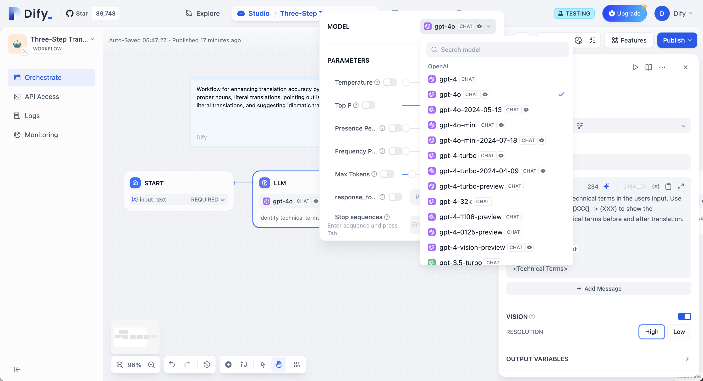
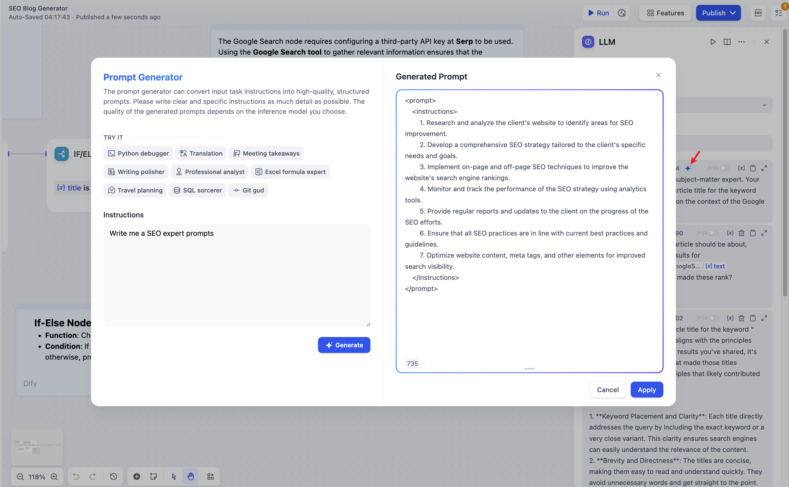
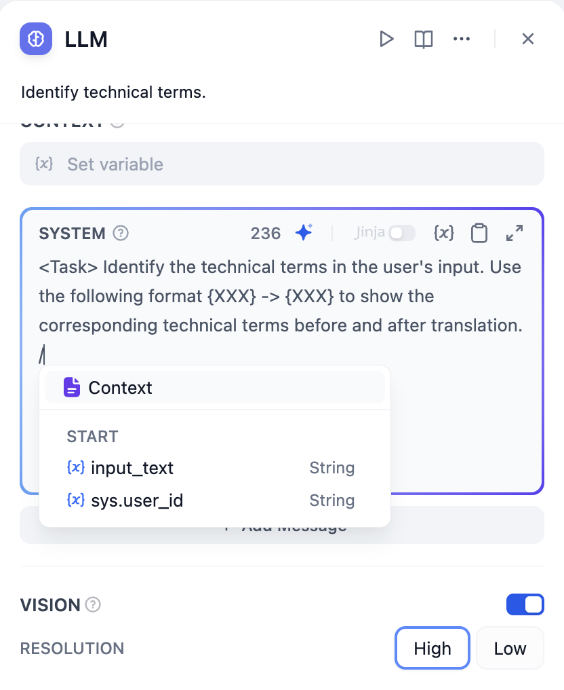
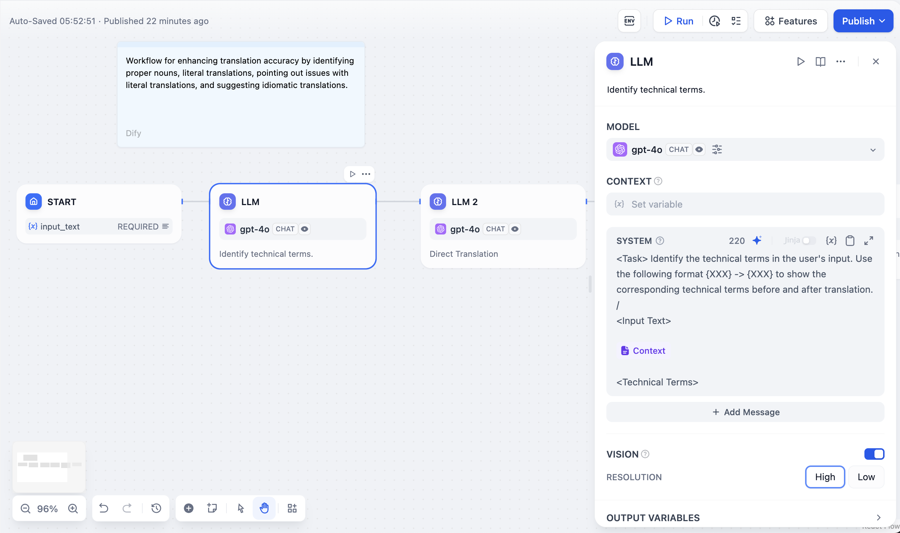

# LLM

### تعریف

برای پاسخ به سوالات یا پردازش زبان طبیعی، مدل های زبان بزرگ را فراخوانی می کند.

<figure><figcaption>
گره LLM
</figcaption></figure>

***

### سناریو ها

LLM هسته اصلی Chatflow/Workflow است که از قابلیت های مکالمه ای/تولیدی/طبقه بندی/پردازش مدل های زبان بزرگ برای رسیدگی به طیف گسترده ای از وظایف بر اساس درخواست های داده شده استفاده می کند و می تواند در مراحل مختلف گردش کار استفاده شود.

* **شناسایی نیت**: در سناریو های خدمات مشتری، شناسایی و طبقه بندی استعلامات کاربران برای هدایت فرآیندهای پایین دست.
* **تولید متن**: در سناریو های ایجاد محتوا، تولید متن مرتبط بر اساس موضوعات و کلمات کلیدی.
* **طبقه بندی محتوا**: در سناریو های پردازش دسته ای ایمیل، طبقه بندی خودکار ایمیل ها، مانند سوالات/شکایات/اسپم.
* **تبدیل متن**: در سناریو های ترجمه، ترجمه متن ارائه شده توسط کاربر به زبان مشخص شده.
* **تولید کد**: در سناریو های کمک برنامه نویسی، تولید کد تجاری خاص یا نوشتن موارد تست بر اساس نیازهای کاربر.
* **RAG**: در سناریو های پاسخگویی به سوالات پایگاه دانش، سازماندهی مجدد دانش مرتبط بازیابی شده برای پاسخ به سوالات کاربران.
* **درک تصویر**: استفاده از مدل های چندوجهی با قابلیت های دیداری برای درک و پاسخ به سوالات در مورد اطلاعات موجود در تصاویر.

با انتخاب مدل مناسب و نوشتن درخواست ها، می توانید راه حل های قدرتمند و قابل اعتماد را در Chatflow/Workflow ایجاد کنید.

***

### نحوه پیکربندی

<figure><figcaption>
پیکربندی گره LLM - انتخاب مدل
</figcaption></figure>

**مراحل پیکربندی:**

1. **انتخاب مدل**: Dify از مدل های اصلی جهانی، از جمله سری GPT OpenAI، سری Claude Anthropic و سری Gemini Google پشتیبانی می کند. انتخاب یک مدل به توانایی استنباط، هزینه، سرعت پاسخ، پنجره متن و غیره بستگی دارد. شما باید بر اساس نیازهای سناریو و نوع کار، یک مدل مناسب را انتخاب کنید.
2. **پیکربندی پارامتر های مدل**: پارامتر های مدل، نتایج تولید را کنترل می کنند، مانند درجه حرارت، TopP، حداکثر توکن، قالب پاسخ و غیره. برای تسهیل انتخاب، سیستم سه مجموعه پارامتر از پیش تعیین شده ارائه می دهد: خلاقانه، متعادل و دقیق.
3. **نوشتن درخواست ها**: گره LLM یک صفحه ترکیب درخواست آسان برای استفاده ارائه می دهد. انتخاب یک مدل چت یا مدل تکمیل، ساختارهای مختلف ترکیب درخواست را نشان می دهد.
4. **تنظیمات پیشرفته**: می توانید حافظه را فعال کنید، پنجره های حافظه را تنظیم کنید و از زبان قالب Jinja-2 برای درخواست های پیچیده تر استفاده کنید.


اگر برای اولین بار از Dify استفاده می کنید، باید قبل از انتخاب یک مدل در گره LLM، [پیکربندی مدل](../../model-configuration/) را در **تنظیمات سیستم—ارائه دهندگان مدل** تکمیل کنید.


#### **نوشتن درخواست ها**

در گره LLM، می توانید درخواست های ورودی مدل را سفارشی کنید. اگر یک مدل چت را انتخاب می کنید، می توانید بخش های SYSTEM/User/ASSISTANT را سفارشی کنید.

**مولد درخواست**

اگر در ارائه درخواست های موثر سیستم (SYSTEM) با مشکل مواجه هستید، می توانید از مولد درخواست برای ایجاد سریع درخواست هایی که برای سناریو های خاص شما مناسب هستند، استفاده کنید و از قابلیت های هوش مصنوعی بهره مند شوید.

<figure><figcaption></figcaption></figure>

در ویرایشگر درخواست، می توانید با تایپ **"/"** یا **"{"** ، **منوی درج متغیر** را برای درج **بلوک های متغیر ویژه** یا **متغیر های گره بالادستی** به عنوان محتوای زمینه در درخواست فراخوانی کنید.

<figure><figcaption>
فراخوانی منوی درج متغیر
</figcaption></figure>

***

### توضیح متغیر های ویژه

**متغیر های زمینه**

متغیر های زمینه، نوع خاصی از متغیر هستند که در داخل گره LLM تعریف شده اند و برای درج محتوای متنی بازیابی شده از خارج به درخواست استفاده می شوند.

<figure><figcaption>
متغیر های زمینه
</figcaption></figure>

در برنامه های معمول پرسش و پاسخ پایگاه دانش، گره پایین دست بازیابی دانش به طور معمول گره LLM است. **متغیر خروجی** `result` بازیابی دانش باید در **متغیر زمینه** در داخل گره LLM برای ارتباط و انتساب پیکربندی شود. پس از ارتباط، درج **متغیر زمینه** در موقعیت مناسب در درخواست می تواند دانش بازیابی شده از خارج را در درخواست بگنجاند.

این متغیر نه تنها می تواند به عنوان دانش خارجی معرفی شده به زمینه درخواست برای پاسخ های LLM استفاده شود، بلکه از ویژگی [**نقل قول و استناد**](../../knowledge-base/retrieval\_test\_and\_citation.md#id-2-yin-yong-yu-gui-shu) برنامه به دلیل ساختار داده ای آن که حاوی اطلاعات مرجع بخش است، پشتیبانی می کند.


اگر متغیر زمینه با یک متغیر مشترک از گره بالادستی، مانند یک متغیر نوع رشته ای از گره شروع، مرتبط باشد، متغیر زمینه هنوز هم می تواند به عنوان دانش خارجی استفاده شود، اما ویژگی **نقل قول و استناد** غیرفعال خواهد شد.


**تاریخچه مکالمه**

برای دستیابی به حافظه مکالمه ای در مدل های تکمیل متن (مانند gpt-3.5-turbo-Instruct)، Dify متغیر تاریخچه مکالمه را در [حالت تخصصی Prompt (منسوخ)](../../../learn-more/extended-reading/prompt-engineering/prompt-engineering-1/) طراحی کرد. این متغیر به گره LLM در Chatflow منتقل می شود و برای درج تاریخچه چت بین هوش مصنوعی و کاربر در درخواست استفاده می شود و به LLM کمک می کند تا زمینه مکالمه را درک کند.


متغیر تاریخچه مکالمه به طور گسترده ای استفاده نمی شود و فقط هنگام انتخاب مدل های تکمیل متن در Chatflow قابل درج است.


<figure><figcaption>
درج متغیر تاریخچه مکالمه
</figcaption></figure>

***

### ویژگی های پیشرفته

**حافظه**: هنگام فعال شدن، هر ورودی به طبقه بندی نیت، شامل تاریخچه چت از مکالمه خواهد بود تا به LLM در درک زمینه و بهبود درک سوال در دیالوگ های تعاملی کمک کند.

**پنجره حافظه**: هنگام بسته شدن پنجره حافظه، سیستم به طور پویا مقدار تاریخچه چت منتقل شده را بر اساس پنجره متن مدل فیلتر می کند. هنگام باز بودن، کاربران می توانند مقدار دقیق تاریخچه چت منتقل شده (به لحاظ تعداد) را کنترل کنند.

**تنظیمات نام نقش مکالمه**: به دلیل تفاوت در مراحل آموزش مدل، مدل های مختلف به طور متفاوتی به دستورالعمل های نام نقش عمل می کنند، مانند Human/Assistant، Human/AI، Human/Assistant و غیره. برای سازگاری با اثرات پاسخ درخواست چندین مدل، سیستم تنظیمات نام نقش مکالمه را ارائه می دهد. تغییر نام نقش، پیشوند نقش را در تاریخچه مکالمه تغییر می دهد.

**قالب های Jinja-2**: ویرایشگر درخواست LLM از زبان قالب Jinja-2 پشتیبانی می کند و به شما امکان می دهد از این زبان قالب قدرتمند Python برای تبدیل داده های سبک وزن و پردازش منطقی استفاده کنید. به [مستندات رسمی](https://jinja.palletsprojects.com/en/3.1.x/templates/) مراجعه کنید.

مثال سناریو: **🚧**

