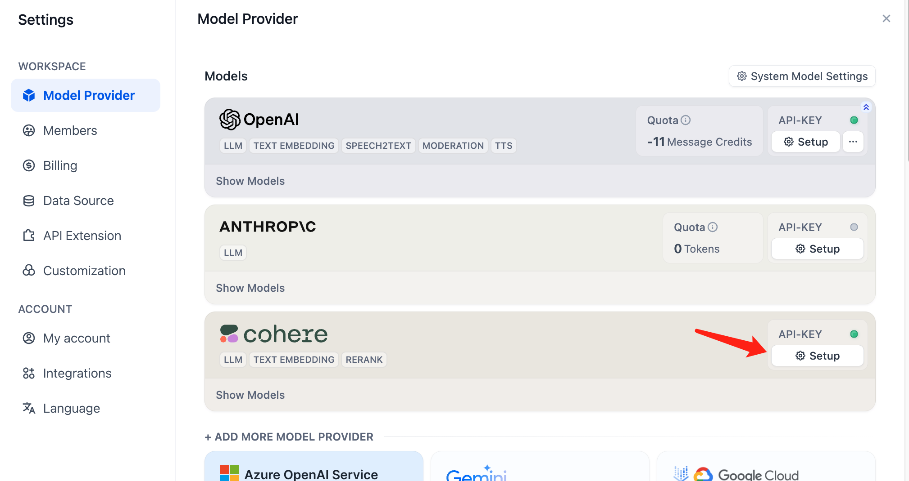

# باز رتبه بندی

### چرا باز رتبه بندی لازم است؟

جستجوی ترکیبی می تواند از نقاط قوت فناوری های مختلف بازیابی برای دستیابی به نتایج بازیابی بهتر استفاده کند. با این حال، نتایج جستجو از حالت های مختلف بازیابی نیاز به ادغام و عادی سازی (تبدیل داده ها به یک محدوده یا توزیع استاندارد یکسان برای مقایسه، تحلیل و پردازش بهتر) دارند قبل از اینکه به طور همزمان به مدل بزرگ ارائه شوند. اینجاست که سیستم امتیازدهی وارد عمل می شود: مدل باز رتبه بندی.

**مدل باز رتبه بندی تطابق معنایی بین لیست اسناد نامزد و پرس و جوی کاربر را محاسبه کرده و آنها را بر اساس تطابق معنایی برای بهبود نتایج مرتب سازی معنایی مرتب می کند.** اصل، محاسبه امتیاز مرتبط بودن بین پرس و جوی کاربر و هر سند نامزد و بازگرداندن لیستی از اسناد مرتب شده بر اساس مرتبط بودن از بالا به پایین است. مدل های رایج باز رتبه بندی شامل Cohere rerank، bge-reranker و غیره می شوند.

<figure><figcaption>
جستجوی ترکیبی + باز رتبه بندی
</figcaption></figure>

در بیشتر موارد، قبل از باز رتبه بندی، یک بازیابی مقدماتی وجود دارد زیرا محاسبه امتیاز مرتبط بودن بین یک پرس و جو و میلیون ها سند بسیار ناکارآمد خواهد بود. بنابراین، **باز رتبه بندی معمولاً در مرحله نهایی فرآیند جستجو قرار می گیرد و برای ادغام و مرتب سازی نتایج از سیستم های مختلف بازیابی ایده آل است.**

با این حال، باز رتبه بندی فقط برای ادغام نتایج از سیستم های مختلف بازیابی قابل استفاده نیست. حتی در یک حالت بازیابی واحد، معرفی یک مرحله باز رتبه بندی می تواند به طور موثر بازیابی سند را بهبود بخشد. به عنوان مثال، باز رتبه بندی معنایی را می توان پس از بازیابی کلمات کلیدی اضافه کرد.

در کاربردهای عملی، علاوه بر عادی سازی چندین نتیجه پرس و جو، ما معمولاً تعداد بخش هایی را که به مدل بزرگ منتقل می شوند محدود می کنیم (یعنی TopK که می تواند در پارامترهای مدل باز رتبه بندی تنظیم شود) قبل از تحویل بخش های متنی مرتبط به مدل بزرگ. این به این دلیل است که پنجره ورودی مدل بزرگ دارای محدودیت های اندازه (معمولاً 4K، 8K، 16K، 128K توکن) است. شما باید یک استراتژی تقسیم بندی مناسب و مقدار TopK را بر اساس اندازه پنجره ورودی مدل انتخابی انتخاب کنید.

مهم است که توجه داشته باشید که حتی اگر پنجره زمینه مدل به اندازه کافی بزرگ باشد، بازیابی بیش از حد بخش ها ممکن است محتوای کمتر مرتبطی را معرفی کند و کیفیت پاسخ را کاهش دهد. بنابراین، پارامتر TopK برای باز رتبه بندی لزوماً هرچه بزرگتر باشد، بهتر نیست.

باز رتبه بندی جایگزینی برای فناوری جستجو نیست بلکه یک ابزار کمکی برای ارتقا سیستم های بازیابی موجود است. **بزرگترین مزیت آن این است که روشی ساده و کم پیچیدگی برای بهبود نتایج جستجو ارائه می دهد و به کاربران امکان می دهد بدون نیاز به تغییرات قابل توجه در زیرساخت، مرتبط بودن معنایی را در سیستم های جستجوی موجود ادغام کنند.**

به عنوان مثال، با Cohere Rerank، شما فقط نیاز به ثبت یک حساب کاربری و درخواست صلاحیت استفاده از API دارید. ادغام فقط به دو خط کد نیاز دارد. علاوه بر این، آنها مدل های چند زبانه را ارائه می دهند، به این معنی که شما می توانید نتایج پرس و جو را به طور همزمان در زبان های مختلف مرتب کنید.

### نحوه پیکربندی مدل باز رتبه بندی؟

Dify در حال حاضر از مدل Cohere Rerank پشتیبانی می کند. می توانید وارد صفحه "Model Providers -> Cohere" شده و کلید API را برای مدل باز رتبه بندی پر کنید:

<figure><figcaption>
پیکربندی مدل Cohere Rerank در Model Providers
</figcaption></figure>

### نحوه دریافت مدل Cohere Rerank؟

به: [https://cohere.com/rerank](https://cohere.com/rerank) مراجعه کنید، در صفحه ثبت نام کنید و برای واجد شرایط بودن استفاده از مدل Rerank درخواست دهید تا کلید API را دریافت کنید.

### تنظیم مدل باز رتبه بندی در حالت بازیابی مجموعه داده

برای اضافه کردن تنظیمات باز رتبه بندی، وارد صفحه "Dataset -> Create Dataset -> Retrieval Settings" شوید. علاوه بر تنظیم مدل باز رتبه بندی هنگام ایجاد مجموعه داده، می توانید پیکربندی باز رتبه بندی را در تنظیمات مجموعه داده موجود و در تنظیمات حالت یادآوری مجموعه داده در تنظیمات برنامه نیز تغییر دهید.

<figure><figcaption>
تنظیم مدل باز رتبه بندی در حالت بازیابی مجموعه داده
</figcaption></figure>

**TopK:** برای تنظیم تعداد اسناد مرتبط بازگردانده شده پس از باز رتبه بندی استفاده می شود.

**Score Threshold:** برای تنظیم حداقل نمره برای اسناد مرتبط بازگردانده شده پس از باز رتبه بندی استفاده می شود. هنگامی که مدل باز رتبه بندی تنظیم می شود، تنظیمات TopK و Score Threshold فقط در مرحله باز رتبه بندی اعمال می شوند.

### تنظیم مدل باز رتبه بندی در حالت یادآوری چند مسیر برای مجموعه داده ها

برای فعال کردن مدل باز رتبه بندی هنگام تنظیم حالت یادآوری چند مسیر، وارد صفحه "Prompt Arrangement -> Context -> Settings" شوید.

توضیح در مورد حالت یادآوری چند مسیر: 🔗لطفاً بخش [بازیابی چند مسیر](https://docs.dify.ai/guides/knowledge-base/integrate-knowledge-within-application#multi-path-retrieval-recommended) را بررسی کنید.

<figure><figcaption>
تنظیم مدل باز رتبه بندی در حالت یادآوری چند مسیر برای مجموعه داده ها
</figcaption></figure>

