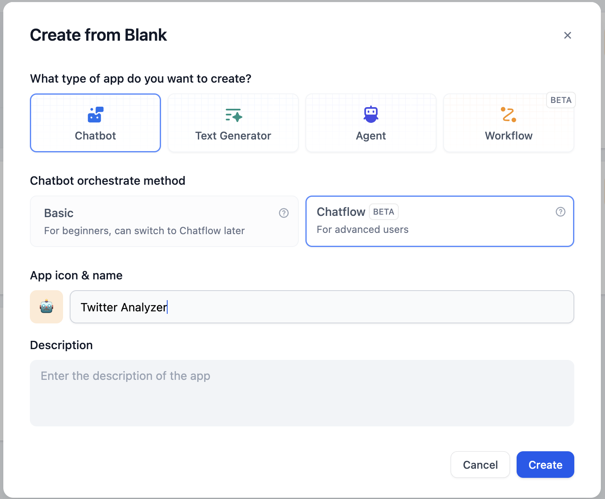
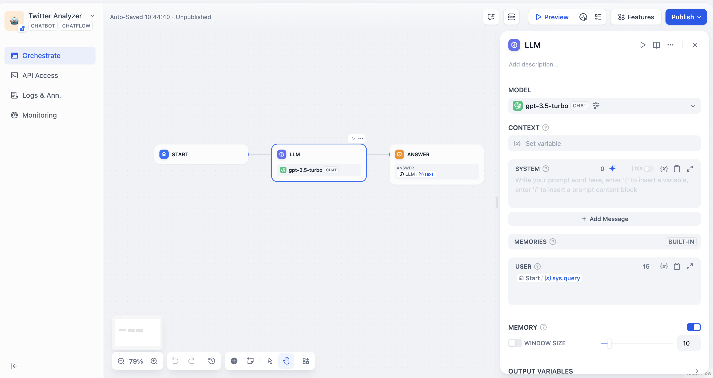
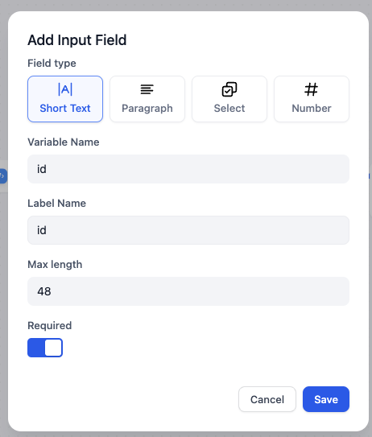
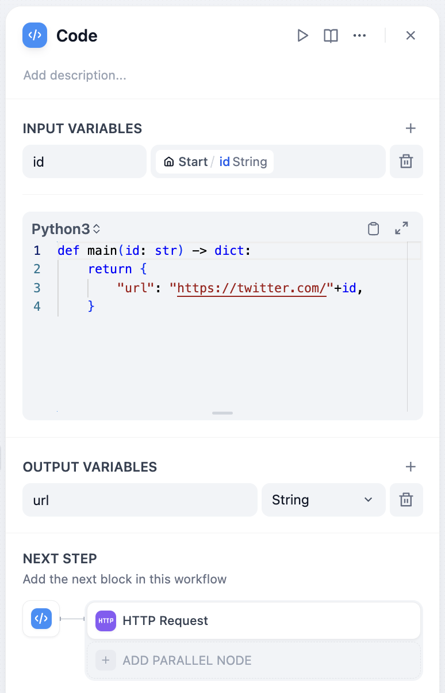
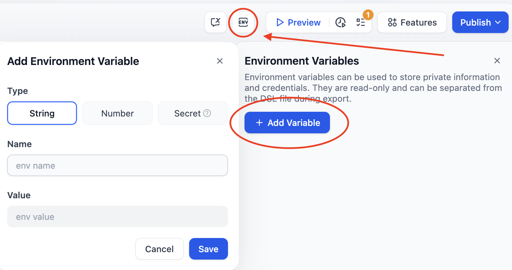
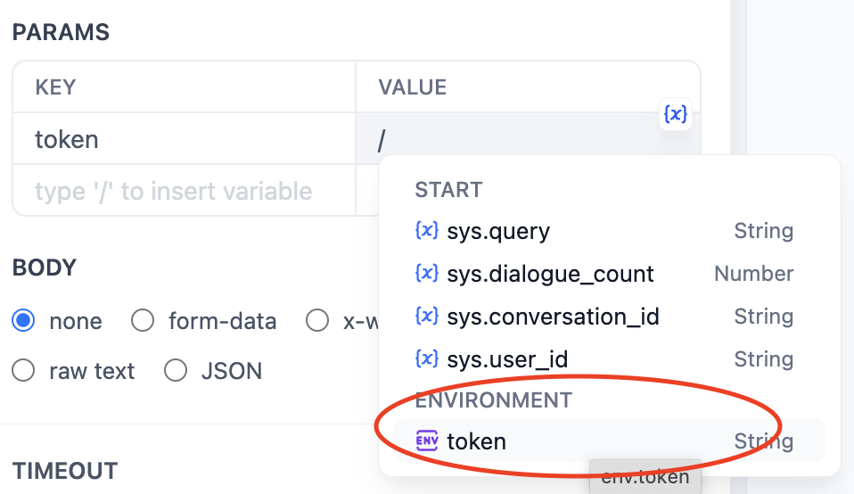
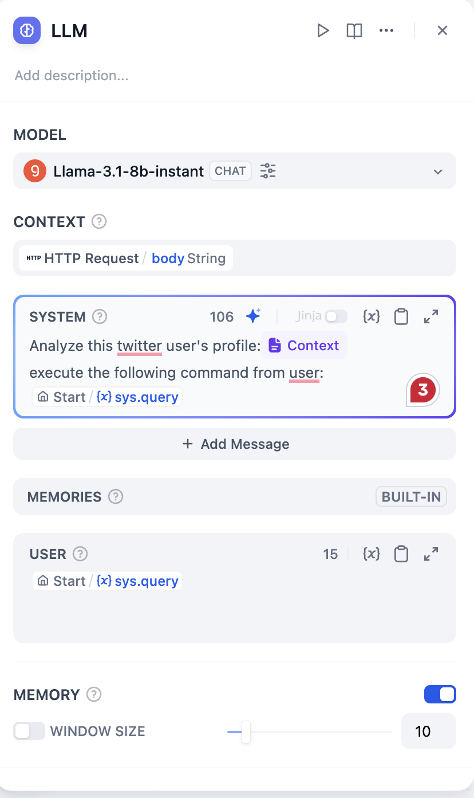

# با استفاده از عامل گفتگو، تجزیه و تحلیل حساب کاربری توییتر را تولید کنید

## مقدمه

در Dify، شما می توانید از ابزارهای خزنده مانند Jina استفاده کنید که می توانند صفحات وب را به فرمت Markdown تبدیل کنند تا مدل های زبانی بزرگ بتوانند آن را بخوانند.

به تازگی، [wordware.ai](https://www.wordware.ai/) توجه ما را به این نکته جلب کرده است که می توانیم از خزنده ها برای جمع آوری داده از شبکه های اجتماعی برای تجزیه و تحلیل توسط مدل های زبانی بزرگ استفاده کنیم و برنامه های کاربردی جالب تری ایجاد کنیم.

با این حال، با توجه به اینکه X (که قبلاً توییتر بود) از تاریخ 2 فوریه 2023 دسترسی رایگان API خود را متوقف کرده است و از آن زمان اقدامات ضد خزنده خود را ارتقا داده است. ابزارهایی مانند Jina نمی توانند به طور مستقیم به محتوای X دسترسی داشته باشند.

> از 9 فوریه، ما دیگر از دسترسی رایگان به API توییتر، هم v2 و هم v1.1 پشتیبانی نخواهیم کرد. در عوض، یک سطوح پایه پولی در دسترس خواهد بود. 🧵
>
> — Developers (@XDevelopers) [فوریه 2، 2023](https://twitter.com/XDevelopers/status/1621026986784337922?ref\_src=twsrc%5Etfw)

خوشبختانه، Dify همچنین دارای یک ابزار HTTP است که به ما امکان می دهد با ارسال درخواست های HTTP، ابزارهای خزنده خارجی را فراخوانی کنیم. بیایید شروع کنیم!

## **پیش نیازها**

### ثبت Crawlbase

Crawlbase یک پلتفرم جمع آوری و خراشیدن داده همه کاره برای کسب و کارها و توسعه دهندگان است.

علاوه بر این، با استفاده از Crawlbase Scraper، می توانید داده ها را از پلتفرم های اجتماعی مانند X، فیسبوک و اینستاگرام جمع آوری کنید.

برای ثبت نام کلیک کنید: [crawlbase.com](https://crawlbase.com)

### استقرار محلی Dify

Dify یک پلتفرم توسعه برنامه های کاربردی مدل های زبانی بزرگ منبع باز است. شما می توانید سرویس ابری را انتخاب کنید یا آن را با استفاده از docker compose به صورت محلی استقرار دهید.

در این مقاله، اگر نمی خواهید آن را به صورت محلی استقرار دهید، یک حساب کاربری رایگان Dify Cloud sandbox را در اینجا ثبت نام کنید: [https://cloud.dify.ai/signin](https://cloud.dify.ai/signin).


کاربران Dify Cloud Sandbox 200 اعتبار رایگان دریافت می کنند که معادل 200 پیام GPT-3.5 یا 20 پیام GPT-4 است.


در ادامه، آموزش های کوتاهی در مورد نحوه استقرار Dify ارائه شده است:

#### کلون Dify

```bash
git clone https://github.com/langgenius/dify.git
```

#### **شروع Dify**

```bash
cd dify/docker
cp .env.example .env
docker compose up -d
```

### پیکربندی ارائه دهندگان مدل های زبانی بزرگ

ارائه دهنده مدل را در تنظیمات حساب پیکربندی کنید:

<figure><figcaption></figcaption></figure>

## یک جریان گفتگو ایجاد کنید

اکنون، بیایید روی جریان گفتگو شروع به کار کنیم.

برای شروع، روی `ایجاد از خالِص` کلیک کنید:

<figure><figcaption></figcaption></figure>

جریان گفتگوی آغازین باید شبیه به این باشد:

<figure><figcaption></figcaption></figure>

## گره ها را به جریان گفتگو اضافه کنید

<figure><figcaption><p>جریان گفتگوی نهایی به این صورت است</p></figcaption></figure>

### گره شروع

در گره شروع، می توانیم در ابتدای یک گفتگو، برخی از متغیرهای سیستم را اضافه کنیم. در این مقاله، به یک شناسه کاربری توییتر به عنوان یک متغیر رشته ای نیاز داریم. بیایید آن را `id` نامگذاری کنیم.

روی گره شروع کلیک کنید و یک متغیر جدید اضافه کنید:

<figure><figcaption></figcaption></figure>

### گره کد

مطابق با [اسناد Crawlbase](https://crawlbase.com/docs/crawling-api/scrapers/#twitter-profile)، متغیر `url` (که در گره بعدی استفاده خواهد شد) باید `https://twitter.com/` + `شناسه کاربری` باشد، مانند `https://twitter.com/elonmusk` برای ایلان ماسک.

برای تبدیل شناسه کاربری به یک URL کامل، می توانیم از کد پایتون زیر برای ادغام پیشوند `https://twitter.com/` با شناسه کاربری استفاده کنیم:

```python
def main(id: str) -> dict:
    return {
        "url": "https://twitter.com/"+id,
    }
```

یک گره کد اضافه کنید و پایتون را انتخاب کنید و نام متغیرهای ورودی و خروجی را تنظیم کنید:

<figure><figcaption></figcaption></figure>

### گره درخواست HTTP

بر اساس [اسناد Crawlbase](https://crawlbase.com/docs/crawling-api/scrapers/#twitter-profile)، برای خراشیدن پروفایل یک کاربر توییتر در قالب http، باید گره درخواست HTTP را به فرمت زیر تکمیل کنیم:

<figure><figcaption></figcaption></figure>

مهم است که به دلایل امنیتی، بهتر است مقدار توکن را به صورت متن ساده وارد نکنید، زیرا این کار یک روش خوب نیست. در واقع، در آخرین نسخه Dify، می توانیم مقدار توکن را در **`متغیرهای محیطی`** تنظیم کنیم. برای تنظیم مقدار توکن، روی `env` - `اضافه کردن متغیر` کلیک کنید، بنابراین متن ساده در گره ظاهر نمی شود.

برای کلید API Crawlbase خود، [https://crawlbase.com/dashboard/account/docs](https://crawlbase.com/dashboard/account/docs) را بررسی کنید.

<figure><figcaption></figcaption></figure>

با تایپ `/` ، می توانید به راحتی کلید API را به عنوان یک متغیر وارد کنید.

<figure><figcaption></figcaption></figure>

برای بررسی اینکه آیا به درستی کار می کند، روی دکمه شروع این گره ضربه بزنید:

<figure><figcaption></figcaption></figure>

### گره مدل زبانی بزرگ

اکنون، می توانیم از مدل زبانی بزرگ برای تجزیه و تحلیل نتیجه جمع آوری شده توسط crawlbase و اجرای دستور خود استفاده کنیم.

مقدار `context` باید `body` از گره درخواست HTTP باشد.

در ادامه یک نمونه سیستم پرومپت ارائه شده است.

<figure><figcaption></figcaption></figure>

## تست اجرا

برای شروع یک تست اجرا، روی `پیش نمایش` کلیک کنید و شناسه کاربری توییتر را در `id` وارد کنید.

<figure><figcaption></figcaption></figure>

به عنوان مثال، من می خواهم توییت های ایلان ماسک را تجزیه و تحلیل کنم و یک توییت در مورد گرم شدن کره زمین با لحن او بنویسم.

<figure><figcaption></figcaption></figure>

آیا این مثل ایلان به نظر می رسد؟ lol

در گوشه بالا سمت راست روی `انتشار` کلیک کنید و آن را به وب سایت خود اضافه کنید.

خوش بگذره!

## در نهایت…

### خزنده های دیگر X(توییتر)

در این مقاله، من Crawlbase را معرفی کردم. باید ارزان ترین سرویس جمع آوری داده های توییتر موجود باشد، اما گاهی اوقات نمی تواند محتوای توییت های کاربران را به درستی جمع آوری کند.

سرویس جمع آوری داده های توییتر مورد استفاده توسط [wordware.ai](http://wordware.ai) که قبلاً ذکر شد، **Tweet Scraper V2** است، اما اشتراک برای پلتفرم میزبانی شده **apify** 49 دلار در ماه است.

## لینک ها

* [X@dify\_ai](https://x.com/dify\_ai)
* مخزن Dify در GitHub:[https://github.com/langgenius/dify](https://github.com/langgenius/dify)


