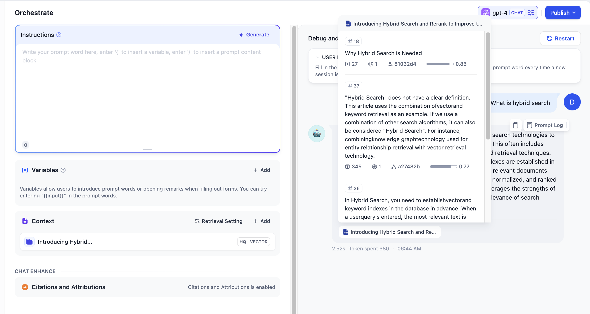

# リコールテスト/引用帰属

### 1 リコールテスト

Difyのナレッジベースでは、テキストによる検索テスト機能を提供しており、ユーザーがキーワードを入力すると、ナレッジベース内の関連コンテンツを呼び出すプロセスを模擬します。この際、検索されたコンテンツは関連度のスコアによって並べ替えられ、その後LLM（大規模言語モデル）に送られます。一般に、質問とコンテンツの一致度が高ければ高いほど、LLMによる回答の質も向上し、テキストの「学習習効果」も高まります。

異なる検索手法や設定を試して、検索されたコンテンツの品質と効果を確認することが可能です。各ナレッジベースの分割方法には、それぞれ異なる検索テスト手法が対応しています。



#### 一般モード

**「ソーステキスト」**入力欄に一般的なユーザー質問を入力し、**「テスト」**ボタンをクリックすることで、リコール結果を右側の **「リコール段落」**で確認できます。

一般モードでは、各コンテンツは独立しており、右上に表示されるスコアは、そのコンテンツがキーワードとどれだけマッチしているかを示します。高いスコアは、質問のキーワードとコンテンツがより密接に一致していることを意味します。

<figure><figcaption>
一般モード - レコール内容チョック
</figcaption></figure>

コンテンツをクリックすると、詳しい情報を確認できます。各コンテンツの下には、その情報源が表示され、その内容が信頼できるかどうかを判断できます。

<figure><figcaption>
レコール内容の詳細
</figcaption></figure>




#### 親子分割モード

**「ソーステキスト」**入力欄に質問を入力し、**「テスト」**をクリックすると、右側の「検索結果段落」で結果を確認できます。親子分割モードでは、質問のキーワードが子コンテンツにヒットし、より精度の高い一致を得られます。右上のスコアは、子コンテンツとキーワード間の一致度を示します。

プレビューエリアでは、具体的にヒットした段落の内容を確認できます。一致後、子コンテンツが属する親コンテンツの全文脈を検索し、AIアプリケーションに完全な情報を提供します。

<figure><figcaption>
レコールテスト - 親子分割モード
</figcaption></figure>

各コンテンツの下にある情報源を参照することで、引用された内容を確認できます。詳細ページでは、左側に親コンテンツ、右側にヒットした子コンテンツの情報が表示されます。キーワードは複数の子コンテンツにヒットする可能性があり、一致度スコアも表示されます。これに基づき、現在のコンテンツが適切かどうかを判断できます。

<figure><figcaption>
レコール内容の詳細
</figcaption></figure>



**「履歴」**では、過去の検索記録を確認できます。ナレッジベースがアプリケーションに関連付けられている場合、そのアプリケーションでの検索履歴もここで見ることができます。

**検索方法の変更**

ソーステキスト入力欄の右上にあるアイコンをクリックすると、現在のナレッジベースの検索方法と具体的なパラメータを変更することができます。変更後は、現在の検索テストのデバッグプロセス中にのみ適用されます。異なる検索手法の効果を比較したい場合は、「ナレッジベース設定」>「検索設定」で設定してください。

**リコールテストの推奨手順：**

1. ユーザーの一般的な質問をカバーするテストケースやガイドラインの内容を設計・整理します。
2. コンテンツの特徴や使用シーン（QAコンテンツか、多言語QAを含むかなど）に基づいて、適切な検索戦略を選択します。異なる検索手法の長所と短所については、拡張読み取り[検索強化生成（RAG）](../../learn-more/extended-reading/retrieval-augment/README.md)を参照してください。
3. 検索するコンテンツの数（TopK）と検索スコアの閾値（Score）を調整し、実際のアプリケーションシナリオや文書の品質を考慮して、適切なパラメータの組み合わせを選択します。

**TopK値と検索閾値（Score）の設定方法**

* **TopKは、類似スコアの降順で検索されるコンテンツの最大数を指します。** TopK値を小さくすると、関連性の高いテキストが不足する可能性があります；TopK値を大きくすると、意味的に関連性の低いコンテンツが検索される可能性があり、LLMの応答品質が低下するかもしれません。

* **検索閾値（Score）は、検索されるコンテンツの最低類似スコアを指します。** 閾値を下げると、関連性の低いコンテンツが検索される可能性があります；閾値を高く設定すると、関連するコンテンツが見逃される可能性があります。

***

### 2 引用と帰属

アプリケーション内でナレッジベースの効果をテストする際、**スタジオ -- 機能追加 -- 引用と帰属**に進み、引用と帰属機能を有効にします。

<figure><figcaption>
引用と帰属機能を有効にする
</figcaption></figure>

機能を有効にすると、大規模言語モデルが質問に回答する際にナレッジベースからの内容を引用した場合、返信内容の下に具体的な引用段落情報を確認できます。これには**元のパラグラフテキスト、パラグラフ番号、マッチ度**などが含まれます。引用段落上部の**ナレッジベースにジャンプ**をクリックすると、開発者がデバッグ編集を行いやすいように、そのパラグラフが含まれるナレッジベースのパラグラフリストに簡単にアクセスできます。

<figure><figcaption>
返信内容の引用情報を確認する
</figcaption></figure>
