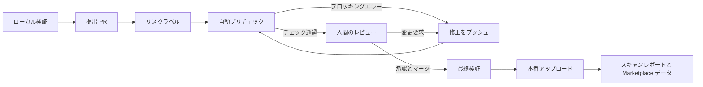

---
dimensions:
  type:
    primary: operational
    detail: deployment
  level: intermediate
standard_title: Dify Marketplace Review and Release
language: ja
title: チェック、レビュー、Marketplace での公開
description: Dify Marketplace の CI 結果、レビュー対応、マージ後の検証と公開パイプラインを説明します
---

> このドキュメントは AI によって自動翻訳されています。不正確な部分がある場合は、[英語版](/en/develop-plugin/publishing/marketplace-listing/marketplace-review-and-release) を参照してください。

Marketplace への公開は、単一の承認チェックではなく、信頼を構築するパイプラインです。パッケージはローカル検証、PR チェック、人間のレビューを経て、マージ後に再検証されてからアップロードされます。

## PR の自動チェック

`main` または `dev` 向け PR を作成、更新、Ready for review にすると、`Pre Check Plugin` ワークフローが実行されます。現在の [Dify Marketplace Toolkit](https://github.com/langgenius/dify-marketplace-toolkit) とプラグイン daemon を取得するため、各リポジトリへワークフローをコピーしなくてもルールが更新されます。

<Tabs>
  <Tab title="パッケージの整合性">
    - 変更された `.difypkg` が 1 つだけで、パスが正しいこと。
    - アーカイブを安全に展開でき、サイズとファイル数の制限内であること。
    - 開発成果物、シークレット、不審な代入、実行ファイル、同梱バイナリ、デフォルトアイコンを検出すること。
  </Tab>
  <Tab title="メタデータと開示">
    - manifest、ソースリポジトリ、連絡先、プライバシー、アイコン、バージョンを検証すること。
    - README のメタデータと英語のメイン文書を確認すること。
    - PR テンプレート、リスク選択、レビューメモ、更新内容、機密性の高い機能をパッケージと比較すること。
  </Tab>
  <Tab title="依存関係とコード">
    - 依存関係ポリシーとインストールを確認すること。
    - Python ソースをコンパイルし、安全性の警告を検出すること。
    - 既知の脆弱性、禁止された金融活動、その他のレビュー信号を表示すること。
  </Tab>
  <Tab title="実行時とパッケージ化">
    - 必要に応じてクリーンな環境で依存関係をインストールすること。
    - 互換性のある daemon フローでプラグインをインストールすること。
    - Marketplace uploader をテストモードで実行し、公開せずに処理できることを確認すること。
  </Tab>
</Tabs>

<Note>
現在のチェック項目は、リポジトリのワークフローが信頼できる情報源です。検証項目が増減すると、固定番号のチェックリストは古くなります。上記のカテゴリを入口にし、正確な結果はワークフローレポートで確認してください。
</Note>

## エラーと警告の違い

ワークフローは各検証を最後まで実行し、結果をステップサマリーへ集約します。

| 結果 | 意味 | 対応 |
| :--- | :--- | :--- |
| **ブロッキングエラー** | パッケージ内のシークレット、無効なメタデータ、不完全な PR 本文、重複バージョン、インストール失敗など、明確な要件違反。 | パッケージまたは PR を修正し、必要なら再ビルドして同じブランチへプッシュする。 |
| **警告** | 機密性の高い機能、バイナリの例外、安全性パターン、金融活動、文脈不足など、人間の判断が必要な動作や証拠。 | 説明または修正する。警告だけでは失敗しないが、レビュアーは変更を要求できる。 |
| **成功** | 自動チェックでブロッキング項目が見つからなかった。 | 人間のレビューを待つ。緑色のワークフローは自動承認ではない。 |

<Warning>
正しい開示を削除して警告を消さないでください。レビュアーはパッケージの動作、文書、プライバシー、ソースコード、PR の主張を比較します。不整合も変更要求の理由になります。
</Warning>

## 人間によるレビュー

自動チェック後、メンテナーは自動化だけで判断できない領域を確認します。

- パッケージ内容が説明された目的と一致すること。
- README にセットアップ、認証情報、API、接続要件が十分に記載されていること。
- プライバシーポリシーが実際のデータフローと外部サービスに一致すること。
- リスクレベルと機密性の高い機能の説明が実際の動作に一致すること。
- 依存関係とバイナリが必要で、適切に制約されていること。
- 高リスク入力、ネットワーク要求、認証情報、エラー処理に適切な対策があること。

<Steps>
  <Step title="レポート全体の確認">
    GitHub Actions のサマリーから始め、関連するエラーと警告の詳細を開きます。最初に見える症状だけでなく、原因を修正してください。
  </Step>
  <Step title="ソースとパッケージの更新">
    ソースリポジトリで変更します。必要に応じてバージョンを上げ、`.difypkg` を再ビルドし、メンテナーの指示に従って置き換えまたは追加します。
  </Step>
  <Step title="同じ PR ブランチへのプッシュ">
    プッシュごとにプリチェックが再実行されます。レビューコメントには、変更内容と新しい証拠の場所を返信してください。
  </Step>
  <Step title="再レビューの依頼">
    すべての要求に対応し、チェックが最新になったら Ready for review にするか、再レビューを依頼します。重複 PR は作成しません。
  </Step>
</Steps>

## マージ後の処理

マージ後も検証は省略されません。`main` へのプッシュで `Upload Merged Plugin` ワークフローが開始します。

<Steps>
  <Step title="マージされたパッケージの特定">
    変更ファイルを計算し、公開可能な `.difypkg` パスが 1 つであることを確認します。
  </Step>
  <Step title="最終パッケージチェック">
    アーカイブを展開し、内容、シークレット、バイナリ、manifest、README、依存関係ポリシー、禁止された金融活動を再確認します。
  </Step>
  <Step title="リリースノートの抽出">
    関連する PR を特定し、本文から変更ログを生成します。そのため、更新 PR の **What changed** は正確に記述する必要があります。
  </Step>
  <Step title="本番環境へのアップロード">
    Marketplace uploader が検証し、本番 Marketplace へアップロードします。本番アップロードの失敗はワークフローを停止します。
  </Step>
  <Step title="スキャン証拠の追加">
    uploader はパッケージをスキャンし、バージョン固有のレポートを送信します。このデータは Marketplace のアクセスドメインとセキュリティ表示に使われます。新しいバージョンは新しい証拠としてスキャンされ、旧版の信頼結果を継承しません。
  </Step>
</Steps>

パッケージを staging にミラーする場合もあります。staging アップロードはベストエフォートで、本番公開の成功をロールバックしません。

<Check>
本番アップロードが成功すると、マージされたパッケージの公開パイプラインは完了です。コントリビューター側で別のアップロードコマンドを実行する必要はありません。
</Check>

## 公開済みプラグインの保守

公開後も継続的な対応が必要です。

- 提出時に記載したソースリポジトリと連絡先を監視する。
- セキュリティ問題と依存関係の脆弱性を速やかに修正する。
- 動作、送信先ドメイン、README、プライバシー開示を同期する。
- 更新ごとに新しいバージョンと PR を使用し、公開済みバージョンを置き換えない。
- ユーザーの更新前に移行と破壊的変更を説明する。

<AccordionGroup>
  <Accordion title="ローカル検証に成功しても CI が失敗する理由">
    ローカル検証はパッケージ内の証拠を対象にします。CI はテンプレート、リスクラベル、重複バージョン、クリーンな依存関係インストール、daemon インストール、uploader テストなどの PR と Marketplace のコンテキストも確認します。
  </Accordion>
  <Accordion title="失敗後に新しい PR は必要ですか？">
    通常は不要です。修正したパッケージまたは PR 本文を既存ブランチへプッシュします。レビューの文脈を維持し、自動的に再チェックできます。
  </Accordion>
  <Accordion title="警告は公開をブロックしますか？">
    警告だけではブロックしません。曖昧または機密性の高い動作を人間のレビューへ渡します。説明が受理される場合も、対策や変更を求められる場合もあります。
  </Accordion>
  <Accordion title="緑色のワークフローなら承認されますか？">
    保証されません。自動化は定義済みルールを検証します。目的、文書、プライバシー、セキュリティ境界、依存関係の必要性、主張との整合性はメンテナーが判断します。
  </Accordion>
</AccordionGroup>

<CardGroup cols={2}>
  <Card title="準備と検証" icon="shield-check" href="/ja/develop-plugin/publishing/marketplace-listing/prepare-plugin-for-marketplace">
    パッケージ衛生、リスク分類、ローカル検証へ戻ります。
  </Card>
  <Card title="PR の提出" icon="code-pull-request" href="/ja/develop-plugin/publishing/marketplace-listing/submit-plugin-to-marketplace">
    パッケージパスと PR に必要な証拠を確認します。
  </Card>
</CardGroup>
