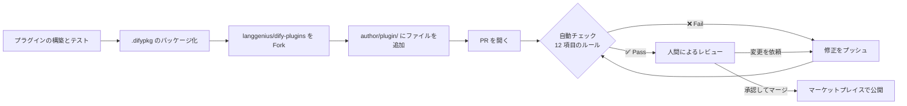

---
dimensions:
  type:
    primary: operational
    detail: deployment
  level: intermediate
standard_title: Release to Dify Marketplace
language: ja
title: Dify マーケットプレイスへの公開
description: 提出前のチェックリストと 12 項目のレビューチェックから、PR フロー、承認後の流れまでを含め、プラグインを Dify マーケットプレイスに提出します
---

> このドキュメントは AI によって自動翻訳されています。不正確な部分がある場合は、[英語版](/en/develop-plugin/publishing/marketplace-listing/release-to-dify-marketplace) を参照してください。

マーケットプレイスは、コミュニティやパートナーが構築した Dify プラグインを集めた公式カタログです。プラグインをここに提出すると、すべての Dify ユーザーがワンクリックでインストールできるようになります。

プラグインは、[`langgenius/dify-plugins`](https://github.com/langgenius/dify-plugins) に対して Pull Request を開くことで公開します。レビュアー（および一連の自動チェック）が PR を順に確認し、承認されるとプラグインは [marketplace.dify.ai](https://marketplace.dify.ai/) に自動的に公開されます。

まだプラグインを構築していない場合は、[Tool プラグインのチュートリアル](/ja/develop-plugin/dev-guides-and-walkthroughs/tool-plugin) から始めてください。

## 提出する前に

Dify レビュアーは、すべての PR に対して 12 項目の自動プリフライトチェックを実行します。却下の多くは機械的な理由によるもので、事前に修正しておくとレビューの往復を 1 回省けます。

<Tabs>
  <Tab title="プロジェクトファイル">
    各プラグインディレクトリには、以下が必ず含まれている必要があります。

    | ファイル / フォルダ | 用途 |
    | :--- | :--- |
    | `manifest.yaml` | プラグインのメタデータ（名前、作成者、バージョンなど） |
    | `README.md` | 英語のみの説明、セットアップ、使い方 |
    | `PRIVACY.md` | プライバシーポリシー（必須、空欄不可） |
    | `_assets/` | プラグインアイコンとその他の静的アセット |

    manifest のフィールドについては [一般仕様](/ja/develop-plugin/features-and-specs/plugin-types/general-specifications) を、プライバシーポリシーについては [プライバシーガイドライン](/ja/develop-plugin/publishing/standards/privacy-protection-guidelines) を参照してください。
  </Tab>
  <Tab title="manifest のルール">
    - `manifest.yaml` の **Author** に `langgenius` や `dify` を含めることはできません。これらはファーストパーティ製プラグイン用に予約されています。自分の GitHub ハンドルを使用してください。
    - **Version** は新しい値である必要があります。すでに公開済みのバージョンを提出すると却下されます。
    - **Icon** は `_assets/` 内の実際のアイコンである必要があり、テンプレートの初期設定のまま残してはいけません。
  </Tab>
  <Tab title="依存関係">
    - `pip install -r requirements.txt` がエラーなく完了する必要があります。
    - プラグイン SDK のピン留めは少なくとも `dify_plugin>=0.5.0` である必要があります。
    - プラグインは、現在の daemon に対してエラーなくインストールおよびパッケージ化できる必要があります（レビュアーは `test-plugin-install.py` と `upload-package.py --test` を実行します）。
  </Tab>
  <Tab title="言語">
    - **PR のタイトルと本文** は英語である必要があります。バイリンガルの注意書き `【中文用户 & Non English User】请使用英语提交，否则会被关闭 ：）` のみが許可された例外です。
    - **`README.md`** に中国語の文字を含めることはできません。代わりに `readme/README_<lang>.md` として翻訳を追加してください。[多言語 README](/ja/develop-plugin/features-and-specs/plugin-types/multilingual-readme) を参照してください。
  </Tab>
</Tabs>

## レビュアーのチェックリスト

これは、レビュアーが順に実行する正確なチェック項目です。PR を開く前のプリフライトとして使用してください。

| # | チェック項目 | よくある失敗原因 |
| :--- | :--- | :--- |
| 1 | **単一の `.difypkg`** | PR に複数のパッケージファイルが含まれている、または 1 つも含まれていない |
| 2 | **PR の言語** | 許可された注意書き以外で、タイトルまたは本文に CJK 文字が含まれている |
| 3 | **プロジェクト構造** | `manifest.yaml`、`README.md`、`PRIVACY.md`、`_assets/` のいずれかが欠けている |
| 4 | **manifest の作成者** | Author に `langgenius` または `dify` が含まれている |
| 5 | **アイコン** | デフォルトのテンプレートアイコンがそのまま残っている、またはアイコンが欠けている |
| 6 | **バージョン** | このバージョンはすでにマーケットプレイスに存在する |
| 7 | **README の言語** | `README.md` に中国語の文字が含まれている（代わりに `readme/README_zh_Hans.md` を使用） |
| 8 | **PRIVACY.md** | 欠けている、または空である |
| 9 | **依存関係のインストール** | `pip install -r requirements.txt` がエラーになる |
| 10 | **SDK のバージョン** | `dify_plugin` が `0.5.0` 未満にピン留めされている |
| 11 | **インストールテスト** | プラグインが daemon 経由でインストールできない |
| 12 | **パッケージングテスト** | プラグインがエラーなく再パッケージ化できない |

いずれかのチェックが失敗するとレビューは中断され、`❌ Fail` の行と必要な修正内容を示したステータステーブルが投稿されます。これらに対処して再度プッシュしてください。

## PR を提出する

<Steps>
  <Step title="プラグイン開発ガイドラインを読む">
    [プラグイン開発ガイドライン](/ja/develop-plugin/publishing/standards/contributor-covenant-code-of-conduct) に目を通します。レビュアーは、独自性、ブランドとの整合性、コンテンツの品質、知的財産、メンテナンスへのコミットメントといった非機械的な観点を判断する際にこれを使用します。
  </Step>
  <Step title="プライバシーポリシーを作成する">
    プラグインのルートに `PRIVACY.md` を作成します（または別の場所でホストし、その URL を manifest に記載します）。[プライバシーガイドライン](/ja/develop-plugin/publishing/standards/privacy-protection-guidelines) に従い、プラグイン本体と、それが呼び出すサードパーティサービスが収集するデータを明記してください。
  </Step>
  <Step title="プラグインをパッケージ化する">
    プラグインプロジェクトの 1 つ上のディレクトリで、以下を実行します。

    ```bash
    dify plugin package ./your_plugin_project
    ```

    これにより `your_plugin_project.difypkg` が生成されます。
  </Step>
  <Step title="Fork してファイルを追加する">
    [`langgenius/dify-plugins`](https://github.com/langgenius/dify-plugins) を Fork します。`<your-author-name>/<your-plugin-name>/` というフォルダを作成し、その中に `.difypkg` を配置します。
  </Step>
  <Step title="PR を開く">
    自分の fork にプッシュし、リポジトリの PR テンプレートを使って `main` に対する PR を開きます。タイトルと本文は英語にします。
  </Step>
  <Step title="レビューに対応する">
    最初に自動チェックの結果が投稿され、その後に人間のレビュアーが続きます。新しいコミットをプッシュしてフィードバックに対応します。プッシュのたびにチェックが再実行されます。
  </Step>
</Steps>



<Tip>
最初のレビューは通常 1 週間以内に始まります。それより時間がかかる場合は、レビュアーが遅延の理由を説明するコメントを残します。
</Tip>

<Check>
`main` にマージされると、プラグインは別途の公開手順なしに、自動的に [marketplace.dify.ai](https://marketplace.dify.ai/) に表示されます。
</Check>

## 承認後

マージされた時点から、プラグインはあなたが所有します。

- **バグ修正と機能リクエスト。** ユーザーからの issue をトリアージします。
- **互換性の更新。** Dify が破壊的な API 変更をリリースする際、チームが移行手順を公開するので、あなたがプラグインを更新します。必要に応じて Dify のエンジニアが支援できます。
- **バージョン管理。** `manifest.yaml` の `version` を上げ、再パッケージ化し、新しい `.difypkg` を付けて新規 PR を開きます。[自動公開 PR ワークフロー](/ja/develop-plugin/publishing/marketplace-listing/plugin-auto-publish-pr) は、これを GitHub Action から自動化します。

<Warning>
マーケットプレイスがパブリックベータの間は、すでに使用されているプラグインへの破壊的変更を避けてください。既存のフィールドを変更するのではなく新しいフィールドを追加し、削除する前に非推奨化します。
</Warning>

## PR のライフサイクル

| ステータス | 意味 | 対応 |
| :--- | :--- | :--- |
| **オープン、レビュー待ち** | 最初の約 7 日間。対応は不要 | 待つ |
| **変更依頼** | チェックが失敗した、またはレビュアーがフィードバックを残した | 修正をプッシュする。チェックは自動的に再実行される |
| **stale（14 日間放置）** | 2 週間あなたからの応答がない | PR に返信してタイマーをリセットする。再オープン可能 |
| **クローズ（30 日間放置）** | 非アクティブのためクローズ | 新しい PR を開く。クローズされた PR は再オープンできない |

## よくある質問

<AccordionGroup>
  <Accordion title="自分のプラグインが既存のものと似すぎているかどうかは、どう判断しますか？">
    マーケットプレイスは、**統合先** ではなく **機能** で重複を判断します。新しい翻訳を追加しただけの 2 つ目の Google 検索プラグインは重複です。バッチクエリ、より優れたエラーハンドリング、意味のある新機能を追加した Google 検索プラグインであれば問題ありません。その点を PR の説明に記載してください。
  </Accordion>
  <Accordion title="PR が stale またはクローズとしてマークされました。どうすればよいですか？">
    **stale** の PR（14 日間放置）は再オープンできます。PR に返信するか、修正をプッシュしてクロックを再開してください。**クローズ** された PR（30 日間放置）は再オープンできません。フィードバックを修正し、同じパッケージで新しい PR を開いてください。
  </Accordion>
  <Accordion title="パブリックベータの間にプラグインを更新できますか？">
    できます。破壊的変更は避けてください。フィールドは変更ではなく追加し、削除する前に非推奨化します。
  </Accordion>
  <Accordion title="有料プラグインを公開できますか？">
    現在はできません。マーケットプレイスは無料プラグインのみを受け付けています。収益化のポリシーは別途お知らせします。
  </Accordion>
  <Accordion title="PR の本文に、チーム用として英語と中国語の両方を含める必要があります。これは許可されますか？">
    いいえ。PR のタイトルと本文では、許可された 1 行のバイリンガル注意書きのみが認められます。内部向けの多言語メモは別の場所（コミットメッセージ、社内ドキュメント）に記載してください。
  </Accordion>
</AccordionGroup>

## 関連リソース

<CardGroup cols={2}>
  <Card title="公開方法の概要" icon="signs-post" href="/ja/develop-plugin/publishing/marketplace-listing/release-overview">
    マーケットプレイス、GitHub、ローカルファイルによる配布を比較します。
  </Card>
  <Card title="プラグイン開発ガイドライン" icon="clipboard-check" href="/ja/develop-plugin/publishing/standards/contributor-covenant-code-of-conduct">
    レビュアーが適用するコンテンツと品質の基準の全体像。
  </Card>
  <Card title="プライバシーガイドライン" icon="shield-halved" href="/ja/develop-plugin/publishing/standards/privacy-protection-guidelines">
    レビューを通過する `PRIVACY.md` の書き方。
  </Card>
  <Card title="自動公開 PR ワークフロー" icon="robot" href="/ja/develop-plugin/publishing/marketplace-listing/plugin-auto-publish-pr">
    プッシュのたびにパッケージ化と PR の作成を代行する GitHub Action。
  </Card>
  <Card title="多言語 README" icon="language" href="/ja/develop-plugin/features-and-specs/plugin-types/multilingual-readme">
    非英語ユーザー向けに `readme/README_<lang>.md` ファイルを追加します。
  </Card>
  <Card title="一般仕様" icon="file-code" href="/ja/develop-plugin/features-and-specs/plugin-types/general-specifications">
    manifest フィールドのリファレンス。
  </Card>
</CardGroup>

{/*
Contributing Section
DO NOT edit this section!
It will be automatically generated by the script.
*/}

---

[Edit this page](https://github.com/langgenius/dify-docs/edit/main/en/develop-plugin/publishing/marketplace-listing/release-to-dify-marketplace.mdx) | [Report an issue](https://github.com/langgenius/dify-docs/issues/new?template=docs.yml)
