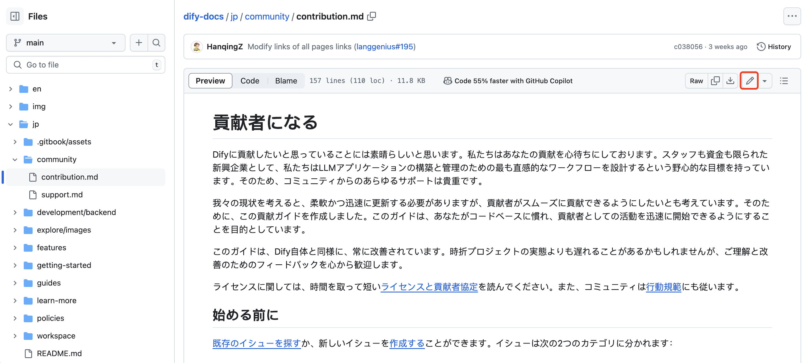

# Dify ドキュメントへの貢献

Dify のヘルプドキュメントは、[オープンソースプロジェクト](https://github.com/langgenius/dify-docs)として運営されています。どのような形式の貢献も歓迎します。ドキュメントに問題を見つけた場合や、自分で内容を追加したい場合には、GitHub 上で issue を提出するか、もしくは直接 pull request を作成してください。我々は迅速に対応いたします。

## 貢献の方法

ドキュメントの問題は次の2つのカテゴリーに分けられます：

- コンテンツの誤り（誤字/内容が間違っている場合）
- コンテンツの欠落（新しい情報の追加したい場合）

### コンテンツの誤り

ドキュメントを読んでいる際に内容の誤りを見つけたり、一部を修正したい場合は、文書ページの右側にある目次内の **“Github に編集”** ボタンをクリックしてください。これにより、GitHub のオンラインエディターを使用してファイルを修正できます。その後、修正内容を簡潔に説明した pull request を作成してください。タイトルは `Fix: Update xxx` の形式を使用してください。リクエストを受け取った後、レビューを行い、問題がなければ修正をマージします。



もちろん、[Issues ページ](https://github.com/langgenius/dify-docs/issues)にドキュメントのリンクを貼り付け、修正が必要な内容を簡単に説明していただくことも可能です。フィードバックを受け取った後、迅速に対応いたします。

### コンテンツの欠落

新しいドキュメントをコードリポジトリに追加したい場合は、以下の手順に従ってください：

1. リポジトリをフォークする

リポジトリを GitHub アカウントにフォークし、リポジトリをローカルにクローンします:

```bash
git clone https://github.com/<your-github-account>/dify-docs.git
```

> 注: GitHub のオンラインコードエディターを使用して、新しい md ファイルを適切なディレクトリに直接送信することもできます。

2. 関連するドキュメントディレクトリを見つけてファイルを追加する

たとえば、サードパーティツールの使用方法に関するドキュメントを追加したい場合は、`/guides/tools/tool-configuration/` ディレクトリに新しい md ファイルを追加してください（可能であれば、日英二言語での内容提供をお勧めします）。

3. pull request を提出する

pull request を提供する時、`Docs: add xxx` のタイトルで説明欄に書いて、文章内容を簡単に記載してください。request を受け取った後、review を行い、問題がなければ merge します。

## ヘルプを受ける

貢献の過程で困難に直面したり、疑問がある場合は、関連する GitHub の issue に質問を投稿するか、[Discord](https://discord.gg/AhzKf7dNgk) に参加して迅速にコミュニケーションを取ることができます。