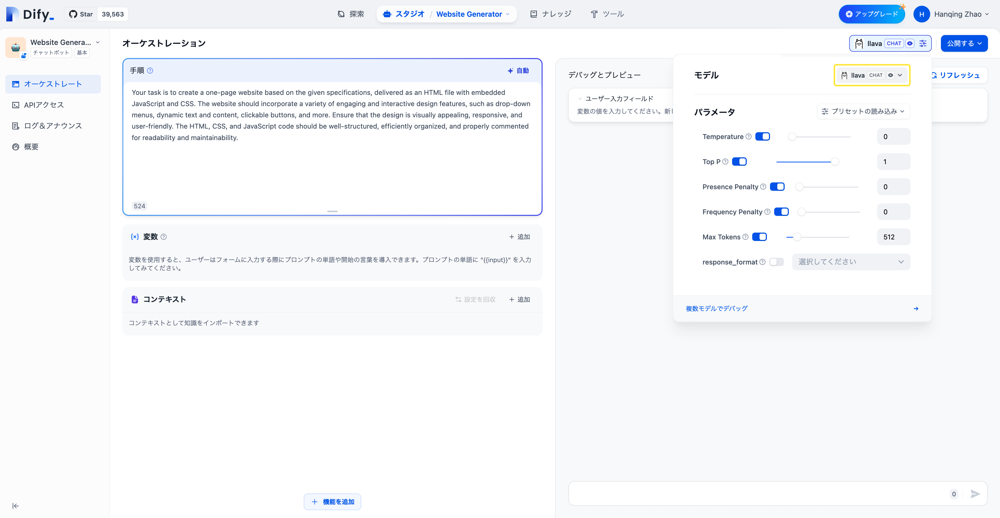

# Ollamaでデプロイしたローカルモデルを統合


[Ollama](https://github.com/jmorganca/ollama) は、Llama 2、Mistral、Llava などの大型言語モデルをワンクリックでデプロイできるローカル推論フレームワーククライアントです。
Dify は、Ollama でデプロイした大型言語モデルの推論および埋め込み機能への接続をサポートしています。

## クイック接続

### Ollama のダウンロードと起動

1. Ollama をダウンロード

   [https://ollama.ai/download](https://ollama.ai/download) にアクセスし、対応するシステムの Ollama クライアントをダウンロードします。

2. Ollama を実行して Llava とチャット

    ```bash
    ollama run llava
    ```

    起動に成功すると、ollama はローカルの 11434 ポートで API サービスを開始し、`http://localhost:11434` でアクセスできます。

    その他のモデルについては [Ollama Models](https://ollama.ai/library) を参照してください。

3. Dify に Ollama を接続

   `設定 > モデル供給元 > Ollama` に以下を入力します：

   

   - モデル名称：`llava`
   
   - 基本 URL：`http://<your-ollama-endpoint-domain>:11434`
   
     ここには、アクセス可能な Ollama サービスのアドレスを入力します。
   
     Dify が docker でデプロイされている場合、ローカルネットワークの IP アドレス（例：`http://192.168.1.100:11434`）または docker ホストマシンの IP アドレス（例：`http://172.17.0.1:11434`）を入力することをお勧めします。
   
     ローカルソースコードでデプロイされている場合は、`http://localhost:11434` を入力できます。

   - モデルタイプ：`対話`

   - モデルのコンテキスト長：`4096`
   
     モデルの最大コンテキスト長です。不明な場合はデフォルト値の 4096 を入力してください。
   
   - 最大トークン上限：`4096`
   
     モデルが返す内容の最大トークン数です。特に記載がない場合、モデルのコンテキスト長と同じ値を入力してください。

   - ビジョン対応：`はい`
   
     モデルが画像理解（マルチモーダル）をサポートしている場合、このオプションを選択してください。例えば `llava` などです。

   「保存」をクリックし、エラーがないことを確認したら、このモデルをアプリで使用できます。

   埋め込みモデルの接続方法も LLM と似ています。モデルタイプを Text Embedding に変更するだけです。

4. Ollama モデルの使用

   

   設定が必要なアプリのプロンプト編成ページに移動し、Ollama 供給元の `llava` モデルを選択し、モデルパラメーターを設定した後に使用できます。

## FAQ

### ⚠️ Docker を使用して Dify と Ollama をデプロイする場合、以下のエラーが発生することがあります:

```
httpconnectionpool(host=127.0.0.1, port=11434): max retries exceeded with url:/cpi/chat (Caused by NewConnectionError('<urllib3.connection.HTTPConnection object at 0x7f8562812c20>: fail to establish a new connection:[Errno 111] Connection refused'))

httpconnectionpool(host=localhost, port=11434): max retries exceeded with url:/cpi/chat (Caused by NewConnectionError('<urllib3.connection.HTTPConnection object at 0x7f8562812c20>: fail to establish a new connection:[Errno 111] Connection refused'))
```

このエラーは、Docker コンテナが Ollama サービスにアクセスできないために発生します。localhost は通常、コンテナ自体を指すため、ホストや他のコンテナではありません。この問題を解決するには、Ollama サービスをネットワークに公開する必要があります。

### Macで環境変数を設定する方法

`Ollama` を `macOS` アプリケーションとして実行する場合、以下のコマンドを使用して環境変数`launchctl`を設定します：

1. `launchctl setenv` を呼び出して環境変数を設定：

    ```bash
    launchctl setenv OLLAMA_HOST "0.0.0.0"
    ```

2. Ollama アプリケーションを再起動します。

3. 上記の手順が無効な場合は、次の方法を試してください：

    問題は docker 内部で、docker のホストにアクセスするために `host.docker.internal` に接続する必要があるため、`localhost` を `host.docker.internal` に置き換えてサービスを設定します：

    ```bash
    http://host.docker.internal:11434
    ```

### Linuxで環境変数を設定する方法

Ollama を systemd サービスとして実行する場合は、`systemctl` を使用して環境変数を設定します：

1. `systemctl edit ollama.service` を呼び出して systemd サービスを編集します。これにより、エディタが開きます。

2. 各環境変数について、`[Service]` セクションの下に `Environment` 行を追加します：

    ```ini
    [Service]
    Environment="OLLAMA_HOST=0.0.0.0"
    ```

3. 保存して終了します。

4. `systemd` をリロードし、Ollama を再起動します：

   ```bash
   systemctl daemon-reload
   systemctl restart ollama
   ```

### Windowsで環境変数を設定する方法

Windows では、Ollama はユーザーとシステムの環境変数を継承します。

1. まずタスクバーから Ollama をクリックしてプログラムを終了します

2. コントロールパネルからシステム環境変数を編集します

3. ユーザーアカウントのために変数を編集または新規作成します。例えば、`OLLAMA_HOST`、`OLLAMA_MODELS`などです。

4. OK/適用をクリックして保存します

5. 新しいターミナルウィンドウで `ollama` を実行します

### Ollama をネットワーク上で公開する方法

Ollama はデフォルトで 127.0.0.1 の 11434 ポートにバインドされています。`OLLAMA_HOST` 環境変数を使用してバインドアドレスを変更します。

## Ollama に関する詳細情報については以下を参照してください

For more information on Ollama, please refer to: 

- [Ollama](https://github.com/jmorganca/ollama)
- [Ollama FAQ](https://github.com/ollama/ollama/blob/main/docs/faq.md)