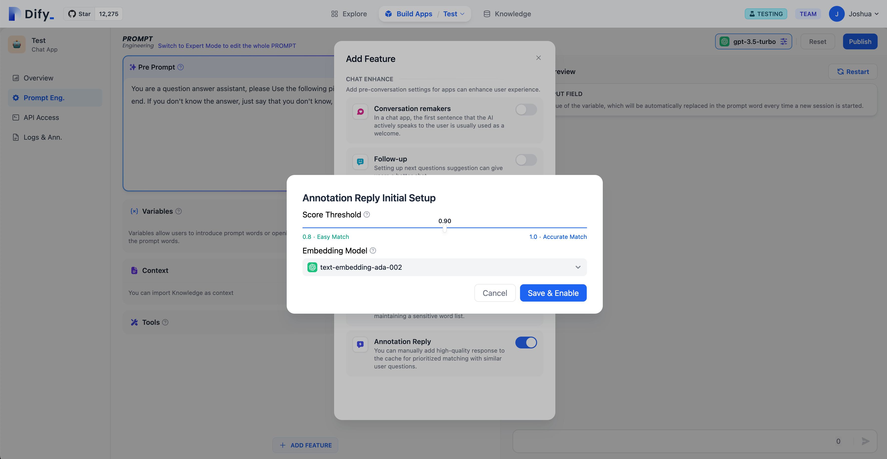
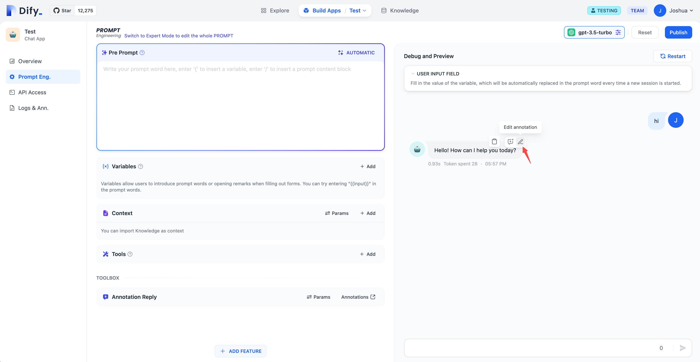
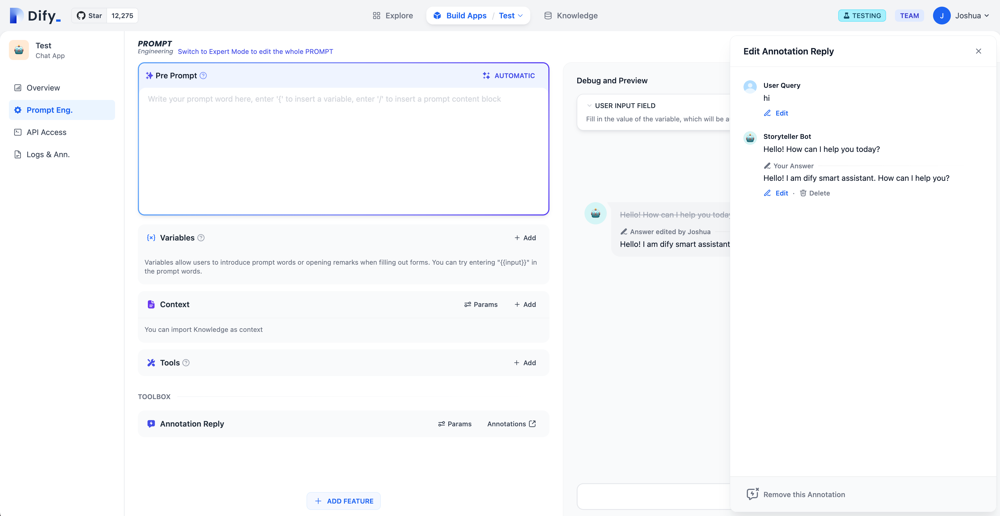
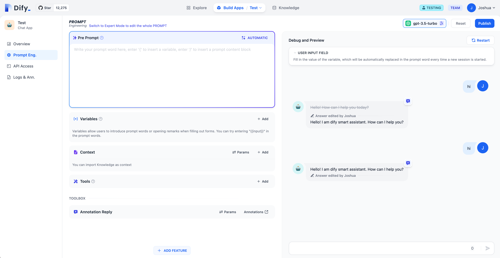
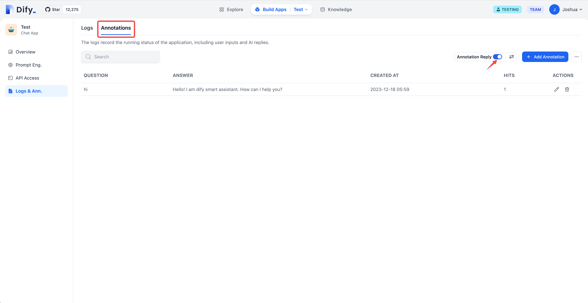
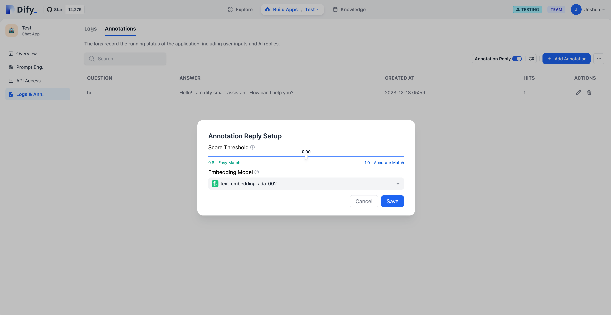
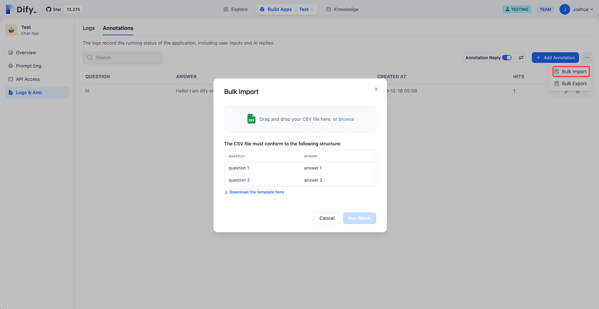
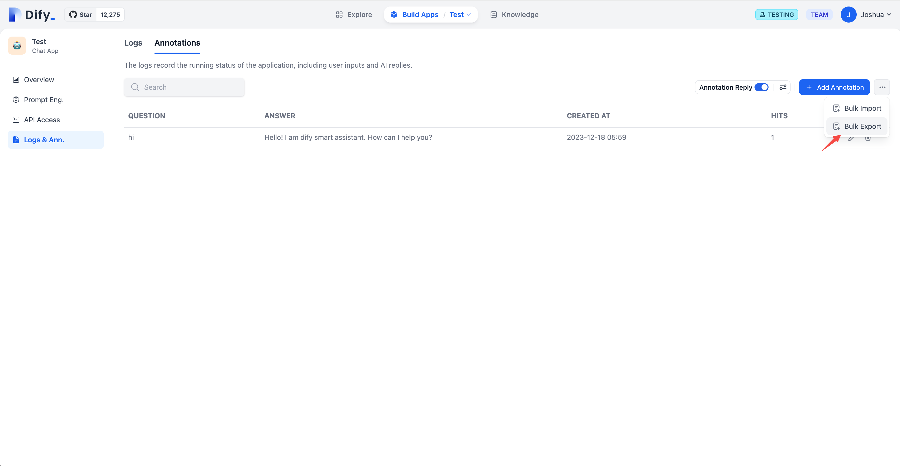
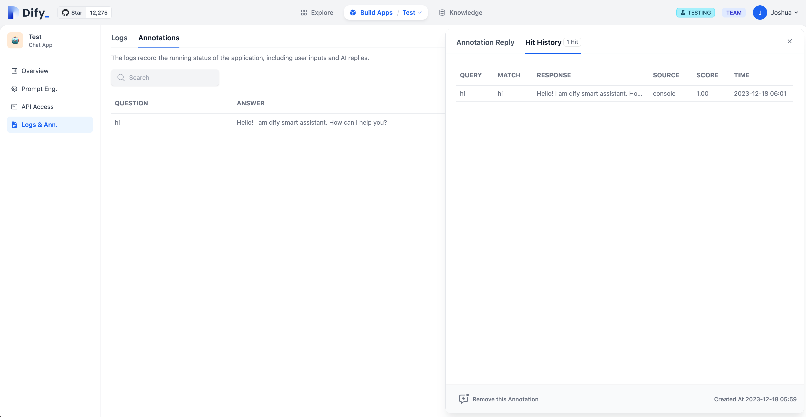

# Annotation Reply

## Feature Overview

The Annotation Reply feature offers tailored, high-quality replies for various applications, achieved through manual annotation.

#### Key Uses:

1. **Specialized Replies for Specific Sectors:** This is particularly valuable in customer service or knowledge bases within business, government, etc. It allows for precise answers to specific questions by annotating replies, such as setting "standard annotations" for some or marking others as "unanswerable."
2. **Quick Adaptation for Prototypes:** Utilizing Annotation Reply can significantly improve reply quality in the rapid development of prototype products, enhancing customer satisfaction.

#### How It Works:

The feature provides an alternative system for enhancing retrieval, skipping the generation phase of Large Language Models (LLMs) and avoiding the complications of Retrieval-Augmented Generation (RAG).

1. Once activated, you can annotate LLM dialogue replies. Annotations can either be high-quality answers taken directly from the LLM or your own edited annotations. These annotated contents are saved for future use.
2. When similar questions are asked again, the system identifies matching annotated questions.
3. If a match is found, the annotated answer is returned directly, bypassing LLM or RAG processes.
4. Without a match, the query follows the standard LLM or RAG process.
5. Deactivating Annotation Reply ceases matching replies from the annotations.

<figure><figcaption>
Annotation Reply Process
</figcaption></figure>

## Activation

Navigate to “Build Apps -> Add Feature” to enable the Annotation Reply feature.

<figure><figcaption></figcaption></figure>

Start by setting the parameters for Annotation Reply. These include the Score threshold and the Embedding model.

* **Score Threshold:** Sets the minimum similarity score for an annotation to be considered a match and recalled.
* **Embedding Model:** Used for converting annotated text into vectors. Changing the model leads to re-creation of embeddings.

Select 'Save' for immediate application of these settings. The system then creates and stores embeddings for all existing annotations.

<figure><figcaption></figcaption></figure>

## Adding Annotations in Debug Mode

Annotations can be added or modified directly on the model's replies within the debug and preview interface.

<figure><figcaption></figcaption></figure>

Edit and save these replies to ensure high quality.

<figure><figcaption></figcaption></figure>

When a user repeats a query, the system uses the relevant saved annotation for a direct reply.

<figure><figcaption></figcaption></figure>

## Enabling Annotations in System Logs

Turn on the Annotation Reply feature under “Build Apps -> Logs and Annotations -> Annotations.”

<figure><figcaption></figcaption></figure>

## Adjusting Backend Parameters for Annotations

**Parameter Settings:** These include the Score threshold and Embedding model, just as in the initial configuration.

<figure><figcaption></figcaption></figure>

## Bulk Importing Annotated Q\&As

**Import Process:** Use the provided template to format Q\&A pairs for annotations, then upload them in bulk.

<figure><figcaption></figcaption></figure>

## Bulk Exporting Annotated Q\&As

**Export Function:** This feature allows for a one-time export of all annotated Q\&A pairs stored in the system.

<figure><figcaption></figcaption></figure>

## Reviewing Annotation Hit History

View the history of each annotation's use, including edits, queries, replies, sources, similarity scores, and timestamps. This information is valuable for ongoing improvements to your annotations.

<figure><figcaption></figcaption></figure>
