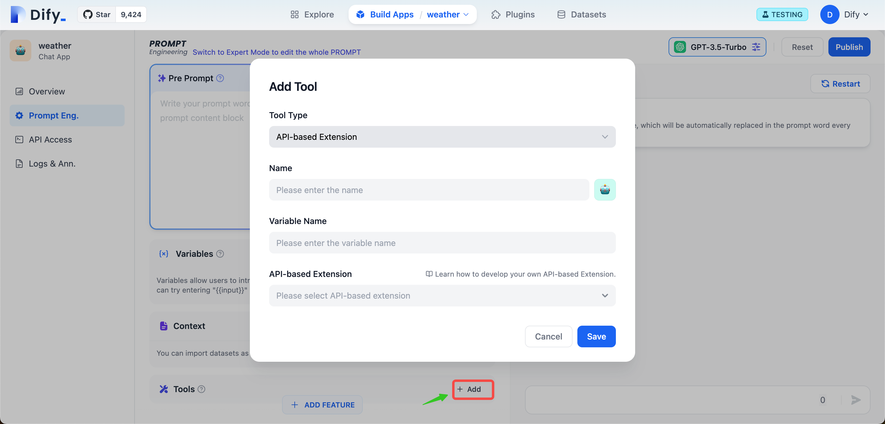

# External Data Tool

Previously, [datasets](datasets/ "mention") allowed developers to directly upload long texts in various formats and structured data to build knowledge, enabling AI applications to converse based on the latest context uploaded by users. With this update, the external data tool empowers developers to use their own search capabilities or external data such as internal knowledge bases as the context for LLMs. This is achieved by extending APIs to fetch external data and embedding it into Prompts. Compared to uploading knowledge to the cloud, using external data tools offers significant advantages in ensuring the security of private data, customizing searches, and obtaining real-time data.

## What does it do?

When end-users make a request to the conversational system, the platform backend triggers the external data tool (i.e., calling its own API), which queries external information related to the user's question, such as employee profiles, real-time records, etc. The tool then returns through the API the portions relevant to the current request. The platform backend will assemble the returned results into text as context injected into the Prompt, in order to produce replies that are more personalized and meet user needs more accurately.

## Quick Start

1. Before using the external data tool, you need to prepare an API and an API Key for authentication. Head to [external\_data\_tool.md](extension/api\_based\_extension/external\_data\_tool.md "mention").
2. Dify offers centralized API management; After adding API extension configurations in the settings interface, they can be directly utilized across various applications on Dify.

<figure><figcaption>
API-based Extension 
</figcaption></figure>

3. Taking "Query Weather" as an example, enter the name, API endpoint, and API Key in the "Add New API-based Extension" dialog box. After saving, we can then call the API.

<figure><figcaption>
Weather Inquiry
</figcaption></figure>

4. On the prompt orchestration page, click the "+ Add" button to the right of "Tools," and in the "Add Tool" dialog that opens, fill in the name and variable name (the variable name will be referenced in the Prompt, so please use English), as well as select the API-based extension added in Step 2.

<figure><figcaption>
External_data_tool
</figcaption></figure>

5. In the prompt orchestration box, we can assemble the queried external data into the Prompt. For instance, if we want to query today's weather in London, we can add a variable named `location`, enter "London", and combine it with the external data tool's extension variable name `weather_data`. The debug output would be as follows:

<figure><figcaption>
Weather_search_tool
</figcaption></figure>

In the Prompt Log, we can also see the real-time data returned by the API:

<figure><figcaption>
Prompt Log
</figcaption></figure>
