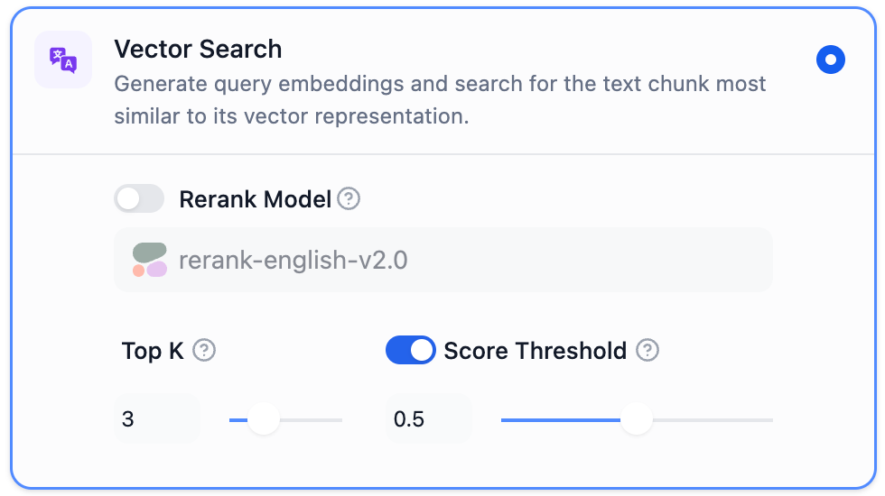
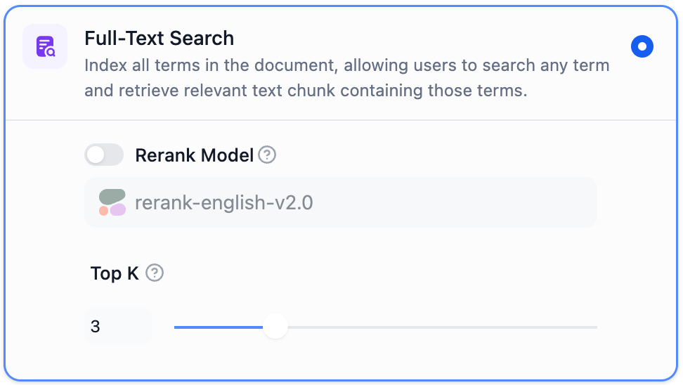
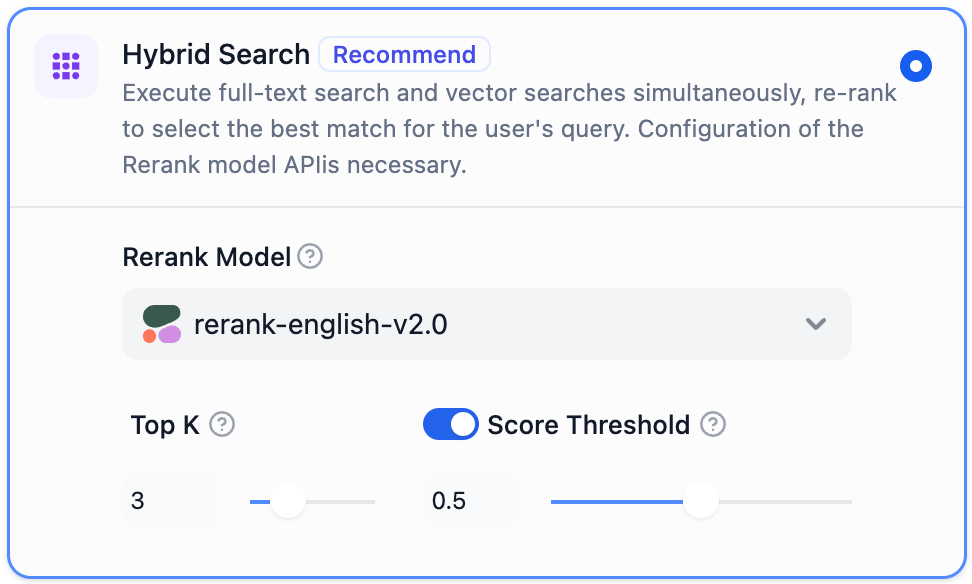
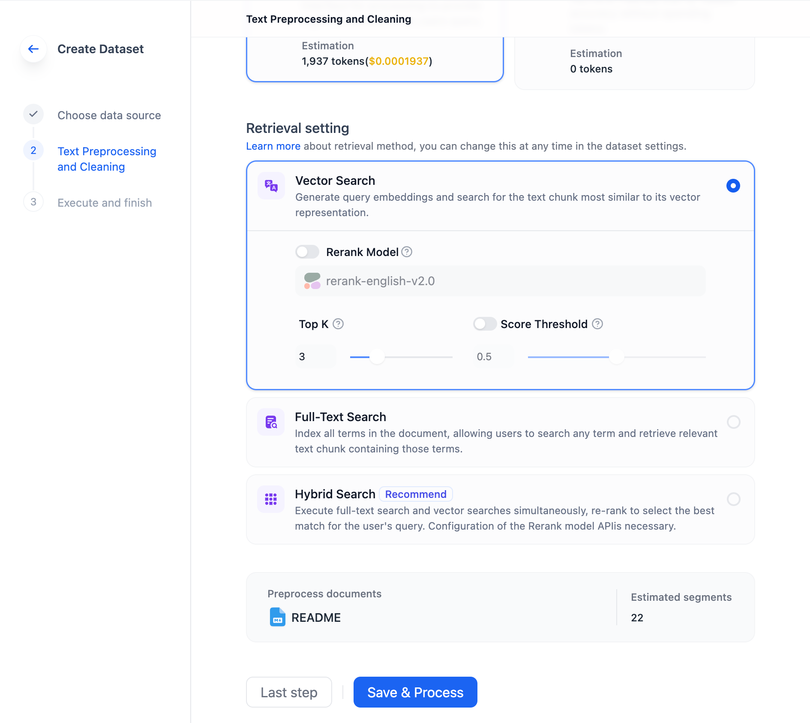
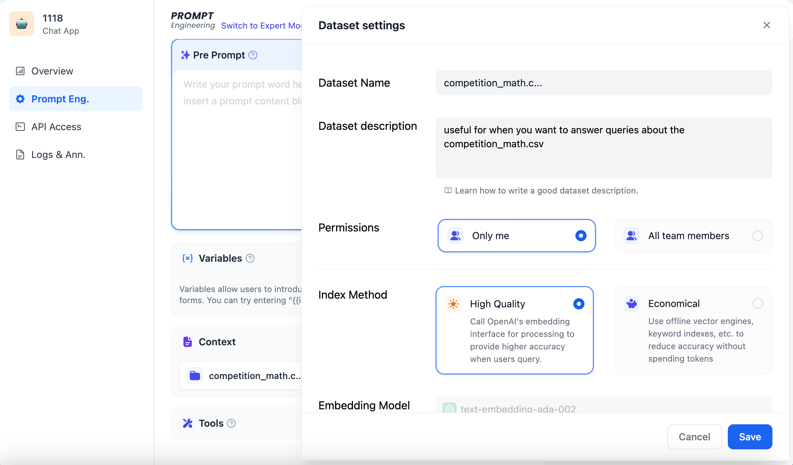

# Hybrid Search

## Why is Hybrid Search Necessary?

The mainstream method in the RAG retrieval phase is Vector Search, which is based on semantic relevance matching. The technical principle involves initially dividing documents from external knowledge bases into semantically complete paragraphs or sentences, and then converting them through a process known as embedding into a series of numerical expressions (multidimensional vectors) that computers can understand. The user's query undergoes a similar conversion.

Computers can detect subtle semantic correlations between user queries and sentences. For example, the semantic relevance between "a cat chases a mouse" and "a kitten hunting a mouse" is higher than between "a cat chases a mouse" and "I like to eat ham." After identifying the text with the highest relevance, the RAG system provides it as context alongside the user's query to the large model, aiding in answering the question.

Besides complex semantic text searches, Vector Search has other advantages:

* Understanding of similar semantics (e.g., mouse/mousetrap/cheese, Google/Bing/search engine)
* Multilingual comprehension (e.g., matching Chinese input with English content)
* Multimodal understanding (supports matching text, images, audio, and video)
* Fault tolerance (handles spelling mistakes, vague descriptions)

However, Vector Search might underperform in certain scenarios, like:

* Searching names of people or objects (e.g., Elon Musk, iPhone 15)
* Searching acronyms or short phrases (e.g., RAG, RLHF)
* Searching IDs (e.g., `gpt-3.5-turbo`, `titan-xlarge-v1.01`)

These limitations are precisely where traditional keyword search excels, being adept at:

* Precise matching (e.g., product names, personal names, product numbers)
* Matching a small number of characters (vector search performs poorly with few characters, but users often input just a few keywords)
* Matching low-frequency vocabulary (which often carries more significant meanings, like in “Do you want to go for a coffee with me?”, words like “drink” and “coffee” carry more weight than “you”, “want”, “me”)

In most text search scenarios, it's crucial to ensure that the most relevant results appear in the candidates. Vector and keyword searches each have their strengths in the search domain. Hybrid Search combines the advantages of both techniques while compensating for their respective shortcomings.

In Hybrid Search, vector and keyword indices are pre-established in the database. Upon user query input, the system searches for the most relevant text in documents using both search methods.

<figure><figcaption>
Hybrid Search
</figcaption></figure>

"Hybrid Search" doesn't have a definitive definition; this article exemplifies it as a combination of Vector Search and Keyword Search. However, the term can also apply to other combinations of search algorithms. For instance, we could combine knowledge graph technology, used for retrieving entity relationships, with Vector Search.

Different search systems each excel at uncovering various subtle connections within texts (paragraphs, sentences, words), including precise relationships, semantic relationships, thematic relationships, structural relationships, entity relationships, temporal relationships, and event relationships. It's safe to say that no single search mode is suitable for all scenarios. **Hybrid Search, by integrating multiple search systems, achieves a complementarity among various search technologies.**

## Vector Search

Definition: Vector Search involves generating query embeddings and then searching for text chunks that most closely match these embeddings in terms of vector representation.

<figure><figcaption>
Settings for Vector Search
</figcaption></figure>

**TopK:** This setting is used to filter text chunks that have the highest similarity to the user's query. The system also dynamically adjusts the number of chunks based on the context window size of the selected model. The default value for this setting is 3.

**Score Threshold:** This setting is used to establish a similarity threshold for the selection of text chunks. It means that only text chunks exceeding the set score are recalled. By default, this setting is turned off, meaning that the system does not filter the similarity values of the recalled text chunks. When activated, the default value is set to 0.5.

**Rerank Model:** After configuring the Rerank model's API key on the "Model Provider" page, you can enable the "Rerank Model" in the search settings. The system then performs a semantic re-ranking of the document results that have been recalled after semantic search, optimizing the order of these results. Once the Rerank model is set up, the TopK and Score threshold settings are only effective in the Rerank step.

## Full-Text Search

Definition: Full-Text Search involves indexing all the words in a document, enabling users to query any term and retrieve text chunks that contain these terms.

<figure><figcaption>
Settings for Full-Text Search
</figcaption></figure>

**TopK:** This setting is utilized to select text chunks that most closely match the user's query in terms of similarity. The system also dynamically adjusts the number of chunks based on the context window size of the chosen model. The default value for TopK is set at 3.

**Rerank Model:** After configuring the API key for the Rerank model on the "Model Provider" page, you can activate the "Rerank Model" in the search settings. The system will then perform a semantic re-ranking of the document results retrieved through full-text search, optimizing the order of these results. Once the Rerank model is configured, the TopK and any Score threshold settings will only be effective during the Rerank step.

## Hybrid Search

Hybrid Search operates by concurrently executing Full-Text Search and Vector Search. It then applies a re-ranking step to choose the best results that match the user's query from both types of search results. To effectively use this feature, it is necessary to configure the Rerank Model API.

<figure><figcaption>
Settings for Hybrid Search
</figcaption></figure>

**TopK:** This setting is used for filtering text chunks that have the highest similarity to the user's query. The system will dynamically adjust the number of chunks based on the context window size of the model in use. The default value for TopK is set at 3.

**Rerank Model:** After configuring the Rerank model's API key on the "Model Supplier" page, you can enable the "Rerank Model" in the search settings. The system will perform a semantic re-ranking of the document results retrieved through hybrid search, thereby optimizing the order of these results. Once the Rerank model is set up, the TopK and any Score threshold settings are only applicable during the Rerank step.

## Setting the Search Mode When Creating a Knowledge

To set the search mode when creating a knowledge base, navigate to the "Knowledge -> Create Knowledge" page. There, you can configure different search modes in the retrieval settings section.

<figure><figcaption>
Setting the Search Mode When Creating a Knowledge base
</figcaption></figure>

## Modifying the Search Mode in Prompt Engineering

You can modify the search mode during application creation by navigating to the "Prompt Engineering -> Context -> Select Knowledge -> Settings" page. This allows for adjustments to different search modes within the prompt arrangement phase.

<figure><figcaption>
Modifying the Search Mode in Prompt Engineering
</figcaption></figure>
