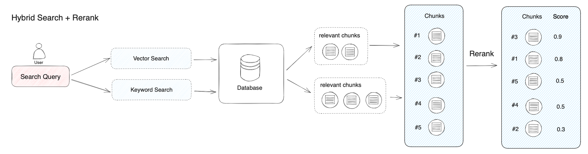
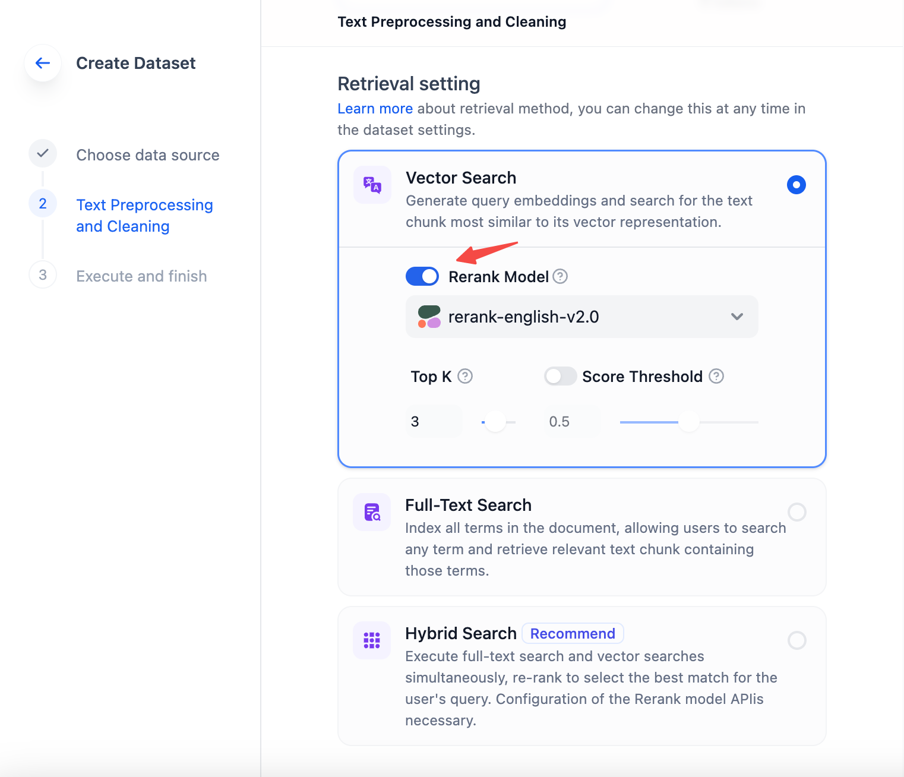
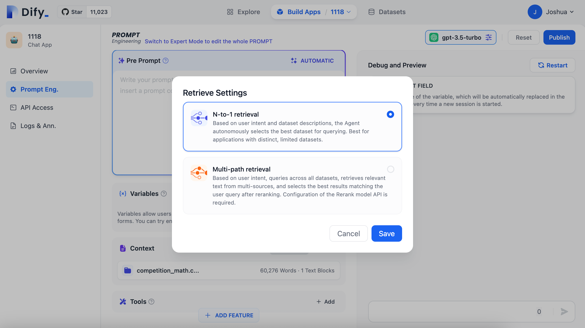

# Rerank

## Why is Rerank Necessary?&#x20;

Hybrid Search combines the advantages of various search technologies to achieve better recall results. However, results from different search modes need to be merged and normalized (converting data into a uniform standard range or distribution for better comparison, analysis, and processing) before being collectively provided to the large model. This necessitates the introduction of a scoring system: Rerank Model.

The Rerank Model works by reordering the list of candidate documents based on their semantic match with the user's question, thus improving the results of semantic sorting. It does this by calculating a relevance score between the user's question and each candidate document, returning a list of documents sorted by relevance from high to low. Common Rerank models include Cohere rerank, bge-reranker, and others.

<figure><figcaption>
Hybrid Search + Rerank
</figcaption></figure>

In most cases, there is an initial search before rerank because calculating the relevance score between a query and millions of documents is highly inefficient. **Therefore, rerank is typically placed at the end of the search process, making it very suitable for merging and sorting results from different search systems.**

However, rerank is not only applicable to merging results from different search systems. Even in a single search mode, introducing a rerank step can effectively improve the recall of documents, such as adding semantic rerank after keyword search.

In practice, apart from normalizing results from multiple queries, we usually limit the number of text chunks passed to the large model before providing the relevant text chunks (i.e., TopK, which can be set in the rerank model parameters). This is done because the input window of the large model has size limitations (generally 4K, 8K, 16K, 128K Token counts), and you need to select an appropriate segmentation strategy and TopK value based on the size limitation of the chosen model's input window.

It should be noted that even if the model's context window is sufficiently large, too many recalled chunks may introduce content with lower relevance, thus degrading the quality of the answer. Therefore, the TopK parameter for rerank is not necessarily better when larger.

Rerank is not a substitute for search technology but an auxiliary tool to enhance existing search systems. **Its greatest advantage is that it not only offers a simple and low-complexity method to improve search results but also allows users to integrate semantic relevance into existing search systems without the need for significant infrastructure modifications.**

## How to Obtain the Cohere Rerank Model?&#x20;

Visit [https://cohere.com/rerank](https://cohere.com/rerank), register on the page, and apply for usage rights for the Rerank model to obtain the API key.

## Setting the Rerank Model in Knowledge Search Mode&#x20;

Access the Rerank settings by navigating to “Knowledge -> Create Knowledge -> Retrieval Settings”. Besides setting Rerank during knowledge creation, you can also modify the Rerank configuration in the settings of an already created knowledge base, and change the Rerank configuration in the knowledge recall mode settings of application arrangement.

<figure><figcaption>
Setting the Rerank Model in Knowledge Search Mode 
</figcaption></figure>

**TopK:** Used to set the number of relevant documents returned after Rerank.&#x20;

**Score Threshold:** Used to set the minimum score for relevant documents to be returned after Rerank. After setting the Rerank model, the TopK and Score threshold settings are only effective in the Rerank step.

## Setting the Rerank Model in Multi-path retrieval

&#x20;Recall Mode Enable the Rerank model by setting it to Multi-path retrieval mode in the “Prompt Engineering -> Context -> Settings” page.&#x20;

Explanation of Multi-path retrieval Mode: 🔗

<figure><figcaption>
Setting the Rerank Model in Multi-path retrieval
</figcaption></figure>
