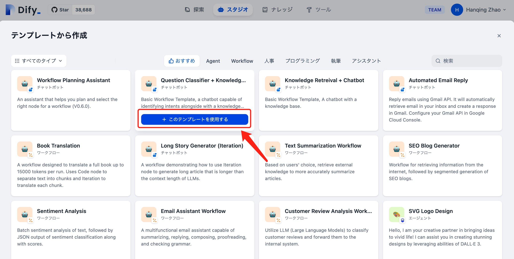
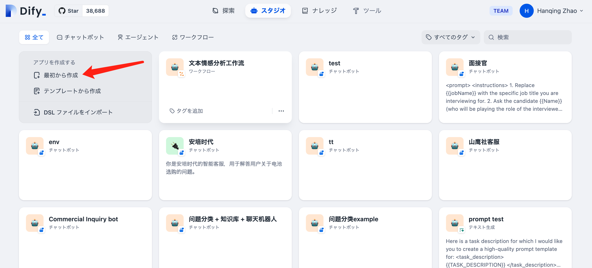

# アプリケーションの作成

Difyスタジオでは、アプリケーションを作成するにあたり以下の3つの方法があります：

* アプリケーションテンプレートを使用（初心者におすすめ）
* 空白のアプリケーションからスタート
* DSLファイルをインポートして作成(ローカル・オンライン)

### テンプレートを使ってアプリケーションを作成

Difyを初めて使う場合、アプリケーション制作に不慣れなこともあるでしょう。そのため、Difyチームは様々な用途に対応する高品質なテンプレートを提供しており、これによりDifyで作成可能なアプリケーションの種類を迅速に把握できます。

ナビゲーションメニューより「スタジオ」を選んだ後、「テンプレートから作成」をアプリケーションリストから選択してください。

<figure><figcaption><p>テンプレートからアプリケーションを作成</p></figcaption></figure>

好みのテンプレートを選択し、**このテンプレートを使用する**ボタンをクリックします。

<figure><figcaption><p>Difyアプリケーションテンプレート</p></figcaption></figure>

### 新しいアプリケーションの作成

空白のアプリケーションをDifyで作成する場合、ナビゲーションメニューから「スタジオ」を選び、「空白から作成」をアプリケーションリストで選択します。

<figure><figcaption></figcaption></figure>

Difyで初めてアプリケーションを作成する際は、チャットボイス、テキストジェネレータ、エージェント、ワークフローという4つの異なる種類のアプリケーションの[基本概念](./#application_type)を理解することが重要です。

アプリケーションを作成する際には、名前を付け、適切なアイコンを選択し、このアプリケーションの目的を簡潔に説明することで、チーム内での使用を容易にします。

<figure><figcaption><p>空白アプリケーションを作成</p></figcaption></figure>

### DSLファイルから作成


Dify DSLは、Dify.AIが定めるAIアプリケーション開発のための標準ファイルフォーマット(YML)です。この標準には、アプリケーションの基本情報、モデルのパラメータ、オーケストレーションの設定などが含まれます。


#### ローカルのDSLファイルをインポート

コミュニティや他者から提供されたDSLファイル（テンプレート）を持っている場合は、「DSLファイルをインポート」をスタジオから選択してください。インポート後、元のアプリケーションの設定が直接読み込まれます。

<figure><figcaption><p>DSLファイルをインポートしてアプリケーションを作成</p></figcaption></figure>

#### URLを通じてDSLファイルをインポート

以下の形式を使用して、URL経由でDSLファイルをインポートすることができます：

```URL
https://example.com/your_dsl.yml
```

<figure><figcaption><p>URL経由でDSLファイルをインポート</p></figcaption></figure>
