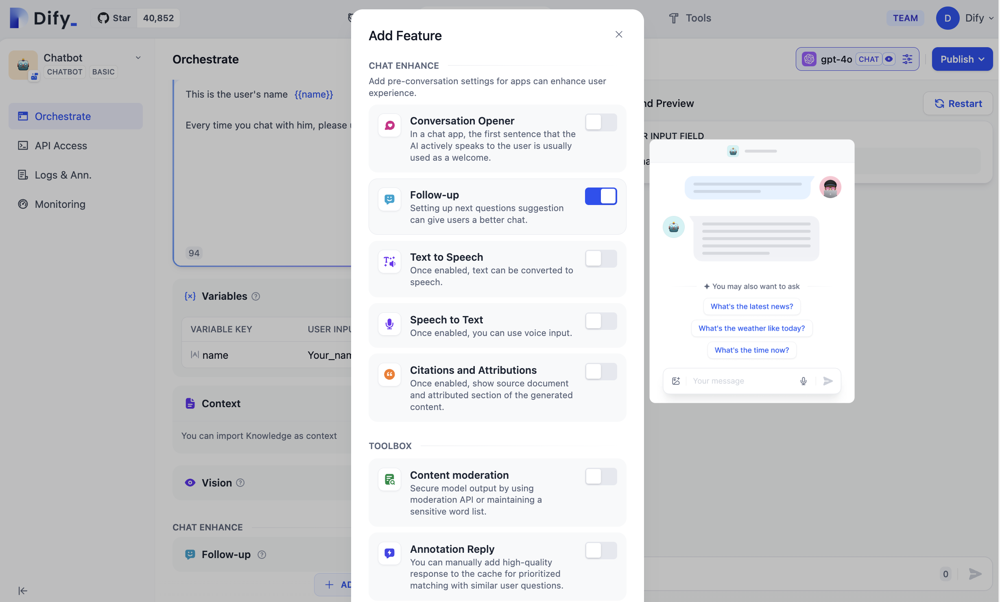

# 会話型アプリケーション

会話型アプリケーションは、一問一答の形式でユーザーと継続的に会話を行います。会話型アプリケーションは以下の機能をサポートします（アプリケーションの設定時にこれらの機能が有効になっていることを確認してください）：

* 会話前に入力する変数。
* 会話の作成、ピン留め、削除。
* 会話の冒頭。
* 次のステップの質問の提案。
* 音声認識。
* 引用と帰属。

### 会話前に入力する変数

アプリケーションの設定時に変数入力を求める設定をしている場合、会話を始める前に指示に従って情報を入力する必要があります：

<figure><figcaption></figcaption></figure>

必要な内容を入力し、「会話を開始」ボタンをクリックしてチャットを始めます。AIの回答に移動して、会話の内容をコピーしたり、回答に「いいね」や「悪いね」を付けたりできます。

<figure><figcaption></figcaption></figure>

### 会話の作成、ピン留め、削除

「新しい会話」ボタンをクリックして新しい会話を開始します。会話に移動して、会話を「ピン留め」または「削除」することができます。

<figure><figcaption></figcaption></figure>

### 会話のオープニング

アプリケーションの設定時に「会話のオープニング」機能が有効になっている場合、新しい会話を作成するとAIアプリケーションが自動的に最初の会話を開始します：

<figure><figcaption></figcaption></figure>

### 次のステップの質問の提案

アプリケーションの設定時に「次のステップの質問の提案」機能が有効になっている場合、会話後にシステムが自動的に3つの関連する質問を提案します：

<figure><figcaption></figcaption></figure>

### 音声認識

アプリケーションの設定時に「音声認識」機能が有効になっている場合、Webアプリケーション端の入力欄に音声入力のアイコンが表示され、アイコンをクリックすることで音声入力が文字に変換されます：

_使用するデバイス環境がマイクロフォンの使用を許可していることを確認してください。_

<figure><figcaption></figcaption></figure>

### 引用と帰属

アプリ内でナレッジベースの効果をテストする際、**ワークスペース -- 機能の追加 -- 引用と帰属** に移動し、引用と帰属機能をオンにすることができます。詳細については[「引用と帰属」](https://docs.dify.ai/v/japanese/guides/knowledge-base/retrieval_test_and_citation#id-2-yin-yong-yu-gui-shu)を参照してください。