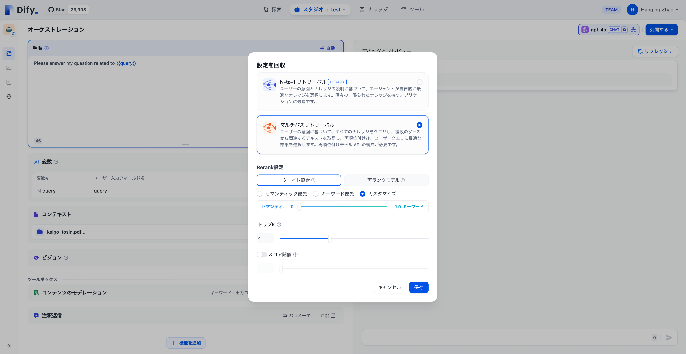
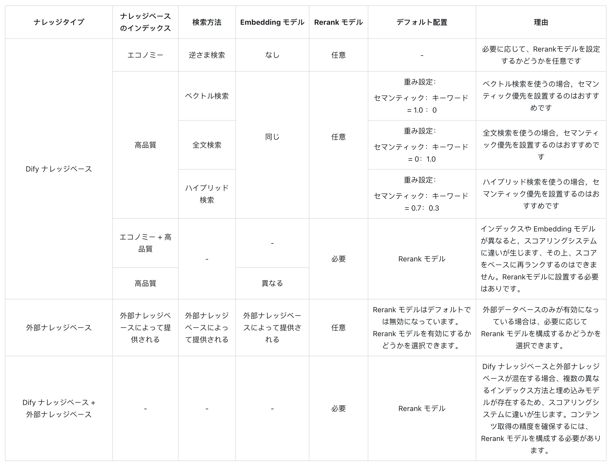

# アプリ内でのナレッジベース統合

### 1 ナレッジベースの引用プロセス

ナレッジベースは、大言語モデルに対して外部知識を提供し、ユーザーの質問に正確に回答するために使用されます。Difyの[すべてのアプリタイプ](../application-orchestrate/#application\_type)内で作成されたナレッジベースを関連付けることができます。

チャットボットを例にすると、以下の手順で進めます：

1. **スタジオ -- アプリを作成 -- チャットボットを作成**に進む
2. **コンテキスト設定**に進み、**追加**をクリックし、作成済みのナレッジベースを選択
3. **コンテキスト設定 -- パラメータ設定**内で**リコール策略**を設定
4. ナレッジベース内のドキュメント検索を最適化するには、**メタデータフィルタリング**を活用します。
5. **コンテキスト設定 - 検索設定**で**検索パラメータ**を構成します。
6. **機能追加**内で**引用と帰属**をオンにする
7. **デバッグとプレビュー**内でナレッジベース関連のユーザー質問を入力してデバッグ
8. デバッグが完了したら、**保存して公開**し、AIナレッジベースQ\&Aアプリケーションとして公開

***

### ナレッジベースの関連付けとリコールモードの設定

現在のアプリケーションのコンテキストが複数のナレッジベースに関連している場合、検索結果をより正確にするためにリコールモードを設定する必要があります。**コンテキスト→パラメータ設定→リコール設定** に進み、ナレッジベースのリコールモードを選択します。

#### 検索設定

複数リコールモードでは、検索器はアプリに関連付けられたすべてのナレッジベースから、ユーザーの問題に関連するテキスト内容を検索します。そして、複数リコールの関連文書結果を統合します。以下は複数リコールモードの技術フローチャートです：

<figure><figcaption></figcaption></figure>

ユーザーの意図に基づいて、すべての **「コンテキスト」** に追加されたナレッジベースを同時に検索し、関連するテキスト断片を複数のナレッジベースからクエリし、ユーザーの問題に最も一致する内容を選択します。最適なコンテンツをRerank戦略で見つけてユーザーに回答します。この方法はより科学的な検索原理です。

<figure><figcaption></figcaption></figure>

例：アプリAのコンテキストには、K1、K2、K3 の3つのナレッジベースが関連付けられています。ユーザーが問い合わせを入力すると、3つのナレッジベースで検索を行い、複数の内容をまとめます。最適な内容を見つけるためには、Rerank戦略を使用してユーザーの問題に最も関連する内容を特定し、結果をより正確で信頼性の高いものにします。

実際の質疑応答シーンでは、各ナレッジベースのコンテンツの出典や検索方法が異なる場合があります。複数の混合コンテンツが返される検索に対して、[Rerank戦略](https://docs.dify.ai/v/ja-jp/learn-more/extended-reading/retrieval-augment/rerank)はより科学的なコンテンツの並べ替えメカニズムです。これにより、候補コンテンツリストをユーザーの問題に一致させ、複数の知識間の結果の順序を改善し、最も一致するコンテンツを見つけて回答の質とユーザーエクスペリエンスを向上させることができます。

Rerankの使用コストとビジネス要件を考慮すると、複数リコールモードは次の2つのRerank設定を提供します：

#### 重み設定

この設定には外部のRerankモデルの構成は不要で、コンテンツの再並べ替えに**追加コストは発生しません**。セマンティクスまたはキーワードの重み比率を設定します。

*   **セマンティック値が1の場合**

    セマンティック検索モードが有効になります。このモードでは、埋め込みモデルを利用して、クエリに正確な単語がナレッジベースに存在しない場合でも、ベクトル距離を計算することで検索の精度を向上させ、適切なコンテンツを返すことができます。また、複数言語のコンテンツを扱う場合には、セマンティック検索が異なる言語間の意味を把握し、より正確なクロス言語検索結果を提供します。
*   **キーワード値が1の場合**

    この場合、キーワード検索モードが有効になります。ユーザーが入力した情報テキストがナレッジベース全体と一致し、ユーザーが正確な情報や用語を把握している場合に適しています。この方法は計算リソースを少なく消費し、大量の文書を迅速に検索するのに適しています。
*   **カスタムキーワードとセマンティックの重み**

    セマンティック検索またはキーワード検索モードのいずれかを選択する代わりに、柔軟なカスタム重み設定も利用可能です。両者の重みを調整し続けることで、ビジネスシナリオに最も適した重み比率を見つけることができます。

**Rerankモデル**

Rerankモデルは外部のスコアリングシステムで、ユーザーの質問と各候補文書の関連性スコアを計算します。これにより、セマンティックソートの結果が改善され、関連性に基づいて高い順に並べ替えられた文書リストが返されます。

この方法には追加のコストが発生しますが、ナレッジベースのコンテンツが複雑な場合に特に適しています。セマンティッククエリとキーワードマッチングのコンテンツが混在している場合や、複数言語のコンテンツが含まれる場合に優れた結果を提供します。

> より詳細な情報は[リコール拡張](https://docs.dify.ai/v/ja-jp/learn-more/extended-reading/retrieval-augment/rerank)メカニズムをご覧ください。

Difyは現在、複数のRerankモデルをサポートしており、"モデルサプライヤー"ページでRerankモデル（例：Cohere、Jina AIなど）のAPIキーを入力することができます。

<figure><figcaption>
モデルサプライヤー内でRerankモデルを設定
</figcaption></figure>

**調整可能なパラメータ**

*   **TopK**

    ユーザーの質問に最も類似したテキストセグメントを選択するために使用されます。システムはモデルの選択に基づいてコンテキストウィンドウサイズを動的に調整し、セグメントの数を増やします。数値が高いほど、リコールされるテキストセグメントの数が増加します。
*   **スコアの閾値**

    テキストセグメントの選択に使用される類似性の閾値を設定します。ベクトル検索の類似性スコアは、設定したスコアを超える必要があり、数値が高いほどリコールされるテキストの数が減少します。

複数のリコールモードを利用することで、高品質なリコール効果を得ることができるため、リコールモードを複数のリコールモードに設定することを強くお勧めします。

### メタデータを使用して知識をフィルタリングする

#### チャットフロー/ワークフロー

**チャットフロー/ワークフロー**の**知識検索**ノードでは、**メタデータフィルタリング**機能を使用して文書を正確に検索できます。この機能は、文書のメタデータフィールド（タグ、カテゴリ、アクセス権限など）に基づいて検索結果を最適化するのに役立ちます。

##### 設定手順

1. フィルタリングモードを選択する

    - **無効モード**（デフォルト）：**メタデータフィルタリング**機能を無効にし、フィルタリング条件を設定しません。

    - **自動モード**：システムは**知識検索**ノードに渡される**クエリ変数**に基づいてフィルタリング条件を自動的に設定します。簡単なフィルタリング要件に適しています。

    > 自動モードを有効にした後も、**モデル**欄で文書検索タスクを実行するための適切な大規模モデルを選択する必要があります。

    

    - **手動モード**：ユーザーが手動でフィルタリング条件を設定し、フィルタリングルールを自由に設定できます。複雑なフィルタリング要件に適しています。

2. **手動モード**を選択した場合は、以下の手順でフィルタリング条件を設定してください：

    1. **条件**ボタンをクリックすると、設定ボックスが表示されます。
    
    

    2. 設定ボックスの**+条件を追加**ボタンをクリックします：

        - ドロップダウンリストから選択したナレッジベース内の既存のメタデータフィールドを選択し、フィルタリング条件リストに追加できます。

        > 複数のナレッジベースを同時に選択した場合、ドロップダウンリストにはこれらのナレッジベースに共通するメタデータフィールドのみが表示されます。

        - **メタデータを検索**検索ボックスで必要なフィールドを検索し、フィルタリング条件リストに追加することもできます。
    
    

    3. 複数のフィールドを追加する必要がある場合は、**+条件を追加**ボタンを繰り返しクリックします。

    

    4. フィールドタイプごとのフィルタリング条件を設定します：

    <table border="0" style="border-collapse: collapse; width: 100%;">
    <tr style="background-color: #f5f5f5;">
        <td width="15%"><b>フィールドタイプ</td>
        <td width="20%"><b>フィルタリング条件</td>
        <td width="65%"><b>フィルタリング条件の説明と例</td>
    </tr>
    <tr>
        <td rowspan="8"><b>文字列</td>
        <td>is</td>
        <td>フィールドの値は入力した値と完全に一致する必要があります。例えば、フィルタリング条件を is <code>"公開済み"</code> に設定した場合、「公開済み」とマークされた文書のみが返されます。</td>
    </tr>
    <tr>
        <td>is not</td>
        <td>フィールドの値は入力した値と一致してはいけません。例えば、フィルタリング条件を <code>is not "下書き"</code> に設定した場合、「下書き」とマークされていないすべての文書が返されます。</td>
    </tr>
    <tr>
        <td>is empty</td>
        <td>フィールドの値が空です。この条件を設定すると、その文字列がマークされていない文書を検索できます。</td>
    </tr>
    <tr>
        <td>is not empty</td>
        <td>フィールドの値が空ではありません。この条件を設定すると、その文字列がマークされている文書を検索できます。</td>
    </tr>
    <tr>
        <td>contains</td>
        <td>フィールドの値に入力したテキストが含まれています。例えば、フィルタリング条件を <code>contains "レポート"</code> に設定した場合、「月次レポート」や「年次レポート」など、「レポート」を含むすべての文書が返されます。</td>
    </tr>
    <tr>
        <td>not contains</td>
        <td>フィールドの値に入力したテキストが含まれていません。例えば、フィルタリング条件を <code>not contains "下書き"</code> に設定した場合、「下書き」を含まないすべての文書が返されます。</td>
    </tr>
    <tr>
        <td>starts with</td>
        <td>フィールドの値が入力したテキストで始まります。例えば、フィルタリング条件を <code>starts with "Doc"</code> に設定した場合、「Doc1」や「Document」など、「Doc」で始まるすべての文書が返されます。</td>
    </tr>
    <tr>
        <td>ends with</td>
        <td>フィールドの値が入力したテキストで終わります。例えば、フィルタリング条件を <code>ends with "2024"</code> に設定した場合、「レポート 2024」や「概要 2024」など、「2024」で終わるすべての文書が返されます。</td>
    </tr>
    <tr>
        <td rowspan="8"><b>数値</td>
        <td>=</td>
        <td>フィールドの値は入力した数値と等しい必要があります。例えば、<code>= 10</code> は数値が10とマークされているすべての文書に一致します。</td>
    </tr>
    <tr>
        <td>≠</td>
        <td>フィールドの値は入力した数値と等しくてはいけません。例えば、<code>≠ 5</code> は数値が5とマークされていないすべての文書を返します。</td>
    </tr>
    <tr>
        <td>></td>
        <td>フィールドの値は入力した数値より大きい必要があります。例えば、<code>> 100</code> は数値が100より大きいとマークされているすべての文書を返します。</td>
    </tr>
    <tr>
        <td><</td>
        <td>フィールドの値は入力した数値より小さい必要があります。例えば、<code>< 50</code> は数値が50より小さいとマークされているすべての文書を返します。</td>
    </tr>
    <tr>
        <td>≥</td>
        <td>フィールドの値は入力した数値以上である必要があります。例えば、<code>≥ 20</code> は数値が20以上とマークされているすべての文書を返します。</td>
    </tr>
    <tr>
        <td>≤</td>
        <td>フィールドの値は入力した数値以下である必要があります。例えば、<code>≤ 200</code> は数値が200以下とマークされているすべての文書を返します。</td>
    </tr>
    <tr>
        <td>is empty</td>
        <td>フィールドに値が設定されていません。例えば、<code>is empty</code> はそのフィールドに数値がマークされていないすべての文書を返します。</td>
    </tr>
    <tr>
        <td>is not empty</td>
        <td>フィールドに値が設定されています。例えば、<code>is not empty</code> はそのフィールドに数値がマークされているすべての文書を返します。</td>
    </tr>
    <tr>
        <td rowspan="5"><b>時間</td>
        <td>is</td>
        <td>フィールドの時間値は選択した時間と完全に一致する必要があります。例えば、<code>is "2024-01-01"</code> は2024年1月1日とマークされている文書のみを返します。</td>
    </tr>
    <tr>
        <td>before</td>
        <td>フィールドの時間値は選択した時間より前でなければなりません。例えば、<code>before "2024-01-01"</code> は2024年1月1日より前とマークされているすべての文書を返します。</td>
    </tr>
    <tr>
        <td>after</td>
        <td>フィールドの時間値は選択した時間より後でなければなりません。例えば、<code>after "2024-01-01"</code> は2024年1月1日より後とマークされているすべての文書を返します。</td>
    </tr>
    <tr>
        <td>is empty</td>
        <td>フィールドの時間値が空です。この条件を設定すると、その時間情報がマークされていない文書を検索できます。</td>
    </tr>
    <tr>
        <td>is not empty</td>
        <td>フィールドの時間値が空ではありません。この条件を設定すると、その時間情報がマークされている文書を検索できます。</td>
    </tr>
</table>

5. メタデータフィルタリング値を選択して追加します：
    - **変数**：**変数（Variable）**を選択し、その**チャットフロー/ワークフロー**内で文書のフィルタリングに使用する変数を選択します。

    

    - **定数**：**定数（Constant）**を選択し、必要な定数値を手動で入力します。

    > **時間**フィールドタイプは定数のみを使用した文書フィルタリングをサポートしています。時間フィールドを使用して文書をフィルタリングする場合、システムは時間選択ツールを表示し、特定の時点を選択できるようにします。

    


定数フィルタリング値を入力する場合、そのフィルタリング値はそのメタデータフィールド値のテキストと完全に一致する必要があり、システムはその文書を返します。例えば、フィルタリング条件を `starts with "アプリ"` または `contains "アプリ"` に設定した場合、システムは「Apple」とマークされた文書を返しますが、「apple」や「APPLE」とマークされた文書は返しません。


6. フィルタリング条件間の論理関係 `AND` または `OR` を設定します。
    - `AND`：文書がすべてのフィルタリング条件を満たす場合にのみ、その文書を検索できます。
    - `OR`：文書がいずれかのフィルタリング条件を満たす場合、その文書を検索できます。

7. ポップアップを閉じると、システムは自動的に選択内容を保存します。

#### チャットボット

**チャットボット**では、**メタデータフィルタリング**機能はインターフェースの左下にある**コンテキスト**セクションの下に位置し、設定方法は**チャットフロー/ワークフロー**での操作と同じです。同じ手順でメタデータフィルタリング条件を設定できます。

### ナレッジベースでリンクされたアプリを表示する

ナレッジベースの左側に関連するアプリを表示し、アプリケーションページでの変更をサッポトします。

<figure><figcaption>
リンクされたアプリを表示する
</figcaption></figure>

### よくある質問

1. **複数のリコールモードでのRerank設定の選択方法は？**

ユーザーが正確な情報や用語を知っている場合は、キーワード検索を使用して一致する結果を正確に取得できるため、「重み設定」の**キーワード優先モード**をお勧めします。

ナレッジベースに正確な単語が表示されていない場合や、クロス言語クエリがある場合は、「重み設定」の**セマンティック優先モード**を選択することをお勧めします。

ビジネスユーザーが実際の質問シナリオに詳しく、セマンティックまたはキーワードの比率を積極的に調整したい場合は、「重み設定」の**カスタムモード**を選択することをお勧めします。

ナレッジベースのコンテンツが複雑であり、セマンティックまたはキーワードのシンプルな条件で一致させることができない場合、かつより正確な回答が必要で追加料金を支払うことを望む場合は、コンテンツ検索に**Rerankモデル**を使用することをお勧めします。

2. **「重み設定」が見つからない、またはRerankモデルの設定が必要な場合、どのように対処すれば良いですか？**

以下は、複数のリコール方法がナレッジベース検索に与える影響を示します：

<figure><figcaption></figcaption></figure>

3. **複数のナレッジベースを引用する際、「重み設定」を調整できず、エラーが表示される場合はどう対処すれば良いですか？**

この問題が発生するのは、引用されている複数のナレッジベースで使用されている埋め込みモデルが一致しないためです。検索コンテンツの競合を避けるためには、以下の推奨解決策を試みてください。「モデルプロバイダー」で設定を行い、Rerankモデルを有効にするか、ナレッジベースの検索設定を統一してください。

4. **複数のリコール方法が使用されている場合、「重み設定」オプションが見つからず、Rerankモデルしか表示されない理由は何ですか？**

ナレッジベースが「エコノミー」モードのインデックスモードを使用しているかどうかを確認してください。その場合は、「ハイクオリティ」モードのインデックスモードに切り替えてください。
