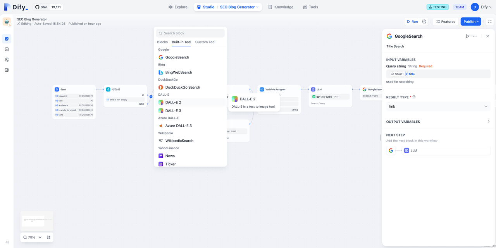

# LangFuseの統合

### 1 Langfuseとは

LangfuseはLLMアプリケーションの開発者がデバッグ、分析、反復等を使用してアプリケーションのパフォーマンスを向上させるためのツールです。


Langfuseの公式サイト：[https://langfuse.com/](https://langfuse.com/)


***

### 2 Langfuseの使い方

1. Langfuseの[公式サイト](https://langfuse.com/)から登録し、ログインする。
2. Langfuseからプロジェクトを作成します
ログイン後、ホームページの **New** をクリックし、新たな**プロジェクト**を作成します。このプロジェクトは、Dify内の**アプリ**と連動したデータモニタリングに使用されます。

<figure><figcaption>
新たなプロジェクトを作成します。
</figcaption></figure>

プロジェクトの名前を付けます。

<figure><figcaption>
プロジェクトの名前を付けます。
</figcaption></figure>

3. プロジェクト認証情報の作成
左のサイドバーでプロジェクト **設定** を見つける。

<figure><figcaption>
左のサイドバーをクリックします
</figcaption></figure>

**Create API Key**をクリックし，新たな認証情報を作ります。

<figure><figcaption>
プロジェクトのAPI Keyを作ります。
</figcaption></figure>

**Secret Key** と **Public Key，Host** をコピーし、保存します。

<figure><figcaption>
APIキーの設定を取得する
</figcaption></figure>

4\. Dify アプリの中に Langfuse を設定します
監視用のアプリのサイトメニューの**監視**ボタンをクリックし，**設定**をクリックします。

<figure><figcaption>
Langfuseを設定します
</figcaption></figure>

それから，Langfuse から作った **Secret Key, Public Key** と **Host** を**設定**の中に貼り付け、保存します。

<figure><figcaption>
Langfuseを設定します
</figcaption></figure>

保存に成功すると、現在のページで監視状態を見ることができます。

<figure><figcaption>
監視状態を見る
</figcaption></figure>

***

### 3 Langfuse ページで監視データをチェックします

設定した後， Difyのアプリや生産データは Langfuse の中にチェクをできます。

<figure><figcaption>
Dify 内でのアプリの調整
</figcaption></figure>

<figure><figcaption>
Langfuse でアプリデータを見る
</figcaption></figure>

<figure><figcaption>
Langfuse でアプリデータを見る
</figcaption></figure>
