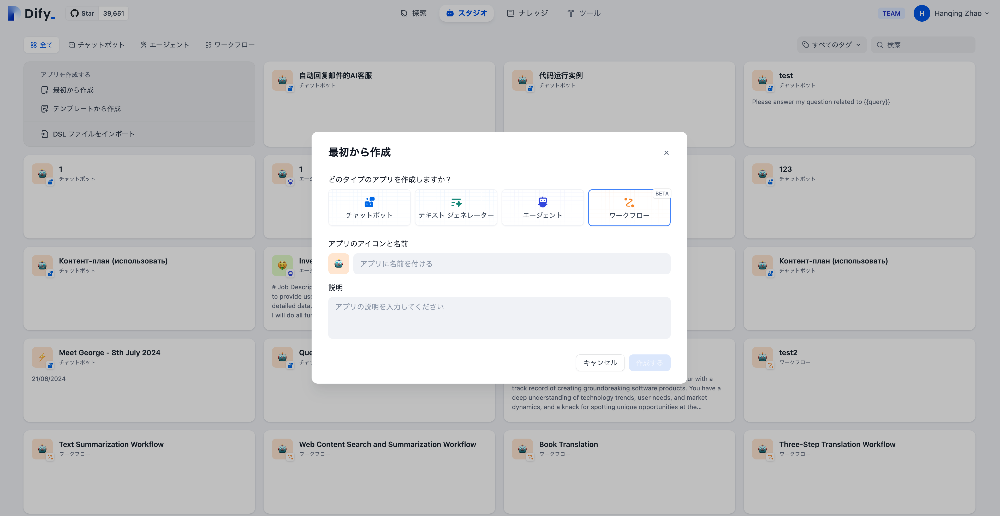

# 重要な概念

### ノード

**ノードはワークフローの重要な構成要素**であり、異なる機能を持つノードを接続することで、ワークフローの一連の操作を実行します。

ワークフローの主要なノードについては[ノード説明](node/)を参照してください。

***

### 変数

変数はワークフロー内のノードの入力と出力をリンクするために使用され、プロセス全体で複雑な処理ロジックを可能にします。詳細については、[変数](variables.md)を参照してください。

***

### チャットフローとワークフロー

**応用シーン**

* **チャットフロー**：対話型シナリオに向いており、カスタマーサービス、セマンティック検索、その他の応答を構築する際に多段階のロジックが必要な対話式アプリケーションに適しています。
* **ワークフロー**：自動化およびバッチ処理のシナリオに向いており、高品質な翻訳、データ分析、コンテンツ生成、電子メール自動化などのアプリケーションに適しています。

**使用方法**

<figure><figcaption>
チャットフロー入口
</figcaption></figure>

<figure><figcaption>
ワークフロー入口
</figcaption></figure>

**利用可能なノードの違い**

1. 終了ノードはワークフローの終了ノードであり、プロセス終了時にのみ選択できます。
2. 回答ノードはチャットフロー用で、テキスト内容をストリーミング出力するために使用され、プロセスの中間ステップでも出力をサポートします。
3. チャットフローにはチャットメモリ（Memory）が内蔵されており、複数回の対話の履歴メッセージを保存および伝達するために使用されます。これはLLMや問題分類などのノードで有効にすることができますが、ワークフローにはメモリ関連の設定がなく、有効にできません。
4. チャットフローの開始ノードに内蔵されている変数には、`sys.query`、`sys.files`、`sys.conversation_id`、`sys.user_id`が含まれます。ワークフローの開始ノードに内蔵されている変数には、`sys.files`、`sys_id`が含まれます。