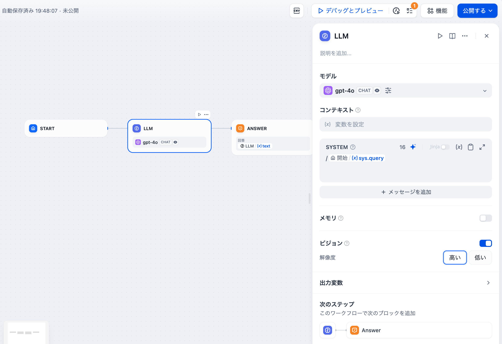

# 重要な概念

### ノード

**ノードはワークフローの重要な構成要素**であり、異なる機能を持つノードを接続することで、ワークフローの一連の操作を実行します。

ワークフローの主要なノードについては[ノード説明](node/)を参照してください。

***

### 変数

**変数はワークフロー内の前後ノードの入力と出力をつなぎ合わせるために使用され**、プロセス中の複雑な処理ロジックを実現します。

* ワークフローでは開始時に実行変数を定義する必要があります。例えば、チャットボットでは入力変数 `sys.query`を定義する必要があります。
* ノードでは一般的に入力変数を定義する必要があります。例えば、問題分類器の入力変数を `sys.query`として定義します。
* 変数を参照する際には、プロセス上流のノードの変数のみを参照できます。
* 変数名が重複しないように、ノード名は重複しないようにします。
* ノードの出力変数は通常、システム固定変数であり、編集できません。

### 環境変数

**環境変数は、APIキーやデータベースのパスワードといった機密性の高い情報を保護する際に、ワークフロー実行時に活用されます。** これらはコードに直接書き込むのではなく、ワークフローに設定され、異なる環境間での共有が可能になっています。

サポートされるデータ型には以下の3つがあります：

- 文字列
- 数値
- シークレット

環境変数は以下の特徴を持ちます：

- 多くのノードでグローバルに参照可能です；
- 同一の環境変数名を複数設定することはできません；
- ノードの出力変数は基本的に読み取り専用で、書き換えることはできません；

### 会話変数

> 会話変数は、チャットフローアプリでのみ使用されます。

**ユーザーは会話変数を使っで、チャットフローの会話内で一時的に特定の情報を保存し、同じワークフロー内の複数のチャットにわたってその情報を参照することができます。** 例えば、コンテキスト、チャットボックスにアップロードされたファイル（近々配布予定）、ユーザーが会話中に入力した設定などが含まれます。この機能は、LLM（大規模言語モデル）に「メモ」を提供するようなもので、メモリエラーによる情報のバイアスを回避できます。

<figure><figcaption></figcaption></figure>

以下の6種類のデータ型がサポートされています：

* 文字列
* 数値
* オブジェクト
* 文字列配列
* 数値の配列
* オブジェクトの配列

**会話変数**には次のような特徴があります：

* 会話変数はチャットフロー内のほとんどのノードでグローバルに参照可能です；
* 会話変数にデータを書き込むには、[変数代入](node/variable\_assignment.md)ノードを使用する必要があります；
* 会話変数は読み書き可能な変数です；

会話変数の具体的な使用方法については、[変数代入](node/variable\_assignment.md)をご参照ください。

***

### チャットフローとワークフロー

**応用シーン**

* **チャットフロー**：対話型シナリオに向いており、カスタマーサービス、セマンティック検索、その他の応答を構築する際に多段階のロジックが必要な対話式アプリケーションに適しています。
* **ワークフロー**：自動化およびバッチ処理のシナリオに向いており、高品質な翻訳、データ分析、コンテンツ生成、電子メール自動化などのアプリケーションに適しています。

**使用方法**

<figure><figcaption>
チャットフロー入口
</figcaption></figure>

<figure><figcaption>
ワークフロー入口
</figcaption></figure>

**利用可能なノードの違い**

1. 終了ノードはワークフローの終了ノードであり、プロセス終了時にのみ選択できます。
2. 回答ノードはチャットフロー用で、テキスト内容をストリーミング出力するために使用され、プロセスの中間ステップでも出力をサポートします。
3. チャットフローにはチャットメモリ（Memory）が内蔵されており、複数回の対話の履歴メッセージを保存および伝達するために使用されます。これはLLMや問題分類などのノードで有効にすることができますが、ワークフローにはメモリ関連の設定がなく、有効にできません。
4. チャットフローの開始ノードに内蔵されている変数には、`sys.query`、`sys.files`、`sys.conversation_id`、`sys.user_id`が含まれます。ワークフローの開始ノードに内蔵されている変数には、`sys.files`、`sys_id`が含まれます。