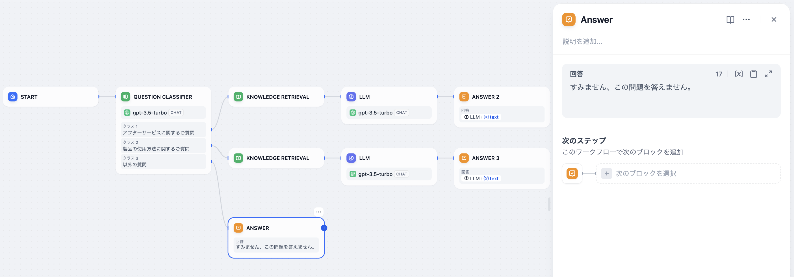
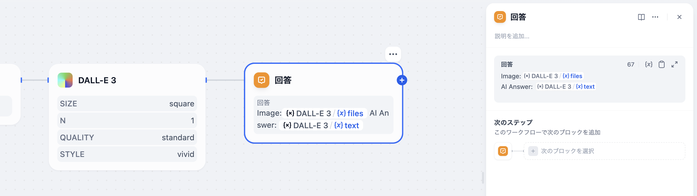

# 直接返信

### 定義

チャットフローのプロセス内で返信内容を定義します。

テキストエディタを使用して返信フォーマットを自由に定義できます。固定のテキスト内容をカスタマイズしたり、前のステップで出力された変数を返信内容として使用したり、カスタマイズしたテキストと変数を組み合わせて返信することができます。

ノードを随時追加して内容をストリーミング形式で会話に返信し、所見即所得の設定モードをサポートし、テキストと画像の混在も可能です。例えば：

1. LLMノードの返信内容を出力
2. 生成された画像を出力
3. 純テキストを出力

**例1：** 純テキストを出力

<figure><figcaption></figcaption></figure>

**例2：** 画像+LLMの返信を出力

<figure><figcaption></figcaption></figure>

<figure><figcaption></figcaption></figure>


直接返信ノードは最終的な出力ノードとして使用しないこともでき、プロセスの中間ステップで結果をストリーミング形式で出力することができます。

