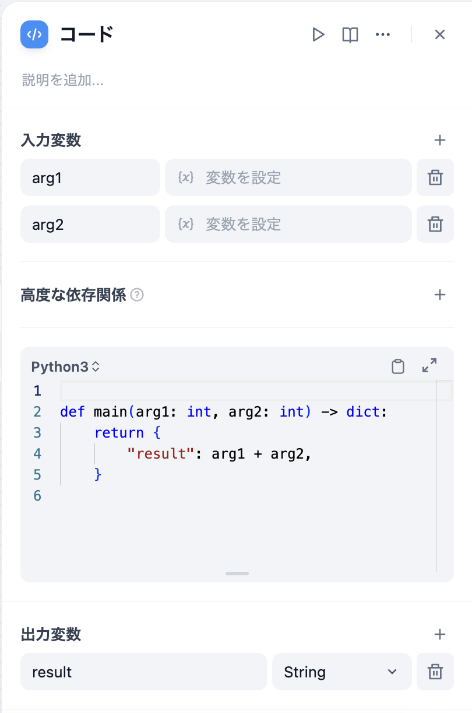

# コード

## 目次

* [紹介](code.md#紹介)
* [使用シナリオ](code.md#使用シナリオ)
* [ローカルデプロイ](code.md#ローカルデプロイ)
* [セキュリティポリシー](code.md#セキュリティポリシー)

## 紹介

コードノードは、Python / NodeJSコードを実行してワークフロー内でデータ変換を行うことをサポートします。これにより、Arithmetic、JSON変換、テキスト処理などのシナリオでワークフローが簡素化されます。

このノードは開発者の柔軟性を大幅に向上させ、ワークフロー内にカスタムPythonまたはJavascriptスクリプトを埋め込んで、事前設定されたノードでは達成できない方法で変数を操作することができます。設定オプションを使用して、必要な入力変数と出力変数を指定し、対応する実行コードを記述できます。

<figure><figcaption></figcaption></figure>

## 設定

他のノードの変数をコードノードで使用する必要がある場合は、`入力変数`で変数名を定義し、これらの変数を参照する必要があります。[変数参照](../key-concept.md#変数)を参考にしてください。

## 使用シナリオ

コードノードを使用して、以下の一般的な操作を実行できます：

### 構造化データ処理

ワークフローでは、しばしば非構造化データの処理が必要です。例えば、JSON文字列の解析、抽出、変換などです。典型的な例として、HTTPノードのデータ処理があります。一般的なAPI応答構造では、データが多層のJSONオブジェクトにネストされていることがあり、特定のフィールドを抽出する必要があります。コードノードはこれらの操作を支援します。以下は、HTTPノードから返されたJSON文字列から`data.name`フィールドを抽出する簡単な例です：

```python
def main(http_response: str) -> str:
    import json
    data = json.loads(http_response)
    return {
        # 出力変数にresultを宣言することに注意
        'result': data['data']['name']
    }
```

### 数学計算

ワークフロー内で複雑な数学計算を行う必要がある場合、コードノードを使用できます。例えば、複雑な数学公式の計算やデータの統計分析です。以下は、配列の平方差を計算する簡単な例です：

```python
def main(x: list) -> float:
    return {
        # 出力変数にresultを宣言することに注意
        'result': sum([(i - sum(x) / len(x)) ** 2 for i in x]) / len(x)
    }
```

### データの結合

時には、複数のデータソースを結合する必要がある場合があります。例えば、複数の知識検索、データサーチ、API呼び出しなどです。コードノードはこれらのデータソースを統合するのに役立ちます。以下は、2つのナレッジベースのデータを結合する簡単な例です：

```python
def main(knowledge1: list, knowledge2: list) -> list:
    return {
        # 出力変数にresultを宣言することに注意
        'result': knowledge1 + knowledge2
    }
```

## ローカルデプロイ

ローカルデプロイのユーザーである場合、悪意のあるコードが実行されないようにするためのサンドボックスサービスを起動する必要があります。このサービスを起動するにはDockerサービスを使用します。サンドボックスサービスの詳細は[こちら](https://github.com/langgenius/dify/tree/main/docker/docker-compose.middleware.yaml)から確認できます。また、`docker-compose`を使用してサービスを直接起動することもできます：

```bash
docker-compose -f docker-compose.middleware.yaml up -d
```

## セキュリティポリシー

PythonとJavascriptのいずれであっても、その実行環境は安全性を確保するために厳密に隔離（サンドボックス化）されています。これにより、ファイルシステムへの直接アクセス、ネットワークリクエストの実行、OSレベルのコマンドの実行など、システムリソースを大量に消費する可能性がある機能を使用することはできません。これらの制限により、コードの安全な実行が保証され、システムリソースの過剰消費が防止されます。

### 高度機能

プログラムを実行する際、コードが予期せぬエラーに直面することがあります。開発者は、エラーが発生した場合に備えて、エラー処理の手順を設定することで、ワークフローが中断されるのを防ぐことができます。以下のステップでエラー処理を設定できます。

1. コードノードのエラー処理を有効にする
2. エラー処理の方法を選択し、設定する


エラー処理に関するさらに詳細な情報は、[エラー処理のガイド](../error-handling/README.md)を参照してください。

### よくある質問

**コードを入力した後、なぜ保存できないのでしょうか？**

安全上の問題を引き起こすコードがないか確認してください。例として以下のようなコードがあります：

```python
def main() -> dict:
    return {
        "result": open("/etc/passwd").read(),
    }
```

このコードは次のような問題を含んでいます：

* **不正なファイルアクセス：** コードが"/etc/passwd"ファイルを読み込もうとしています。これはUnix/Linux システムでユーザーアカウント情報を保持する重要なシステムファイルです。
* **秘密情報の漏えい：** "/etc/passwd" ファイルにはシステムユーザーの重要な情報が含まれています。例えば、ユーザー名、ユーザーID、グループID、ホームディレクトリのパスなどです。これに直接アクセスすると情報漏えいのリスクがあります。

セキュリティリスクがあるコードは Cloudflare WAF により自動的にブロックされます。ブロックされたかどうかは、Webデバッグツールのネットワークタブで確認できます。

<figure><figcaption><p>Cloudflare WAF のスクリーンショット</p></figcaption></figure>
