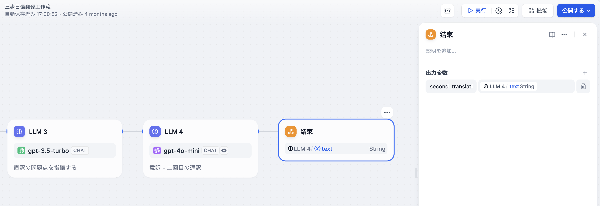

# 終了

### 1 定義

ワークフローの最終出力内容を定義します。すべてのワークフローは、完全に実行された後、最終結果を出力するための少なくとも1つの終了ノードを必要とします。

終了ノードはプロセスの終了ノードであり、その後に他のノードを追加することはできません。ワークフローアプリケーションでは、終了ノードに到達して初めて実行結果が出力されます。プロセスに条件分岐がある場合、複数の終了ノードを定義する必要があります。

終了ノードは1つ以上の出力変数を宣言する必要があります。この宣言の際、任意の上流ノードの出力変数を参照することができます。


Chatflow の場いは終了ノードはサポートされていません


***

### 2 シナリオ

以下の[長編ストーリー生成ワークフロー](iteration.md#shi-li-2-chang-wen-zhang-die-dai-sheng-cheng-qi-ling-yi-zhong-bian-pai-fang-shi)では、終了ノードで宣言された変数 `Output` は上流のコードノードの出力です。つまり、このワークフローはCode3ノードが実行された後に終了し、Code3の実行結果を出力します。

<figure><figcaption>
終了ノード-長編ストーリー生成の例
</figcaption></figure>

**単一ルートの実行例：**

<figure><figcaption></figcaption></figure>

**複数ルートの実行例：**

<figure><figcaption></figcaption></figure>