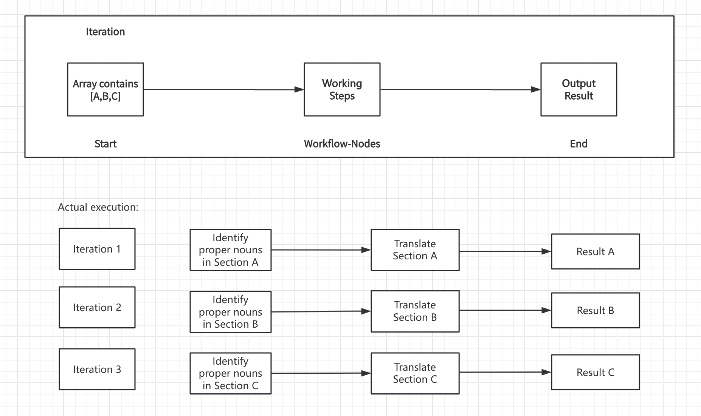
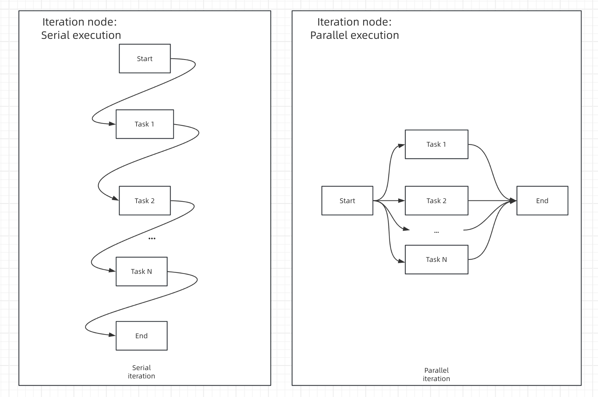

# イテレーション

### 定義

配列に対して複数のステップを実行し、すべての結果を出力すること。

イテレーションステップはリスト中の各項目に対して同じステップを実行します。イテレーションを使用する条件は、入力値がリストオブジェクトとしてフォーマットされていることを確認することです。イテレーションノードは、AIワークフローにより複雑な処理ロジックを取り入れることを可能にします。イテレーションノードはループノードの親しみやすいバージョンであり、非技術ユーザーが迅速に始められるようにカスタマイズの程度を調整しています。

***

### 機能の原理

イテレーションを使用する条件は、入力値がリストオブジェクトとしてフォーマットされていることを確認することです。イテレーションノードは、イテレーションの開始ノードにある配列変数内のすべての要素を順番に処理し、各要素は同じ処理手順に従います。各処理ラウンドはイテレーションと呼ばれ、最終的な処理結果が出力されます。

イテレーションノードの構造には、通常、入力変数、イテレーションワークフロー、出力変数の3つの機能ユニットが含まれています。

* **入力変数**：Array配列変数タイプのデータのみを受け入れます。配列変数が何であるかわからない場合は、[拡張読み物「配列変数」](../../../learn-more/extended-reading/what-is-array-variable.md)をお読みください。
  
* **イテレーションワークフロー**：イテレーションノード内で複数のワークフローノードを使用し、さまざまなタスクステップを編成できます。
  
* **出力変数**：出力はArray[List]配列変数のみをサポートしています。他の変数形式を出力したい場合は、[拡張読み物「配列をテキストに変換する方法」](../../../learn-more/extended-reading/what-is-array-variable.md)をお読みください。

<figure></figure>

***

### シナリオ

#### **例1：長文イテレーション生成器**

<figure><figcaption><p>長文生成器</p></figcaption></figure>

1. **開始ノード** にストーリーのタイトルと変数を入力して、ユーザーに初期情報を手動で入力するよう求めます。
2. **LLMノード** を使用してユーザー入力から完全な内容を抽出
3. **パラメータ抽出ノード** を使用して完全な内容を配列形式に変換
4. **イテレーションノード** でラップされた **LLM ノード** を通じて各章の内容を複数回生成
5. イテレーションノード内に **直接応答ノード** を追加して、各イテレーション生成の後にストリーム出力を行う

**具体的な設定ステップ**

1. **開始ノード** にタイトル（title）とアウトライン（outline）を設定；

<figure><figcaption><p>開始ノードの設定</p></figcaption></figure>

2. **Jinja-2 テンプレートノード** を使用してタイトルとアウトラインを完全なテキストに変換；

<figure><figcaption><p>テンプレートノード</p></figcaption></figure>

3. **パラメータ抽出ノード** を使用して、ストーリーテキストを配列（Array）構造に変換。抽出パラメータは `sections`、パラメータタイプは `Array[Object]`

<figure><figcaption><p>パラメータ抽出</p></figcaption></figure>


パラメータ抽出の効果はモデル推論能力と指示に影響されます。推論能力が高いモデルを使用し、**指示** 内に例を追加することでパラメータ抽出の効果を向上させることができます。


4. ストーリーアウトラインの配列形式をイテレーションノードの入力として使用し、イテレーションノード内で **LLM ノード** を使用して処理

<figure><figcaption><p>イテレーションノードの設定</p></figcaption></figure>

LLM ノード内で入力変数 `GenerateOverallOutline/output` と `Iteration/item` を設定

<figure><figcaption><p>LLM ノードの設定</p></figcaption></figure>


イテレーションの組み込み変数：`items[object]` と `index[number]`

`items[object]` は各イテレーションの入力項目を表します；

`index[number]` は現在のイテレーションのラウンドを表します；


5. イテレーションノード内に **直接応答ノード** を設定して、各イテレーション生成の後にストリーム出力を実現。

<figure><figcaption><p>回答ノードの設定</p></figcaption></figure>

6. 完全なデバッグとプレビュー

<figure><figcaption><p>ストーリー章ごとの多段イテレーション生成</p></figcaption></figure>

#### **例2：長文イテレーション生成器（別の編成方法）**

<figure><figcaption></figcaption></figure>

* **開始ノード** にタイトルとアウトラインを入力
* **LLM ノード** を使用して小見出しと対応する内容を生成
* **コードノード** を使用して完全な内容を配列形式に変換
* **イテレーションノード** でラップされた **LLM ノード** を通じて各章の内容を複数回生成
* **テンプレート変換ノード** を使用してイテレーションノードが出力する文字列配列を文字列に変換
* 最後に **直接応答ノード** を追加して変換後の文字列を直接出力

### ハイレベル機能

#### パラレルモード

イテレーションノードはパラレルモードをサポートしており、有効にするとイテレーションノードの全体的な動作効率が効果的に向上します。

<figure><figcaption></figcaption></figure>

次の図は、パラレルモードをオンまたはオフにした場合のイテレーションノードの実行効果を比較しています。

<figure><figcaption></figcaption></figure>

パラレルモードの実行ラウンドの最大数は10個です。これは、単位時間あたり最大10個のタスクを同時に実行できることを意味します。 10個を超えるタスクを処理する必要がある場合、最初の10個の要素が最初に同時に実行され、最前列のタスクが処理された後、残りのタスクが引き続き処理されます。

 
パラレルモードをオンにした後は、イテレーションノード内に直接応答ノード、変数代入ノード、およびツールノードを配置することは推奨されなくなります。これにより、異常な状況が発生する可能性があります。


* **エラー対応方法**

    イテレーションノードは通常、多くのタスクを処理する必要があり、要素の処理中にエラーが発生することがあります。特定の要素の例外が原因で全てのタスクが中断されるのを避けるため、**エラー対応方法**を設定できます。

    * エラーが発生した場合に中止する。例外が検出された場合、イテレーションノードを中止し、エラーメッセージを出力します。
    * エラーを無視して続行する。例外情報を無視し、残りの要素の処理を続けます。出力には正しい情報のみが含まれ、例外情報は空の値になります。
    * エラー出力を削除する。例外情報を無視し、残りの要素の処理を続けます。出力には正しい情報のみが含まれ、例外変数は出力されません。

    イテレーションノードの入力変数と出力変数は対応しています。例えば、入力変数が [1,2,3] の場合、出力変数も [result-1, result-2, result-3] となります。

    **エラーを無視して続行する**オプションを選択した場合、例外状況の出力値は null となります、例：[result-1, null, result-3]；

    **エラー出力を削除する**オプションを選択した場合、出力には例外変数が含まれません、例：[result-1, result-3]。

#### 拡張読み物

[配列変数とは何ですか？](../../../learn-more/extended-reading/what-is-array-variable.md)

***

### 配列変数を生成する方法は何ですか？

以下の手順に従って、イテレーションノードの入力変数として機能する配列変数を生成することができます：

* [コードノード](./code.md)

<figure><figcaption><p>コードノード出力array</p></figcaption></figure>

* [パラメータ抽出ノード](./parameter-extractor.md)

<figure><figcaption><p>パラメータ抽出ノード出力 array</p></figcaption></figure>

* [ナレッジベース検索](./knowledge-retrieval.md)
* [イテレーション](./iteration.md)
* [ツール](/tools.md)
* [HTTP リクエスト](./http-request.md)

***

### 配列をテキストに変換する方法

イテレーションノードの出力変数は配列形式であり、直接Stringとして出力することはできません。配列をテキストに戻すための簡単なステップを実行することができます。

**コードノードを使用した変換**

<figure><figcaption><p>コードノード変換</p></figcaption></figure>

コード例：

```python
def main(articleSections: list):
    data = articleSections
    return {
        "result": "\n".join(data)
    }
```

**テンプレートノードを使用した変換**

<figure><figcaption><p>テンプレートノード変換</p></figcaption></figure>

コード例：

```django
{{ articleSections | join("\n") }}
```
