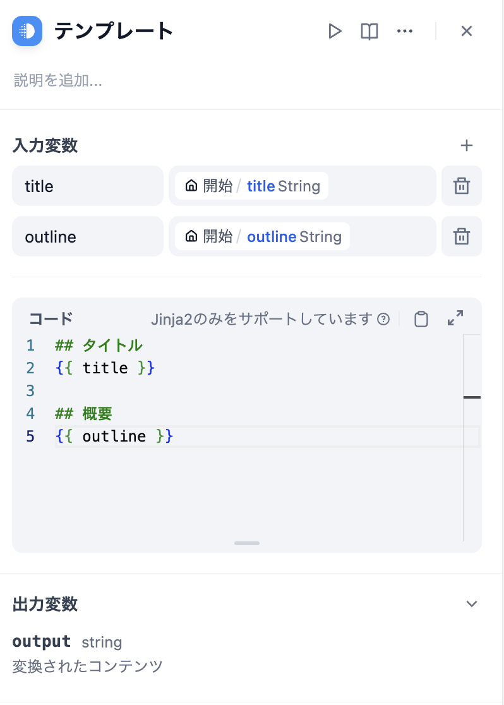
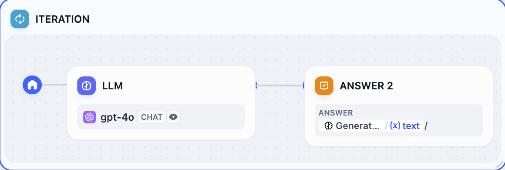
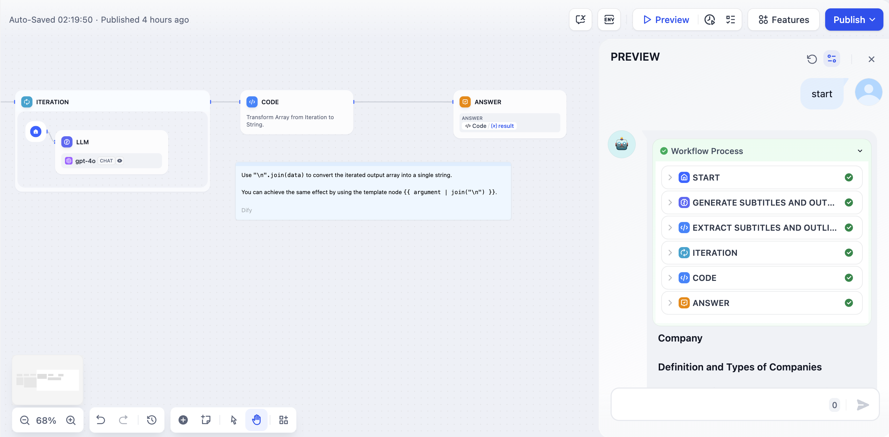

# 反復

### 定義

配列に対して複数のステップを実行し、すべての結果を出力すること。

反復ステップはリスト中の各項目に対して同じステップを実行します。反復を使用する条件は、入力値がリストオブジェクトとしてフォーマットされていることを確認することです。反復ノードは、AIワークフローにより複雑な処理ロジックを取り入れることを可能にします。反復ノードはループノードの親しみやすいバージョンであり、非技術ユーザーが迅速に始められるようにカスタマイズの程度を調整しています。

***

### シナリオ

#### **例1：長文反復生成器**

<figure><figcaption><p>長文生成器</p></figcaption></figure>

1. **開始ノード** 内にタイトルとアウトラインを入力
2. **コードノード** を使用してユーザー入力から完全な内容を抽出
3. **パラメータ抽出ノード** を使用して完全な内容を配列形式に変換
4. **反復ノード** でラップされた **LLM ノード** を通じて各章の内容を複数回生成
5. 反復ノード内に **直接応答ノード** を追加して、各反復生成の後にストリーム出力を行う

**具体的な設定ステップ**

1. **開始ノード** にタイトル（title）とアウトライン（outline）を設定；

<figure><figcaption><p>開始ノードの設定</p></figcaption></figure>

2. **Jinja-2 テンプレートノード** を使用してタイトルとアウトラインを完全なテキストに変換；

<figure><figcaption><p>テンプレートノード</p></figcaption></figure>

3. **パラメータ抽出ノード** を使用して、ストーリーテキストを配列（Array）構造に変換。抽出パラメータは `sections`、パラメータタイプは `Array[Object]`

<figure><figcaption><p>パラメータ抽出</p></figcaption></figure>


パラメータ抽出の効果はモデル推論能力と指示に影響されます。推論能力が高いモデルを使用し、**指示** 内に例を追加することでパラメータ抽出の効果を向上させることができます。


4. ストーリーアウトラインの配列形式を反復ノードの入力として使用し、反復ノード内で **LLM ノード** を使用して処理

<figure><figcaption><p>反復ノードの設定</p></figcaption></figure>

LLM ノード内で入力変数 `GenerateOverallOutline/output` と `Iteration/item` を設定

<figure><figcaption><p>LLM ノードの設定</p></figcaption></figure>


反復の組み込み変数：`items[object]` と `index[number]`

`items[object]` は各反復の入力項目を表します；

`index[number]` は現在の反復のラウンドを表します；


5. 反復ノード内に **直接応答ノード** を設定して、各反復生成の後にストリーム出力を実現。

<figure><figcaption><p>Answer ノードの設定</p></figcaption></figure>

6. 完全なデバッグとプレビュー

<figure><figcaption><p>ストーリー章ごとの多段反復生成</p></figcaption></figure>

#### **例2：長文反復生成器（別の編成方法）**

<figure><figcaption></figcaption></figure>

* **開始ノード** にタイトルとアウトラインを入力
* **LLM ノード** を使用して小見出しと対応する内容を生成
* **コードノード** を使用して完全な内容を配列形式に変換
* **反復ノード** でラップされた **LLM ノード** を通じて各章の内容を複数回生成
* **テンプレート変換ノード** を使用して反復ノードが出力する文字列配列を文字列に変換
* 最後に **直接応答ノード** を追加して変換後の文字列を直接出力

### 配列の内容とは

リストは特定のデータ型であり、要素はコンマで区切られ、 `[` で始まり `]` で終わります。例えば：

**数値型：**

```
[0,1,2,3,4,5]
```

**文字列型：**

```
["monday", "Tuesday", "Wednesday", "Thursday"]
```

**JSON オブジェクト：**

```
[
    {
        "name": "Alice",
        "age": 30,
        "email": "alice@example.com"
    },
    {
        "name": "Bob",
        "age": 25,
        "email": "bob@example.com"
    },
    {
        "name": "Charlie",
        "age": 35,
        "email": "charlie@example.com"
    }
]
```

***

### 配列を返すノード

* コードノード
* パラメータ抽出
* ナレッジベース検索
* 反復
* ツール
* HTTP リクエスト

### 配列形式の内容を取得する方法

**CODE ノードを使用して返す**

<figure><figcaption><p>code ノード出力 array</p></figcaption></figure>

**パラメータ抽出ノードを使用して返す**

<figure><figcaption><p>パラメータ抽出ノード出力 array</p></figcaption></figure>

### 配列をテキストに変換する方法

反復ノードの出力変数は配列形式であり、直接出力することはできません。配列をテキストに戻すための簡単なステップを実行することができます。

**コードノードを使用した変換**

<figure><figcaption><p>コードノード変換</p></figcaption></figure>

コード例：

```python
def main(articleSections: list):
    data = articleSections
    return {
        "result": "\n".join(data)
    }
```

**テンプレートノードを使用した変換**

<figure><figcaption><p>テンプレートノード変換</p></figcaption></figure>

コード例：

```django
{{ articleSections | join("\n") }}
```