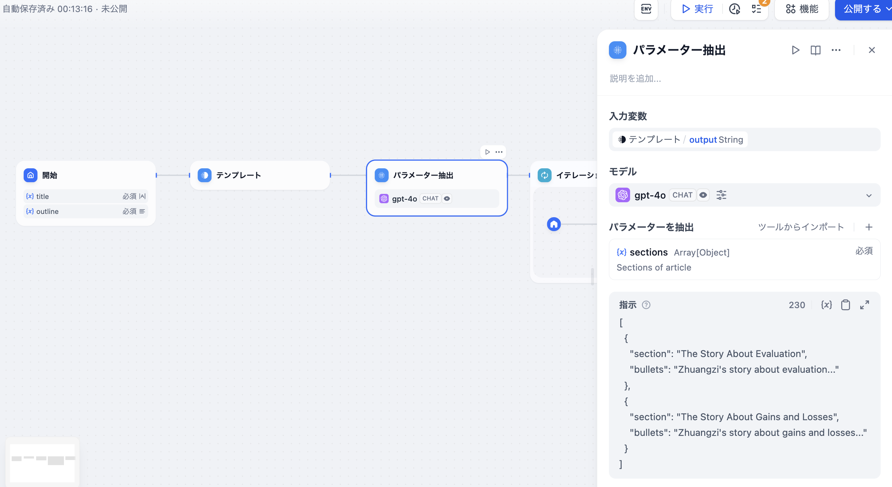

# パラメータ抽出

### 1 定義

大規模言語モデル（LLM）を利用して自然言語から推論し、構造化パラメータを抽出し、ツール呼び出しやHTTPリクエストに用いる。

Difyワークフロー内には豊富な[ツール](../../tools.md)が用意されており、その多くは構造化パラメータを入力として要求します。パラメータ抽出器は、ユーザーの自然言語をツールが認識できるパラメータに変換し、ツールの呼び出しを容易にします。

ワークフロー内の一部のノードは特定のデータ形式を入力として要求します。例えば[イテレーション](iteration.md#ding-yi)ノードの入力は配列形式である必要があり、パラメータ抽出器は[構造化パラメータの変換](iteration.md#shi-li-1-chang-wen-zhang-die-dai-sheng-cheng-qi)を容易に実現します。

***

### 2 シナリオ

1. **自然言語からツールが必要とするキー・パラメーターを抽出する**例として、簡単な対話形式のArxiv論文検索アプリを構築する場合を考えます。

この例では、Arxiv論文検索ツールの入力パラメータとして「論文の著者」または「論文番号」が要求されます。パラメータ抽出器は「この論文の内容は何ですか：2405.10739」という質問から論文番号**2405.10739**を抽出し、ツールのパラメータとして正確に検索します。

<figure><figcaption>
Arxiv論文検索ツール
</figcaption></figure>

2. **テキストを構造化データに変換する**例として、長い物語のイテレーション生成アプリの前工程として、テキスト形式の章内容を配列形式に変換し、[イテレーションノード](iteration.md)でのマルチラウンド生成処理を容易にします。

<figure><figcaption></figcaption></figure>

3. **構造化データを抽出して[HTTPリクエスト](https://docs.dify.ai/v/ja-jp/guides/workflow/node/http_request)を使用する**ことで、任意のアクセス可能なURLにリクエストを送信し、外部検索結果の取得やウェブフック、画像生成などのシナリオに適用できます。

***

### 3 設定方法

<figure><figcaption></figcaption></figure>

**設定ステップ**

1. 入力変数を選択。通常はパラメータ抽出のための変数入力を選びます。
2. モデルを選択。パラメータ抽出器の抽出はLLMの推論と構造化生成能力に依存します。
3. 抽出パラメータを定義。必要なパラメータを手動で追加するか、**既存のツールから簡単にインポート**できます。
4. コマンド作成。複雑なパラメータの抽出時には、例を作成することでLLMの生成効果と安定性を向上させることができます。

**高度な設定**

**推論モード**

一部のモデルは関数/ツール呼び出しや純プロンプトの方法でパラメータ抽出を実現する2つの推論モードをサポートしており、コマンドの遵守能力に違いがあります。例えば、あるモデルが関数呼び出しに不向きな場合、プロンプト推論に切り替えることができます。

* 関数呼び出し/ツール呼び出し
* プロンプト

**メモリ**

メモリを有効にすると、問題分類器の各入力にチャット履歴が含まれ、LLMが前文を理解し、対話の中での問題理解能力を向上させます。

**出力変数**

* 定義された変数を抽出
* ノード組み込み変数

`__is_success 数値` 抽出が成功した場合は1、失敗した場合は0となります。

`__reason 文字列` 抽出エラーの原因