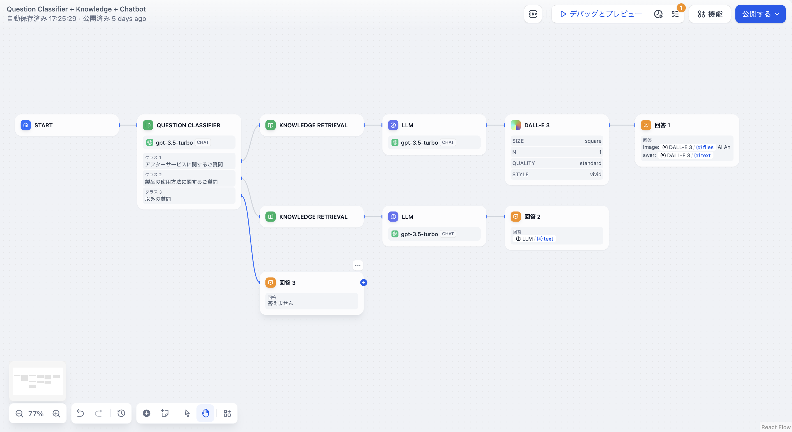

# 問題分類

### 1 **定義**

定義に基づいて問題を分類することにより、問題分類器はユーザーの入力を推論し、対応する分類を出力します。

***

### **2 シナリオ**

よくある使用シナリオには、**カスタマーサービス対話意図分類、製品評価分類、メールのバッチ分類**などがあります。

典型的な製品カスタマーサービスのシナリオでは、問題分類器はナレッジベース検索の前段階として機能し、ユーザーの質問の意図を分類します。分類後、異なるナレッジベースに誘導され、ユーザーの質問に正確に回答します。

以下の図は製品カスタマーサービスシナリオのサンプルワークフローテンプレートです：

<figure><figcaption></figcaption></figure>

このシナリオでは、3つの分類ラベル/説明を設定しています：

* 分類 1：**アフターサービスに関する問題**
* 分類 2：**製品の操作に関する問題**
* 分類 3：**その他の問題**

ユーザーが異なる質問を入力すると、問題分類器は設定された分類ラベル/説明に基づいて自動的に分類を行います：

* “**iPhone 14で連絡先を設定する方法は？**” —> “**製品の操作に関する問題**”
* “**保証期間はどれくらいですか？**” —> “**アフターサービスに関する問題**”
* “**今日の天気はどうですか？**” —> “**その他の問題**”

***

### 3 どうやって設定するか

<figure><figcaption></figcaption></figure>

**設定手順：**

1. **入力変数を選択する**、分類に使用する入力内容を指します。カスタマーサービスのシナリオでは一般的にユーザーの質問 `sys.query` が対象です。
2. **推論モデルを選択する**、問題分類器は大規模言語モデル (LLM) の自然言語分類と推論能力に基づいており、適切なモデルを選ぶことで分類効果を向上させることができます。
3. **分類ラベル/説明を作成する**、複数の分類を手動で追加し、分類のキーワードや説明文を作成することで、大規模言語モデルが分類基準をよりよく理解できるようにします。
4. **分類に対応する下流ノードを選択する**、問題分類ノードが分類を完了した後、分類と下流ノードの関係に基づいて後続のプロセスパスを選択します。

#### **高度な設定：**

**指示：** **高度な設定-指示** では、例えばより豊富な分類基準など、追加の指示を補足することができます。これにより問題分類器の分類能力が強化されます。

**メモリー：** メモリーをオンにすると、問題分類器の各入力には対話のチャット履歴が含まれ、LLM が前文を理解しやすくなり、対話の中での問題理解能力が向上します。

**メモリウィンドウ：** メモリウィンドウがオフの時、システムはモデルのコンテキストウィンドウに基づいてチャット履歴の伝達量を動的にフィルタリングします。オンの時、ユーザーはチャット履歴の伝達量を正確に制御できます（対数表示）。

**出力変数：**

`class_name`

分類後に出力される分類名です。必要に応じて下流ノードで分類結果変数を使用することができます。