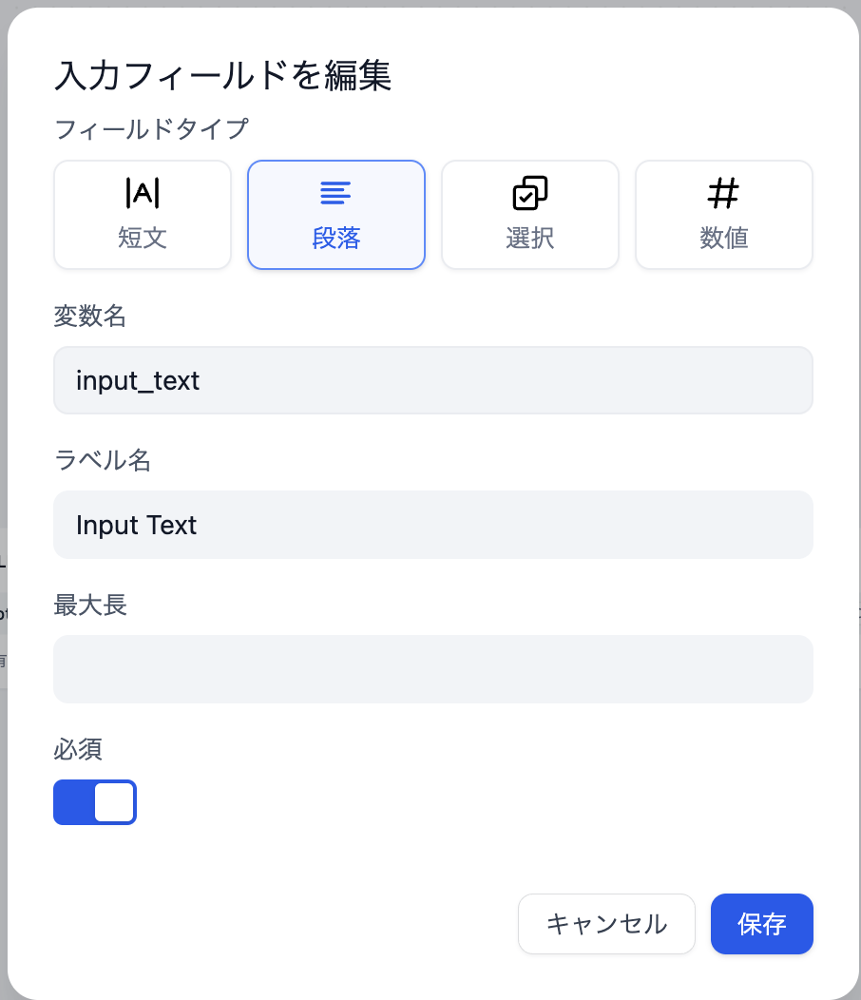

# 開始

### 定義

ワークフローの開始パラメータを定義します。

開始ノードでは、ワークフローの入力変数をカスタマイズすることができます。すべてのワークフローには開始ノードが必要です。

<figure><figcaption>
ワークフロー開始ノード
</figcaption></figure>

開始ノード内で定義できる入力変数は、次の4種類です：

* 短文
* 段落
* ドロップダウンオプション(選択)
* 数字
* ファイル（近日対応予定）

<figure><figcaption>
開始ノード変数の設定
</figcaption></figure>

設定が完了すると、ワークフロー実行時に開始ノードで定義された変数値の入力が求められます。

<figure><figcaption></figcaption></figure>


ヒント：チャットフローでは、開始ノードがシステム組み込み変数 `sys.query` と `sys.files` を提供します。

`sys.query` は対話型アプリケーションにおけるユーザー質問入力に使用されます。

`sys.files` は対話中にファイルをアップロードするために使用されます。例えば、画像理解モデルと連携して画像をアップロードする場合などです。
