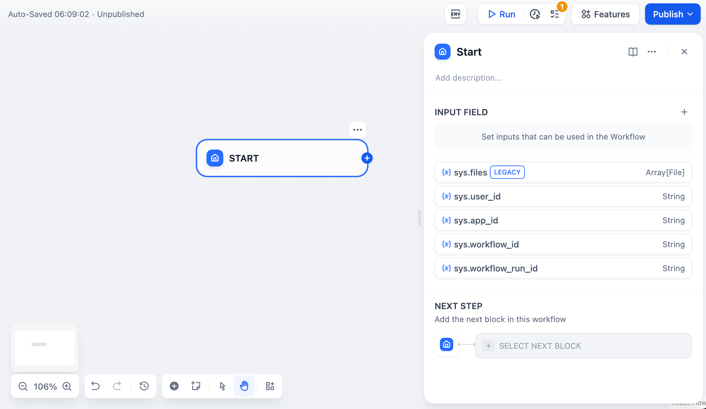

# 変数代入

### 1 定義

変数代入ノードは、可書き入れの変数に値を代入するために使用されます。現在サポートされている可書き入れの変数は[会話変数](../key-concept.md#hui-hua-bian-liang)です。

このノードを使用することで、ワークフローの中で変数の値を会話変数に一時的に保存し、後続の会話でその値を参照することができます。

<figure><figcaption></figcaption></figure>

***

### 2 シナリオ

会話内で**コンテキスト、アップロードされたファイル、ユーザーの好み**などを変数代入し、会話変数に書き込みます。保存された情報は、後続の会話で参照され、異なる処理フローに誘導したり、返信を行ったりします。

**シナリオ 1** &#x20;

**ユーザーの好みの記録**，会話内でユーザーの好みな言語を記憶し、後続の会話ではその言語を使用して返信を続けます。。

<figure><figcaption></figcaption></figure>

**設定手順：**

**会話変数の設定**：まず、会話変数 `language` を設定し、会話フローの開始時に `language` 変数の値が空かどうかを判定する条件分岐ノードを追加します。

**変数の書き込み/代入**：最初の会話が始まると、 `language` 変数の値が空であるため、ユーザー入力の言語を抽出するLLMノードを使用して、その言語を会話変数 `language` に書き込みます。

**変数の読み取り**：後続の会話ラウンドでは、`language` 変数にユーザーの好みな言語が保存されているため、LLMノードはこの変数を参照して、ユーザーの好みの言語で返信を行います。

**シナリオ 2**

**チェックリストの確認**，会話内でユーザーのチェックリストの項目を記憶し、後続の会話で未完了の項目を確認します。

<figure><figcaption></figcaption></figure>

会話が開始前に、LLMはユーザーにチェックリストがすべて記入されているかどうかを尋ねます。

<figure><figcaption></figcaption></figure>

会話中、ユーザーが入力した情報に基づいて、LLMは毎回未記入のチェックリストを確認し、ユーザーに記入を続けるように促します。

<figure><figcaption></figcaption></figure>

**配置流程：**

* **会話変数の設定**：まず、会話変数 `ai_checklist` を設定し、LLM内でこの変数をコンテキストとして参照します。
* **変数の書き込み/代入**：各会話ラウンドで、LLMノード内で`ai_checklist` の値を確認し、ユーザー入力と照合します。新しい情報が提供された場合、チェックリストを更新し、変数代入ノードを使用して`ai_checklist` に書き込みます。
* **変数の読み取り**：各会話ラウンドで `ai_checklist` の値を読み取り、ユーザーの入力と照合し、すべてのチェックリストが完了するまで続けます。

***

### 3 操作方法

<figure><figcaption></figcaption></figure>

**変数の設定：**

Assigned Variable 代入される変数：代入される変数を選択します

Set Variable 設定される変数：代入する変数を選択します

上図の代入ロジック：`Language Recognition/text` を `language` に代入します。&#x20;

**書き込みモード：**

* Overwrite 上書き
* Append 追加，配列(Array)の変数が指定された場合
* Clear クリア

