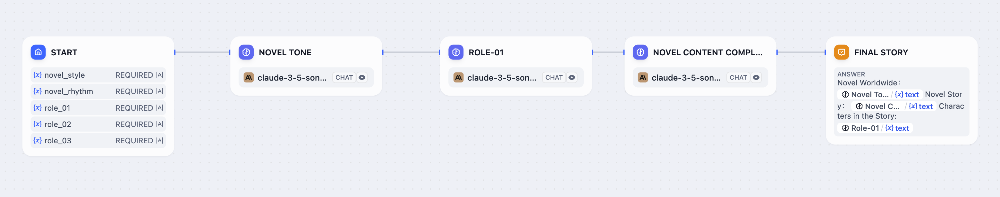
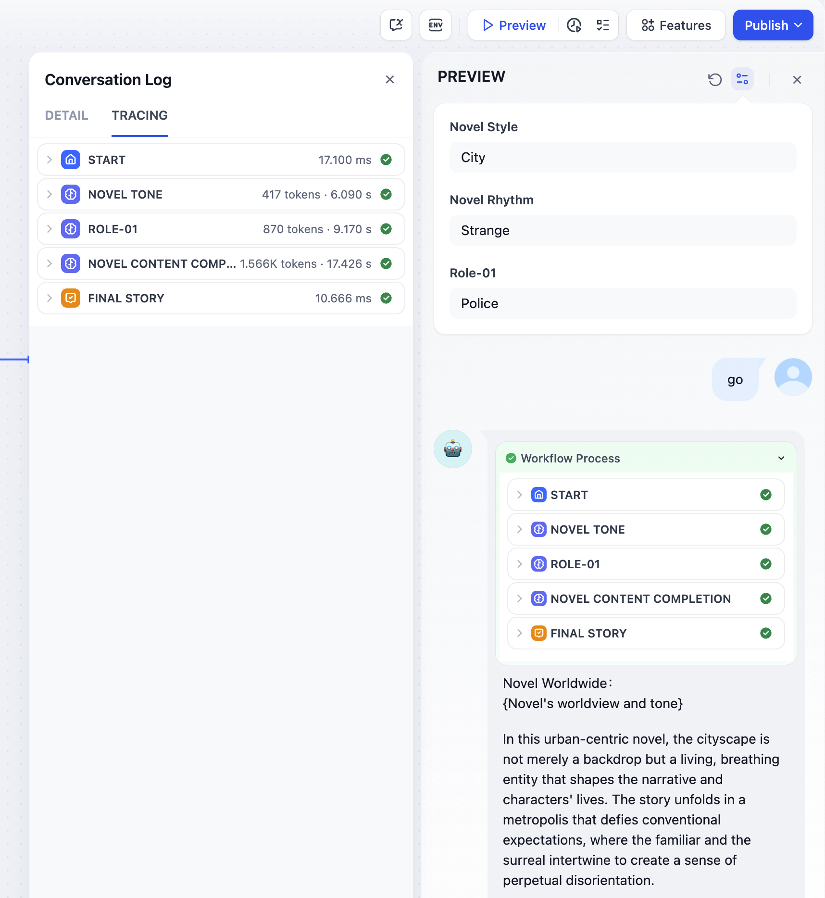
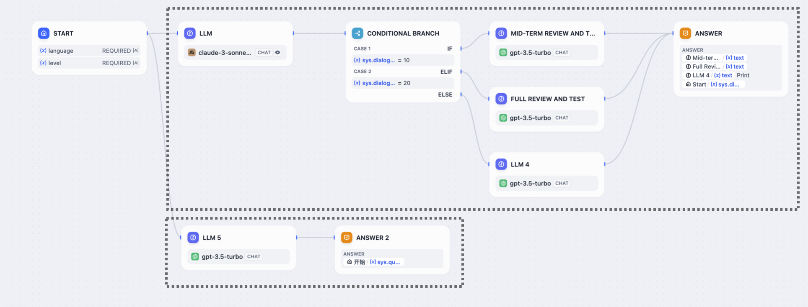

# オーケストレートノード

チャットフローおよびワークフローアプリケーションは、ビジュアルなドラッグアンドドロップ機能を通じてノードのオーケストレーションをサポートしており、シリアルおよびパラレルの2つのオーケストレーションデザインパターンがあります。

## シリアルノードのデザインパターン

このパターンでは、ノードはあらかじめ定義された順序で順次実行されます。各ノードは、前のノードがタスクを完了し、出力を生成した後にのみ操作を開始します。これにより、タスクが論理的な順序で実行されることが保証されます。

シリアルパターンを実装した「小説生成」ワークフローアプリケーションを考えてみましょう。ユーザーが小説のスタイル、リズム、キャラクターを入力した後、LLMが順番に小説の概要、プロット、エンディングを完成させます。各ノードは前のノードの出力に基づいて動作し、小説のスタイルに一貫性をもたらします。

### シリアル構造の作り方

1. 2つのノードの間にある「+」アイコンをクリックして新しいシリアルノードを挿入します。
2. ノードを順次リンクします。
3. すべてのパスを「End」ノードに収束させて、ワークフローを最終承認します。

### シリアル構造のアプリのログをチェックする

シリアル構造のアプリは、ログが順次ノードの操作を表示します。会話ボックスの右上にある "View Logs - Tracing" を順にクリックすると、各ノードの入力、出力、トークン消費、実行時間を含む完全なワークフロープロセスが表示されます。

## パラレルノードのデザインパターン

このアーキテクチャパターンは、複数のノードを並行して実行することを可能にします。前のノードは、パラレル構造内の複数のノードを同時にトリガーできます。これらのパラレルノードは独立して動作し、タスクを同時に実行することで、全体のワークフロー効率を大幅に向上させます。

パラレルアーキテクチャを実装した翻訳ワークフローアプリケーションを考えてみましょう。ユーザーがソーステキストを入力してワークフローをトリガーすると、パラレル構造内のすべてのノードが前のノードから同時に命令を受け取ります。これにより、複数の言語への同時翻訳が可能となり、全体の処理時間が大幅に短縮されます。

### パラレルノードのデザインパターン

次の4つの方法は、ノードの追加やビジュアル操作を通じてパラレル構造を作成する方法を示しています：

**方法1**  
ノードの上にカーソルを合わせると「+」ボタンが表示されます。クリックすると、複数のノードが追加され、自動的にパラレル構造が形成されます。

**方法2**  
ノードから接続を延長するには、ノードの「+」ボタンをドラッグしてパラレル構造を作成します。

**方法3**  
キャンバス上に複数のノードがある場合は、ビジュアルにドラッグしてリンクし、パラレル構造を形成します。

**方法4**  
キャンバスベースの方法に加えて、ノードの右側パネルの「Next Step」セクションからノードを追加することで、パラレル構造を生成することもできます。このアプローチにより、自動的にパラレル構成が作成されます。

**注意:**
- 任意のノードがパラレル構造の下流ノードとして機能します。
- ワークフローアプリケーションには、単一かつ一意な「end」ノードが必要です。
- チャットフローアプリケーションでは複数の「answer」ノードがサポートされます。これらのアプリケーションの各パラレル構造は、適切なコンテンツの出力を確保するために「answer」ノードで終了する必要があります。
- すべてのパラレル構造は同時に実行されます。パラレル構造内のノードは、タスクを完了した後に結果を出力し、出力には順序関係がありません。パラレル構造が単純であればあるほど、結果の出力が速くなります。

### パラレル構造の作り方

以下の4つのパターンは、一般的なパラレル構造デザインを示しています：

#### 1. 通常のパラレル

通常のパラレルは、「開始 | パラレルノード | 終了」の3階層関係を指します。この構造は直感的で、ユーザー入力後に複数のタスクを同時に実行できます。

パラレルブランチの上限は10です。

#### 2. ネストされたパラレル

ネストされたパラレルは、「開始 | 複数のパラレル構造 | 終了」の多階層関係を指します。これは、外部APIを要求する必要があるノード内で同時に複数のタスクを処理し、結果を下流ノードに渡す必要があるような、より複雑なワークフローに適しています。

ワークフローは、最大3層までのネスト関係をサポートします。

#### 3. 条件分岐 + パラレル

パラレル構造は条件分岐と組み合わせて使用することもできます。

#### 4. イテレーション + パラレル

このパターンは、イテレーションとパラレル構造を組み合わせたものです。

### パラレル構造のアプリのログをチェックする

パラレル構造をもつアプリケーションは、ツリーのような形式でログを生成します。折りたたみ可能なパラレルノード グループにより、個々のノード ログを簡単に表示できます。

