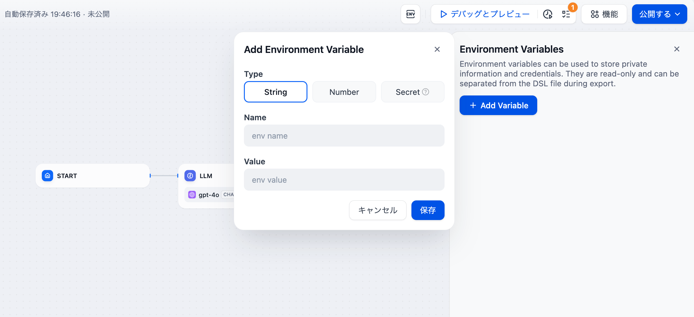

# 変数

**ワークフロー**や**チャットフロー**は、単独ノードで構成されています。多くのノードは入力と出力のアイテムを持っていますが、各ノードの入力および出力情報は一貫性がなく、ダイナミックに変化します。

**固定のシンボルを用いて、ダイナミックなコンテンツをどのように参照するのでしょうか？** 変数はダイナミックなデータコンテナとして、さまざまな内容を格納・送信し、異なるノードの間で相互に参照され、お互いに情報を移動することができます。

### システム変数
システム変数とは、チャットフロー/ワークフロー内でグローバルに使用される事前設定されたシステムレベルのパラメータです。すべてのシステムレベルの変数は`sys.`で始まります。

#### ワークフロー
ワークフローは、以下のシステム変数を提供します：

  | 変数名 | データタイプ | 説明 | 注釈 |
  | --------- | --------------- |----------------------------- | ----------------| 
  | sys.files | ファイルの配列 | ユーザーがアップロードした画像を保存します | 画像アップロードの機能を有効にするために、アプリケーション オーケストレーション ページの右上隅にある[機能]セクションを設定します。 |
  | sys.user_id | 文字列 | ユーザー ID:  ワークフローを使用する際に、システムによって各ユーザーに自動的に割り当てられる識別番号です。異なるユーザーを区別するために使用される。|  |

  <figure><figcaption>
ワークフロー内のシステム変数
</figcaption></figure>

#### チャットフロー

チャットフローは、以下のシステム変数を提供します：

<table><thead><tr><th>変数名</th><th>データ型</th><th width="283">説明</th><th>備考</th></tr></thead><tbody><tr><td><code>sys.query</code></td><td>文字列</td><td>ユーザーがチャットボックスに入力したテキスト。</td><td></td></tr><tr><td><code>sys.files</code></td><td>配列[ファイル]</td><td>ファイルパラメータ：ユーザーがアップロードした画像を保存します。</td><td>画像のアップロード機能は、アプリケーションのオーケストレーションページの右上にある「機能」セクションで有効にする必要があります。</td></tr><tr><td><code>sys.dialogue_count</code></td><td>数値</td><td>
Chatflowアプリケーションとのユーザーの対話中における会話ターンの回数です。各チャットラウンドの後に自動的にカウントが1ずつ増加し、if-elseノードと組み合わせて複雑な分岐ロジックを構築できます。 

例えば、X回目の会話ターンでは、LLMが会話履歴を確認し、自動的に分析を提供します。
</td><td></td></tr><tr><td><code>sys.conversation_id</code></td><td>文字列</td><td>チャットボックス内の対話セッションごとに割り当てられる一意のIDで、関連するメッセージをすべて同じ会話にグループ化し、LLMが同じトピックとコンテキストでチャットを継続できるようにします。</td><td></td></tr><tr><td><code>sys.user_id</code></td><td>文字列</td><td>異なる対話ユーザーを識別するために、各アプリケーションユーザーに割り当てられる一意のIDです。</td><td></td></tr></tbody></table>

<figure><figcaption>
チャットフロー内のシステム変数
</figcaption></figure>

### 環境変数

**環境変数は、APIキーやデータベースのパスワードといった機密性の高い情報を保護する際に、ワークフロー実行時に活用されます。** これらはコードに直接書き込むのではなく、ワークフローに設定され、異なる環境間での共有が可能になっています。

<figure><figcaption>
環境変数
</figcaption></figure>

サポートされるデータ型には以下の3つがあります：

- 文字列
- 数値
- シークレット

環境変数は以下の特徴を持ちます：

- 多くのノードでグローバルに参照可能です；
- 同一の環境変数名を複数設定することはできません；
- ノードの出力変数は基本的に読み取り専用で、書き換えることはできません；

***

### 会話変数

> 会話変数は、チャットフローアプリでのみ使用されます。

**ユーザーは会話変数を使っで、チャットフローの会話内で一時的に特定の情報を保存し、同じワークフロー内の複数のチャットにわたってその情報を参照することができます。** 例えば、コンテキスト、チャットボックスにアップロードされたファイル（近々配布予定）、ユーザーが会話中に入力した設定などが含まれます。この機能は、LLM（大規模言語モデル）に「メモ」を提供するようなもので、メモリエラーによる情報のバイアスを回避できます。

<figure><figcaption></figcaption></figure>

以下の6種類のデータ型をサポートしています：

* 文字列
* 数値
* オブジェクト
* 文字列配列
* 数値の配列
* オブジェクトの配列

**会話変数**には次のような特徴があります：

* 会話変数はチャットフロー内のほとんどのノードでグローバルに参照可能です；
* 会話変数にデータを書き込むには、[変数代入](node/variable-assignment.md)ノードを使用する必要があります；
* 会話変数は読み書き可能な変数です；

会話変数と変数代入ノードの具体的な使用方法については、[変数代入](node/variable-assignment.md)をご参照ください。

### 注意事項
* 変数名の重複を避けるため、ノードの命名を繰り返すことはできません。
* ノードの出力変数、通常は固定変数であり、編集できません。
