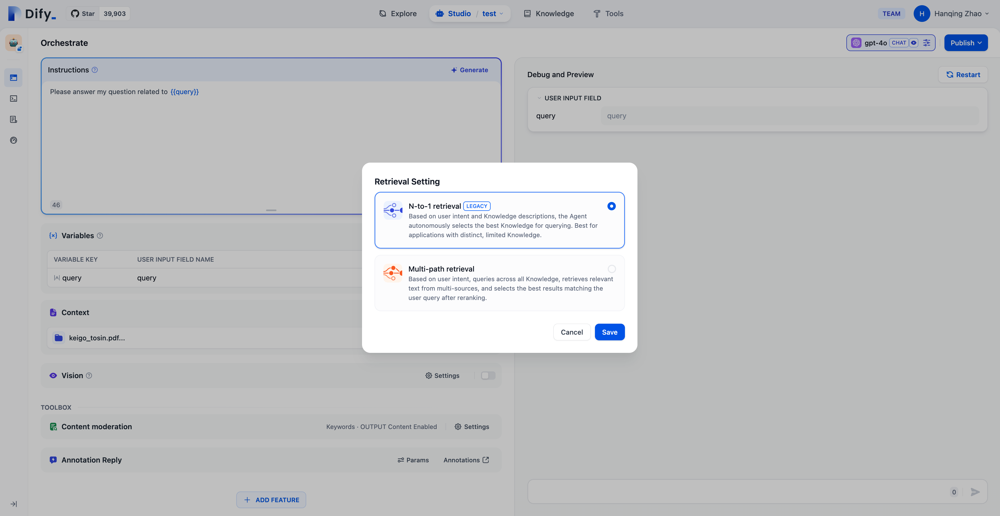

# リトリーバルモード

ユーザーが知識ベースのQ&A用AIアプリケーションを構築する際に、Difyはアプリケーション内で複数のデータセットが関連付けられている場合に、検索時に2つの検索モードをサポートします：N-of-1検索モードとMulti-Path検索モードです。

<figure><figcaption>
検索モード設定
</figcaption></figure>

### N-To-1検索モード

このモードでは、ユーザーの意図とデータセットの説明に基づき、エージェントが関連するテキストを検索するために最も関連性の高い単一のデータセットを自律的に選びます。このモードは、データセットが非常に異なり、数が少ないアプリケーションに適しています。N-of-1検索モードはモデルの推論能力に依存し、ユーザーの意図に基づいて最適なデータセットを選択するために、モデルが適切なデータセットを選ぶ必要があります。推論中、データセットはエージェントによってツールとして扱われ、その説明はデータセットの内容に基づきます。

ユーザーがデータセットをアップロードすると、システムは自動的にその要約説明を作成します。最適な検索結果を得るためには、システムが生成した要約説明を「データセット -> 設定 -> データセットの説明」で確認し、内容が明確に要約されていることを確認してください。

以下は、N-of-1検索モードの技術フローチャートです：

<figure><figcaption>
N-of-1検索
</figcaption></figure>

したがって、データセットの数が非常に多い場合や、データセットの説明が十分に異ならない場合、このモードの検索効果が影響を受ける可能性があります。このモードは、データセットの数が少ないアプリケーションに特に適しています。

ヒント：OpenAI Function Callは現在、複数のツール呼び出しをサポートしています。Difyは将来のバージョンでこのモードを「N-of-M検索」にアップグレードします。

### Multi-Path検索モード

このモードでは、ユーザーの意図に基づいてすべてのデータセットを照合し、複数のデータセットから同時に関連するテキスト断片を検索します。再ランキングステップの後、ユーザーのクエリに最も適合する結果がマルチパス検索の結果から選ばれます。これには構成された再ランキングモデルAPIが必要です。Multi-Path検索モードでは、リトリーバーはアプリケーションに関連付けられたすべてのデータセットを横断してユーザークエリに関連するテキストコンテンツを検索し、マルチパス検索から得られた関連文書の結果を統合し、再ランキングモデルを使用して意味的に取得された文書を再評価します。

Multi-Path検索モードでは、再ランキングモデルを設定する必要があります。再ランキングモデルの構成方法については、こちらをご覧ください：🔗

以下は、Multi-Path検索モードの技術フローチャートです：

<figure><figcaption>
Multi-Path検索
</figcaption></figure>

Multi-Path検索モードはモデルの推論能力やデータセットの説明に依存しないため、複数のデータセットを跨いで高品質な検索結果を得ることができます。さらに、再ランキングステップを組み込むことで文書の検索効果を効果的に向上させることができます。したがって、複数のデータセットに関連付けられた知識ベースのQ&Aアプリケーションを作成する際には、検索モードをMulti-Path検索に設定することをお勧めします。