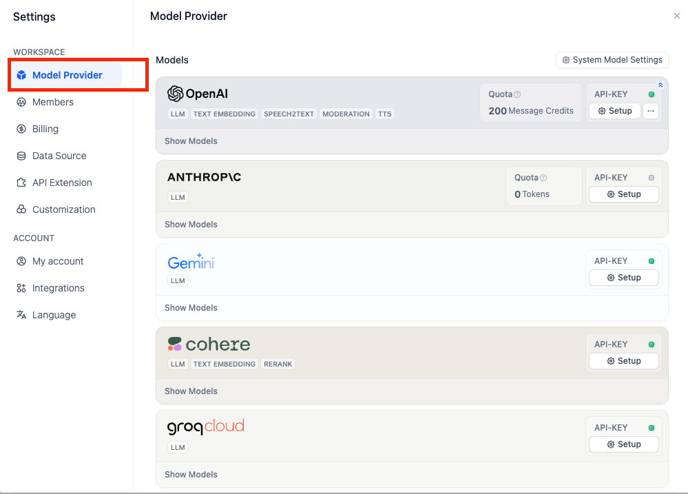
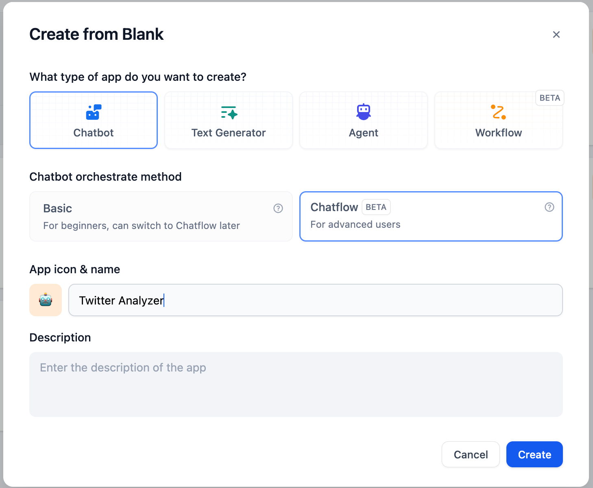
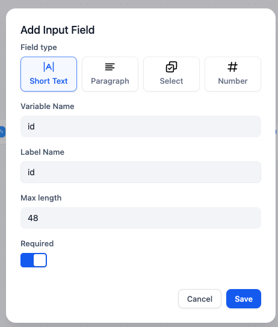
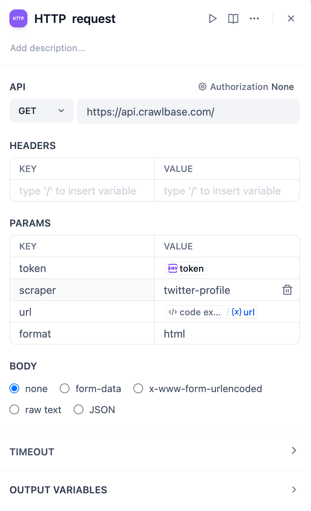
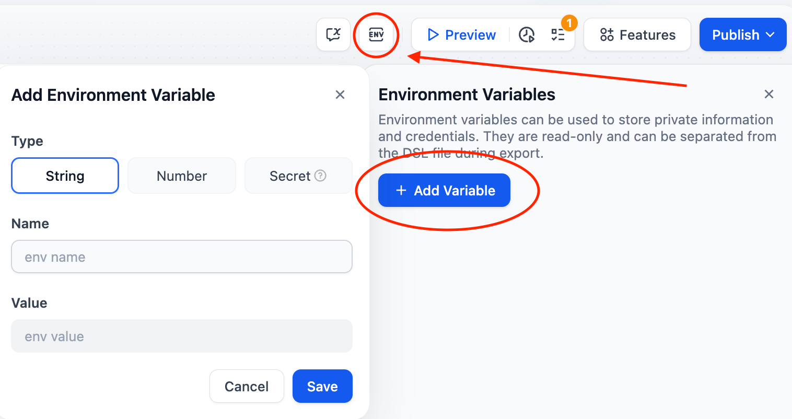
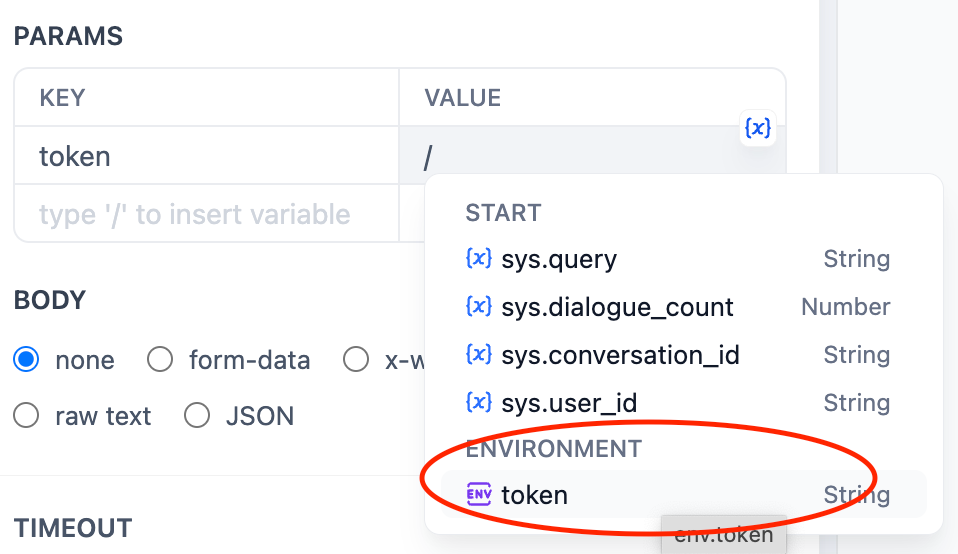
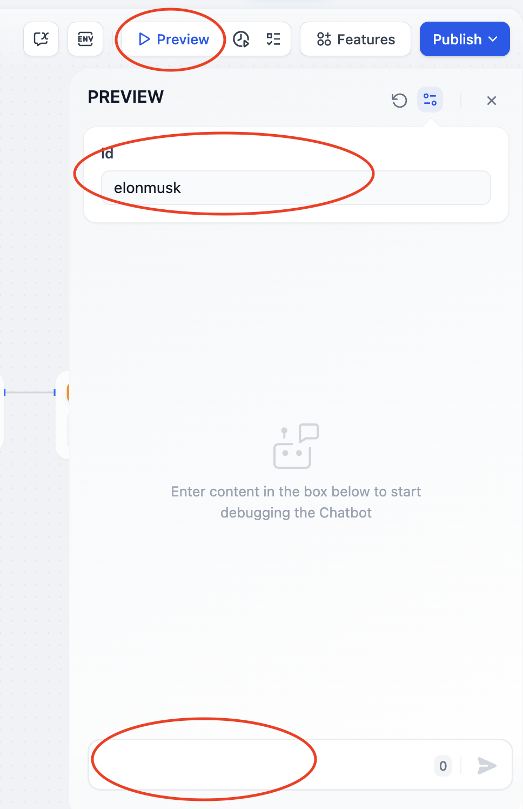

# チャットストリームエージェントを使用した Twitter アカウントの分析方法

> 著者：Steven Lynn. Difyのテクニカルライター

## はじめに

Difyでは、WebページをLLM（大規模言語モデル）が読み取れるMarkdown形式に変換するためのクローラーツール、例えばJinaを利用できます。

最近、[wordware.ai](https://www.wordware.ai/)が、クローラーを使ってソーシャルメディアをデータ収集し、LLM分析用の面白いアプリケーションを開発できることを教えてくれました。このアプリケーションは、特にデータ分析や洞察を提供するために設計されています。

しかし、かつてTwitterとして知られていた「X」は、2023年2月2日以降、無料のAPIアクセスを提供しなくなり、それに続いてクローリング対策を強化しました。そのため、JinaのようなツールはXのコンテンツに直接アクセスすることができなくなっています。

> 2023年2月9日から、Twitter APIの無料アクセスは終了し、v2およびv1.1のサポートも行われなくなります。代わりに、有料の基本プランが提供されます。 🧵
>
> — Developers (@XDevelopers) [February 2, 2023](https://twitter.com/XDevelopers/status/1621026986784337922?ref\_src=twsrc%5Etfw)

幸いなことに、DifyにはHTTPツールがあり、これを使用して外部のクローリングツールにHTTPリクエストを送信できます。それでは、始めていきましょう！

## **前提条件**

### Crawlbaseの登録

Crawlbaseは、ビジネスや開発者向けに設計されたデータクローリングとスクレイピングのプラットフォームです。このツールを使うことで、X、Facebook、Instagramなどのソーシャルメディアプラットフォームからデータを収集できます。

登録は以下のリンクから行えます：[crawlbase.com](https://crawlbase.com)

### Difyのローカル展開

DifyはオープンソースのLLMアプリケーション開発プラットフォームで、クラウドサービスを利用するか、docker composeを使用してローカルに展開できます。

この記事では、ローカル展開を希望しない方のために、無料のDify Cloudサンドボックスアカウントをこちらから登録する方法を紹介します：[https://cloud.dify.ai/signin](https://cloud.dify.ai/signin)。


Dify Cloud Sandboxのユーザーは、200の無料クレジットを取得できます。これは、200のGPT-3.5メッセージまたは20のGPT-4メッセージに相当します。


以下は、Difyを展開するための簡単な手順です：

#### Difyをクローン

```bash
git clone https://github.com/langgenius/dify.git
```

#### **Difyを起動**

```bash
cd dify/docker
cp .env.example .env
docker compose up -d
```

### LLMプロバイダーの設定

アカウント設定にて、モデルプロバイダーを設定してください：

<div>

<figure><figcaption></figcaption></figure>

 

<figure><figcaption></figcaption></figure>

</div>

## チャットフローの作成

それでは、チャットフローの作成を始めましょう。

`最初から作成`をクリックして、新しいフローの作成を開始します：

<div>

<figure><figcaption></figcaption></figure>

 

<figure><figcaption></figcaption></figure>

</div>

初期化されたチャットフローは以下のようになります：

<div>

<figure><figcaption></figcaption></figure>

 

<figure><figcaption></figcaption></figure>

</div>

## チャットフローにノードを追加

<figure><figcaption><p>最終的なチャットフローはこのようになります</p></figcaption></figure>

### 開始ノード

開始ノードでは、チャットの最初にシステム変数を追加できます。このプロセスでは、TwitterユーザーのIDを文字列型の変数として使用します。変数名を`id`としましょう。

開始ノードをクリックして、新しい変数を追加します：

<figure><figcaption></figcaption></figure>

### コードノード

[Crawlbaseのドキュメント](https://crawlbase.com/docs/crawling-api/scrapers/#twitter-profile)によれば、次のノードで使用する変数`url`は`https://twitter.com/`に`ユーザーID`を加えた形にする必要があります。例えば、Elon MuskのユーザーIDの場合は`https://twitter.com/elonmusk`となります。

ユーザーIDを完全なURLに変換するためには、以下のPythonコードを使用して、プレフィックス`https://twitter.com/`とユーザーIDを結合します：

```python
def main(id: str) -> dict:
    return {
        "url": "https://twitter.com/"+id,
    }
```

コードノードを追加し、Pythonを選択した後、入力および出力の変数名を設定してください：

<figure><figcaption></figcaption></figure>

### HTTPリクエストノード

[Crawlbaseのドキュメント](https://crawlbase.com/docs/crawling-api/scrapers/#twitter-profile)によると、TwitterユーザーのプロフィールをHTTP形式でスクレイピングするには、以下の形式でHTTPリクエストノードを設定する必要があります：

<div>

<figure><figcaption></figcaption></figure>

 

<figure><figcaption></figcaption></figure>

</div>

セキュリティ上の観点から、トークン値を平文で直接入力することは避けるべきです。これは推奨されるベストプラクティスではありません。実際、Difyの最新バージョンでは、トークン値を**環境変数**に設定できるようになっています。`env`をクリックして`Add Variable`を選択し、トークン値を設定すると、ノードに平文が表示されなくなります。

あなたのCrawlbase APIキーについては、[こちら](https://crawlbase.com/dashboard/account/docs)で確認できます。

<div>

<figure><figcaption></figcaption></figure>

 

<figure><figcaption></figcaption></figure>

</div>

`/`を入力することで、APIキーを簡単に変数として挿入できます。

<div>

<figure><figcaption></figcaption></figure>

 

<figure><figcaption></figcaption></figure>

</div>

このノードが正しく動作するか確認するために、ノードの開始ボタンをタップしてください：

<figure><figcaption></figcaption></figure>

### LLMノード

さて、Crawlbaseによってスクレイピングされた結果を分析し、コマンドを実行するためにLLMを使用できます。

値`context`はHTTPリクエストノードからの`body`でなければなりません。

以下はサンプルのシステムプロンプトです。

<div>

<figure><figcaption></figcaption></figure>

 

<figure><figcaption></figcaption></figure>

</div>

## テスト実行

`プレビュー`をクリックしてテスト実行を開始し、`id`にTwitterユーザーIDを入力してください。

<div>

<figure><figcaption></figcaption></figure>

 

<figure><figcaption></figcaption></figure>

</div>

例えば、Elon Muskのツイートを分析し、彼の口調で地球温暖化についてのツイートを書きたいと思います。

<figure><figcaption></figcaption></figure>

これはElonらしいですか？笑

右上隅にある`公開`をクリックして、あなたのWebサイトに追加してください。

楽しんでください！

## 最後に…

### 他のX(Twitter)クローラー

この記事では、Crawlbaseを紹介しました。これはおそらく利用可能な最も安価なTwitterクローラーサービスですが、時々ユーザーのツイートの内容を正しくスクレイピングできないことがあります。

以前に紹介した[wordware.ai](http://wordware.ai)が使用しているTwitterクローラーサービスは**Tweet Scraper V2**ですが、ホストされているプラットフォーム**apify**のサブスクリプションは月額49ドルです。

## リンク

* [X@dify\_ai](https://x.com/dify\_ai)
* DifyのGitHubリポジトリ：[https://github.com/langgenius/dify](https://github.com/langgenius/dify)
