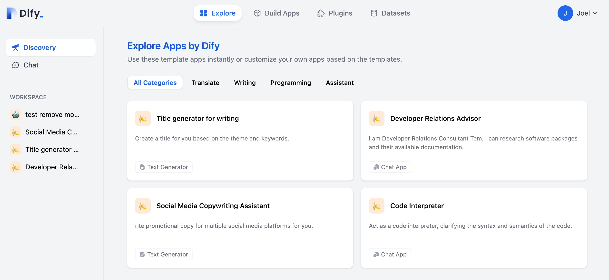
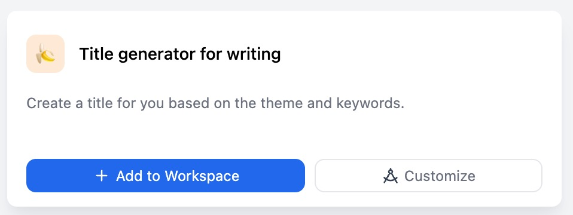

# Discovery

## Template application

In **Explore > Discovery**, some commonly used template applications are provided. These apps cover translate, writing, programming and assistant.

<figure><figcaption></figcaption></figure>

If you want to use a template application, click the template's "Add to Workspace" button. In the workspace on the left, the app is available.

<figure><figcaption></figcaption></figure>

If you want to modify a template to create a new application, click the "Customize" button of the template.

## Workspace

The workspace is the application's navigation. Click an application in the workspace to use the application directly.

<figure><figcaption></figcaption></figure>

Apps in the workspace include: your own apps and apps added to the workspace by other teams.
