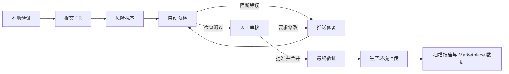

---
dimensions:
  type:
    primary: operational
    detail: deployment
  level: intermediate
standard_title: Dify Marketplace Review and Release
language: zh
title: 检查、审核与 Marketplace 发布
description: 理解 Dify Marketplace CI 结果、处理审核反馈，并了解合并后的验证与发布流水线
---

> 本文档由 AI 自动翻译。如有任何不准确之处，请参考 [英文原版](/en/develop-plugin/publishing/marketplace-listing/marketplace-review-and-release)。

Marketplace 发布是一条信任流水线，并非单次勾选批准。软件包会先在本地验证，再接受 PR 检查和人工审核，合并后还会再次验证，最后才上传产物。

## PR 自动检查

PR 向 `main` 或 `dev` 创建、更新或标记为 Ready for review 时，`Pre Check Plugin` 工作流会运行。工作流会克隆当前 [Dify Marketplace Toolkit](https://github.com/langgenius/dify-marketplace-toolkit) 并下载当前插件 daemon，因此规则可持续演进，无需把工作流复制到每个插件仓库。

<Tabs>
  <Tab title="软件包完整性">
    - 只变更 1 个 `.difypkg`，且仓库路径有效。
    - 归档可安全解压，且未超出软件包大小和文件数限制。
    - 检测开发产物、密钥、可疑赋值、可执行文件、捆绑二进制文件和默认模板图标。
  </Tab>
  <Tab title="元数据与披露">
    - 验证 manifest 字段、源码仓库、联系信息、隐私声明、图标和版本。
    - 检查 README 元数据和英文主文档。
    - 对照软件包检查 PR 模板、风险选择、审核者备注、版本更新和敏感能力披露。
  </Tab>
  <Tab title="依赖与代码">
    - 检查依赖策略和依赖安装。
    - 编译 Python 源码并扫描安全警告。
    - 展示已知依赖漏洞、禁止的金融活动和其他审核信号。
  </Tab>
  <Tab title="运行时与打包">
    - 适用时在干净环境中安装依赖。
    - 按兼容的 daemon 流程安装插件。
    - 以测试模式运行 Marketplace uploader，确认软件包可以处理，但不会发布。
  </Tab>
</Tabs>

<Note>
仓库工作流是当前检查项的权威来源。验证器新增或升级后，固定编号的检查清单很快会过期。应以这些检查类别为导航，并从工作流报告中查看具体结果。
</Note>

## 错误与警告的区别

工作流会完整运行各个验证器，再将结果汇总到步骤摘要中。

| 结果 | 含义 | 处理方式 |
| :--- | :--- | :--- |
| **阻断错误** | 明确的要求未满足，例如软件包中包含密钥、元数据无效、PR 正文不完整、版本重复，或安装/软件包处理失败。 | 修复软件包或 PR，必要时重新构建，再推送到同一分支。 |
| **警告** | 验证器发现需要人工判断的行为或证据，例如敏感能力、二进制例外、安全模式、金融活动或上下文信号不足。 | 解释或修复。警告本身不会使工作流失败，但审核者可要求修改。 |
| **通过** | 自动检查未发现阻断项。 | 等待人工审核；工作流绿色不代表自动批准。 |

<Warning>
不要通过删除真实披露来消除警告。审核者会对比软件包行为、文档、隐私条款、源码和 PR 声明；这些内容不一致也会导致修改请求。
</Warning>

## 人工审核

自动检查完成后，维护者会审核自动化无法可靠判断的部分：

- 软件包内容是否符合声明的用途。
- README 是否充分说明配置、凭据、API 和连接要求。
- 隐私政策是否符合真实数据流和第三方服务。
- 风险等级与敏感能力说明是否符合插件行为。
- 依赖和二进制文件是否必要且受到合理限制。
- 高风险输入、网络请求、凭据和错误处理是否具备适当防护。

<Steps>
  <Step title="阅读完整报告">
    先查看 GitHub Actions 摘要，再展开相关错误和警告详情。应修复根因，而非只处理第一个可见症状。
  </Step>
  <Step title="更新源码与软件包">
    在插件源码仓库中修改；需要时提高版本，重新构建 `.difypkg`，再按维护者要求替换或添加软件包。
  </Step>
  <Step title="推送到同一 PR 分支">
    每次推送都会重新运行预检。回复审核评论时，说明修改内容和新证据所在位置。
  </Step>
  <Step title="重新请求审核">
    处理完所有修改要求且检查结果为最新后，将 PR 标记为 Ready for review 或重新请求审核，不要重复创建提交。
  </Step>
</Steps>

## 合并后的流程

合并不会跳过验证。推送到 `main` 后会启动 `Upload Merged Plugin` 工作流：

<Steps>
  <Step title="识别合并的软件包">
    工作流计算变更文件，并确认推送中只有 1 个可发布的 `.difypkg` 路径。
  </Step>
  <Step title="运行最终软件包检查">
    解压合并后的归档，再次检查软件包内容、密钥、二进制文件、manifest 元数据、README 元数据、依赖策略和禁止的金融活动信号。
  </Step>
  <Step title="提取发布说明">
    工作流查找关联 PR，并从正文提取变更日志。因此，版本更新中的 **What changed** 应准确完整。
  </Step>
  <Step title="上传生产环境">
    Marketplace uploader 会验证软件包并上传到生产环境。生产环境上传失败会停止工作流。
  </Step>
  <Step title="附加扫描证据">
    uploader 会扫描打包产物并提交该版本专属的扫描报告。Marketplace 的访问域名和安全界面会使用这些数据。新版本会作为新证据重新扫描，不会继承旧软件包的信任结果。
  </Step>
</Steps>

工作流也可将软件包同步到 staging。staging 上传采用尽力而为模式，不会回滚已成功的生产环境发布。

<Check>
生产环境上传成功后，合并的软件包即完成仓库发布流水线。贡献者无需再运行单独的上传命令。
</Check>

## 维护已发布插件

发布后仍需持续维护：

- 关注提交中列出的源码仓库和联系渠道。
- 尽快修复安全问题与依赖漏洞。
- 保持插件行为、出站域名、README 说明和隐私披露同步。
- 每次更新都使用新版本并提交新 PR，切勿原地替换已发布版本。
- 在用户升级前说明迁移事项和破坏性变更。

<AccordionGroup>
  <Accordion title="为什么本地验证通过后 CI 仍会失败？">
    本地验证只检查软件包内的证据。CI 还拥有 PR 与 Marketplace 上下文，包括模板完整性、风险标签、重复版本、干净环境依赖安装、daemon 安装测试和 uploader 测试模式。
  </Accordion>
  <Accordion title="检查失败后需要创建新 PR 吗？">
    通常不需要。将修正后的软件包或 PR 正文推送到现有分支。这样既保留审核上下文，也会自动重跑检查。
  </Accordion>
  <Accordion title="警告会阻止发布吗？">
    警告本身不会阻止发布。它会把模糊或敏感行为交给人工审核。审核者可能接受说明，也可能要求加强防护或修改实现。
  </Accordion>
  <Accordion title="工作流绿色就一定会获批吗？">
    不一定。自动化只验证已定义规则；维护者仍会判断用途、文档、隐私、安全边界、依赖必要性，以及软件包与声明是否一致。
  </Accordion>
</AccordionGroup>

<CardGroup cols={2}>
  <Card title="准备并验证" icon="shield-check" href="/zh/develop-plugin/publishing/marketplace-listing/prepare-plugin-for-marketplace">
    返回软件包整理、风险分类和本地验证。
  </Card>
  <Card title="提交 PR" icon="code-pull-request" href="/zh/develop-plugin/publishing/marketplace-listing/submit-plugin-to-marketplace">
    查看软件包路径和 PR 必填证据。
  </Card>
</CardGroup>
