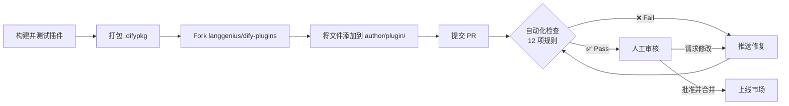

---
dimensions:
  type:
    primary: operational
    detail: deployment
  level: intermediate
standard_title: Release to Dify Marketplace
language: zh
title: 发布到 Dify 市场
description: 将插件提交到 Dify 市场，涵盖提交前检查清单、12 项审核检查、PR 流程，以及通过审核后的后续工作
---

> 本文档由 AI 自动翻译。如有任何不准确之处，请参考 [英文原版](/en/develop-plugin/publishing/marketplace-listing/release-to-dify-marketplace)。

市场是 Dify 官方的插件目录，收录由社区和合作伙伴构建的插件。将插件提交到这里，每位 Dify 用户都能一键安装它。

发布插件的方式是向 [`langgenius/dify-plugins`](https://github.com/langgenius/dify-plugins) 提交一个 Pull Request。审核者（以及一组自动化检查）会逐项检查该 PR，通过后插件会自动上线到 [marketplace.dify.ai](https://marketplace.dify.ai/)。

如果你还没有构建过插件，先从 [Tool 插件实战教程](/zh/develop-plugin/dev-guides-and-walkthroughs/tool-plugin) 开始。

## 提交之前

Dify 审核者会对每个 PR 运行 12 项自动化预检。大多数被拒原因都是机械性问题，提前修复可以省下一轮审核。

<Tabs>
  <Tab title="项目文件">
    每个插件目录都必须包含：

    | 文件 / 文件夹 | 用途 |
    | :--- | :--- |
    | `manifest.yaml` | 插件元数据（名称、作者、版本等） |
    | `README.md` | 仅限英文的描述、安装与使用说明 |
    | `PRIVACY.md` | 隐私政策（必填，不能为空） |
    | `_assets/` | 插件图标及其他静态资源 |

    manifest 字段详见 [通用规范](/zh/develop-plugin/features-and-specs/plugin-types/general-specifications)，隐私政策详见 [隐私保护指南](/zh/develop-plugin/publishing/standards/privacy-protection-guidelines)。
  </Tab>
  <Tab title="manifest 规则">
    - `manifest.yaml` 中的 **Author** 不得包含 `langgenius` 或 `dify`，这两个名称为第一方插件保留。使用你自己的 GitHub 用户名。
    - **Version** 必须是新值。提交已发布过的版本会被拒绝。
    - **Icon** 必须是 `_assets/` 中真实存在的图标，而非遗留的模板默认图标。
  </Tab>
  <Tab title="依赖">
    - `pip install -r requirements.txt` 必须能干净地执行成功。
    - 插件 SDK 的版本固定值至少为 `dify_plugin>=0.5.0`。
    - 插件必须能针对当前 daemon 无错误地安装和打包（审核者会运行 `test-plugin-install.py` 和 `upload-package.py --test`）。
  </Tab>
  <Tab title="语言">
    - **PR 标题和正文** 必须使用英文。双语提示行 `【中文用户 & Non English User】请使用英语提交，否则会被关闭 ：）` 是唯一的白名单例外。
    - **`README.md`** 不得包含任何中文字符。改为以 `readme/README_<lang>.md` 的形式添加翻译。详见 [多语言 README](/zh/develop-plugin/features-and-specs/plugin-types/multilingual-readme)。
  </Tab>
</Tabs>

## 审核检查清单

以下是审核者依次运行的全部检查。把它当作提交 PR 前的预检清单。

| # | 检查项 | 常见失败原因 |
| :--- | :--- | :--- |
| 1 | **单个 `.difypkg`** | PR 包含多个打包文件，或一个都没有 |
| 2 | **PR 语言** | 标题或正文中出现白名单提示行以外的 CJK 字符 |
| 3 | **项目结构** | 缺少 `manifest.yaml`、`README.md`、`PRIVACY.md` 或 `_assets/` |
| 4 | **manifest 作者** | Author 包含 `langgenius` 或 `dify` |
| 5 | **图标** | 保留了默认模板图标，或图标缺失 |
| 6 | **版本** | 该版本已存在于市场中 |
| 7 | **README 语言** | `README.md` 中含有中文字符（改用 `readme/README_zh_Hans.md`） |
| 8 | **PRIVACY.md** | 缺失或为空 |
| 9 | **依赖安装** | `pip install -r requirements.txt` 报错 |
| 10 | **SDK 版本** | `dify_plugin` 固定在 `0.5.0` 以下 |
| 11 | **安装测试** | 插件无法通过 daemon 安装 |
| 12 | **打包测试** | 插件无法干净地重新打包 |

任何一项检查失败都会中止审核，并发布一张包含 `❌ Fail` 行和所需修复项的状态表；你修复这些问题后再次推送即可。

## 提交 PR

<Steps>
  <Step title="阅读插件开发指南">
    浏览 [插件开发指南](/zh/develop-plugin/publishing/standards/contributor-covenant-code-of-conduct)。审核者依据它来判断非机械性的方面：独特性、品牌契合度、内容质量、知识产权，以及维护承诺。
  </Step>
  <Step title="编写隐私政策">
    在插件根目录创建 `PRIVACY.md`（或将其托管在别处，并把 URL 写入 manifest）。遵循 [隐私保护指南](/zh/develop-plugin/publishing/standards/privacy-protection-guidelines)：声明插件本身及其调用的任何第三方服务会收集哪些数据。
  </Step>
  <Step title="打包插件">
    在插件项目所在目录的上一级运行：

    ```bash
    dify plugin package ./your_plugin_project
    ```

    这会生成 `your_plugin_project.difypkg`。
  </Step>
  <Step title="Fork 并添加文件">
    Fork [`langgenius/dify-plugins`](https://github.com/langgenius/dify-plugins)。创建一个 `<your-author-name>/<your-plugin-name>/` 文件夹，并把 `.difypkg` 放进去。
  </Step>
  <Step title="提交 PR">
    推送到你的 fork，然后用仓库的 PR 模板向 `main` 提交一个 PR。标题和正文使用英文。
  </Step>
  <Step title="回应审核">
    自动化检查会先发布结果，随后人工审核者跟进。通过推送新提交来处理反馈；每次推送都会重新运行检查。
  </Step>
</Steps>



<Tip>
首次审核通常会在一周内开始。如果耗时更久，审核者会留下评论说明延迟原因。
</Tip>

<Check>
合并到 `main` 后，插件会自动出现在 [marketplace.dify.ai](https://marketplace.dify.ai/) 上，无需单独的发布步骤。
</Check>

## 通过审核后

从合并那一刻起，这个插件就归你负责：

- **修复缺陷与功能请求。** 处理来自用户的 issue。
- **兼容性更新。** 当 Dify 发布破坏性的 API 变更时，团队会提供迁移说明；你来更新插件。必要时 Dify 工程师可以协助。
- **版本管理。** 在 `manifest.yaml` 中提升 `version`，重新打包，再带上新的 `.difypkg` 提交一个新 PR。[自动发布 PR 工作流](/zh/develop-plugin/publishing/marketplace-listing/plugin-auto-publish-pr) 可通过 GitHub Action 自动完成这一过程。

<Warning>
在市场处于公测期间，避免对已被使用的插件做破坏性变更。新增字段，而非重命名现有字段；移除前先弃用。
</Warning>

## PR 生命周期

| 状态 | 含义 | 该怎么做 |
| :--- | :--- | :--- |
| **开启，等待审核** | 在最初约 7 天内，无需操作 | 等待 |
| **请求修改** | 某项检查失败，或审核者留下了反馈 | 推送修复；检查会自动重新运行 |
| **过期（闲置 14 天）** | 你两周内未回应 | 在 PR 上回复以重置计时；该 PR 可被重新打开 |
| **关闭（闲置 30 天）** | 因不活跃而关闭 | 提交一个全新 PR；已关闭的 PR 无法重新打开 |

## 常见问题

<AccordionGroup>
  <Accordion title="如何判断我的插件与现有插件是否过于相似？">
    市场按**功能**去重，而非按**集成对象**去重。一个仅新增了多语言版本的 Google 搜索插件属于重复。而一个增加了批量查询、更完善的错误处理或某项有意义新能力的 Google 搜索插件则可以接受；在 PR 描述中说明这一点。
  </Accordion>
  <Accordion title="我的 PR 被标记为过期或已关闭，接下来怎么办？">
    **过期** 的 PR（闲置 14 天）可以重新打开；在 PR 上回复或推送一个修复即可重启计时。**已关闭** 的 PR（闲置 30 天）无法重新打开；修复反馈后，用同一个包提交一个全新 PR。
  </Accordion>
  <Accordion title="公测期间可以更新插件吗？">
    可以。避免破坏性变更：新增字段而非重命名，移除前先弃用。
  </Accordion>
  <Accordion title="可以发布付费插件吗？">
    暂时不行。市场目前只接受免费插件；变现政策将另行公布。
  </Accordion>
  <Accordion title="PR 正文需要同时包含英文和中文供我们团队使用，这样可以吗？">
    不行。PR 标题/正文中只允许那一行白名单双语提示。把内部的多语言备注放在别处（提交信息、内部文档）。
  </Accordion>
</AccordionGroup>

## 相关资源

<CardGroup cols={2}>
  <Card title="发布方式总览" icon="signs-post" href="/zh/develop-plugin/publishing/marketplace-listing/release-overview">
    对比市场、GitHub 和本地文件三种分发方式。
  </Card>
  <Card title="插件开发指南" icon="clipboard-check" href="/zh/develop-plugin/publishing/standards/contributor-covenant-code-of-conduct">
    审核者所遵循的完整内容与质量标准。
  </Card>
  <Card title="隐私保护指南" icon="shield-halved" href="/zh/develop-plugin/publishing/standards/privacy-protection-guidelines">
    如何编写一份能通过审核的 `PRIVACY.md`。
  </Card>
  <Card title="自动发布 PR 工作流" icon="robot" href="/zh/develop-plugin/publishing/marketplace-listing/plugin-auto-publish-pr">
    在每次推送时自动打包并提交 PR 的 GitHub Action。
  </Card>
  <Card title="多语言 README" icon="language" href="/zh/develop-plugin/features-and-specs/plugin-types/multilingual-readme">
    为非英文用户添加 `readme/README_<lang>.md` 文件。
  </Card>
  <Card title="通用规范" icon="file-code" href="/zh/develop-plugin/features-and-specs/plugin-types/general-specifications">
    manifest 字段参考。
  </Card>
</CardGroup>

{/*
Contributing Section
DO NOT edit this section!
It will be automatically generated by the script.
*/}

---

[编辑此页面](https://github.com/langgenius/dify-docs/edit/main/en/develop-plugin/publishing/marketplace-listing/release-to-dify-marketplace.mdx) | [报告问题](https://github.com/langgenius/dify-docs/issues/new?template=docs.yml)
