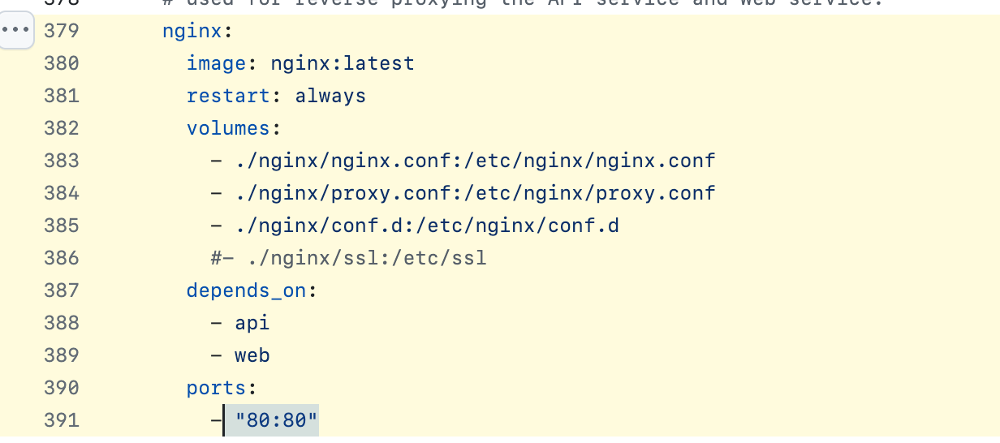

# 单独启动服务端 Docker 容器

在进行前端开发时，如果不需要本地构建和启动后端代码，可以使用 `docker-compose.yml` 来单独启动后端服务。以下是具体步骤：

### 使用源码构建 Docker 镜像

1. **移除 `docker-compose.yml` 中的 `web` 服务**：
   这一步确保不会启动前端服务。

2. **（可选）暴露 `api` 服务端口 `5001`**：
   如果需要直接访问后端服务，可以选择暴露所需端口。

3. **启动后端服务**：
   使用以下命令来启动 Docker 容器：

    ```shell
    docker compose up -d
    ```

4. **启动前端服务**：
   - 如果你执行了步骤2并暴露了端口，可以直接启动前端服务：

     ```shell
     cd web && yarn && yarn dev
     ```

   - 如果没有暴露端口，则需要在启动前端时设置环境变量 `CONSOLE_URL` 和 `APP_URL`。这通常依赖于 Nginx 的配置。例如：

     ```shell
     CONSOLE_URL=http://localhost APP_URL=http://localhost yarn dev
     ```

     或者通过配置 `.env` 文件：
     ```
      NEXT_PUBLIC_API_PREFIX=http://localhost/console/api
      NEXT_PUBLIC_PUBLIC_API_PREFIX=http://localhost/api
     ```


     > 注意：80 是默认端口，如果使用默认端口可以在配置时省略。

     

### 本地访问

访问 [http://localhost:3000](http://localhost:3000) 来查看前端应用。