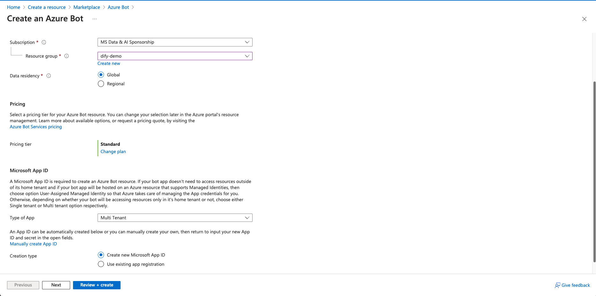
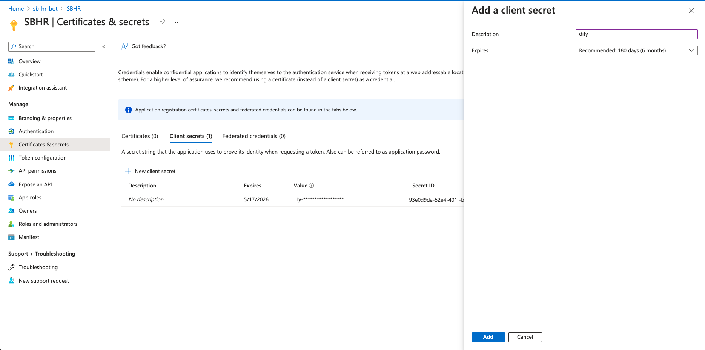
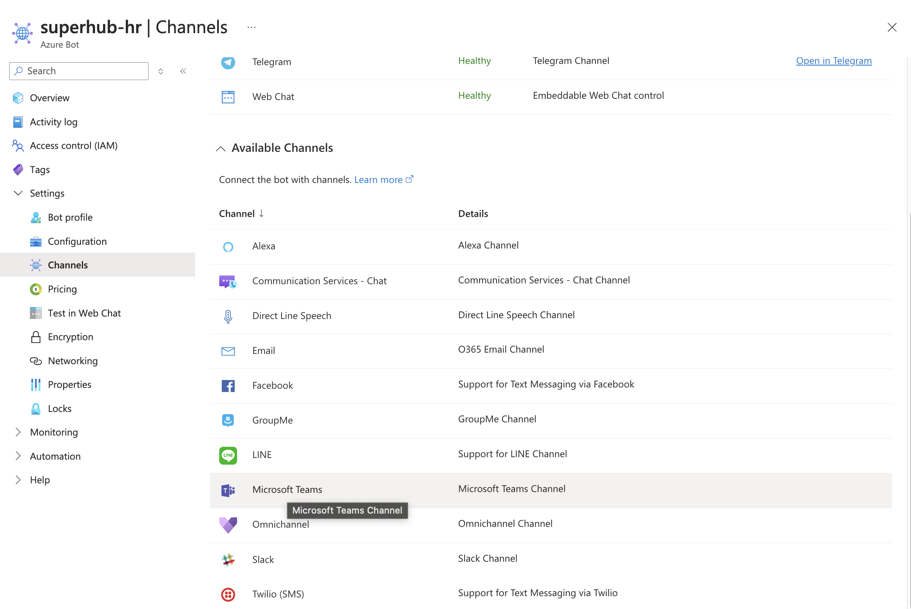
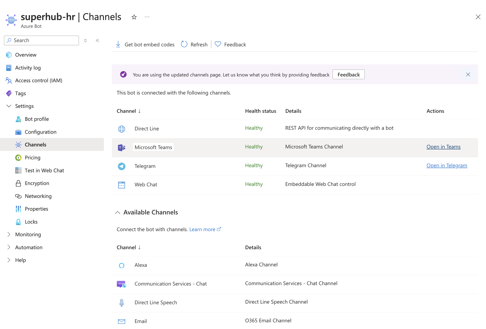
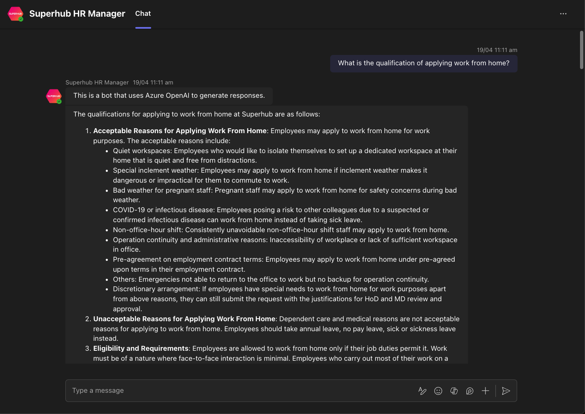

# 使用Dify 和Azure Bot Framework构建Microsoft Teams机器人

> 作者：Warren， [Microsoft 最有價值專家 (MVP)](https://mvp.microsoft.com/en-US/mvp/profile/476f41d3-6bd1-ea11-a812-000d3a8dfe0d)

## 1. 概述

随着世界通过消息应用程序变得越来越紧密地连接在一起，聊天机器人已成为企业与客户进行更个性化交流的关键工具。

随着人工智能的崛起，聊天机器人变得更聪明，更个性化，更直观。在本文中，我们将向您展示如何使用Azure Bot Service集成Microsoft Teams。

您将集成Azure Bot Service 的Teams Channel，允许客户与您的Microsoft Teams聊天机器人开始对话。

使用Azure Bot Service，将您的机器人部署在云中，使其可以供Microsoft Teams Channel通信。

## 2. 準備工作

- 安装好Docker 和Docker Compose
- Microsoft Teams账户
- 一个安装了Microsoft Teams的智能手机或电脑，用于测试您的AI聊天机器人
- [Azure 账户](https://azure.microsoft.com/en-us/free)

## 3. 创建Dify基础编排聊天助手应用 （節錄自[手摸手教你把 Dify 接入微信生态](./dify-on-wechat.md))


首先，登录[Dify官方应用平台](https://cloud.dify.ai/signin)，你可以选择使用Github登录或者使用Google登录。此外，你也可以参考Dify官方教程[Docker Compose 部署 | 中文 | Dify](https://docs.dify.ai/v/zh-hans/getting-started/install-self-hosted/docker-compose) 私有部署，Dify是开源项目，支持私有部署。

<figure><figcaption></figcaption></figure>

登录成功后，进入Dify页面，我们按照下方步骤创建一个基础编排聊天助手应用

1. 点击页面上方的工作室
2. 创建空白应用
3. 应用类型选择聊天助手
4. 聊天助手编排方式选择基础编排
5. 选择应用图标并为应用填写一个名称，比如基础编排聊天助手
6. 点击创建

<figure><figcaption></figcaption></figure>
创建成功后我们会跳转到上图所示页面，我们继续配置应用

1. 选择模型，如gpt-3.5-turbo-0125
2. 设置模型参数
3. 填写应用提示词
<figure><figcaption></figcaption></figure>

在配置完成后，我们可以在右侧对话框进行测试，在测试完成后，进行如下操作

1. 发布
2. 更新
3. 访问API

##### （4）生成基础编排聊天助手API密钥
<figure><figcaption></figcaption></figure>

在点击"访问API"后，我们会跳转到上图的API管理页面，在这个页面我们按照如下步骤获取API密钥：

1. 点击右上角API密钥
2. 点击创建密钥
3. 复制保存密钥

在保存密钥后，还需要查看右上角的API服务器，如果是Dify官网的应用，API服务器地址为 "https://api.dify.ai/v1", 如果是私有部署的，请确认你自己的API服务器地址。

至此，创建聊天助手的准备工作结束，在此小节中我们只需要保存好两个东西：**API密钥**与**API服务器地址**


## 4. 创建Azure Bot Service

转到[Azure Marketplace](https://portal.azure.com/#view/Microsoft_Azure_Marketplace/GalleryItemDetailsBladeNopdl/id/Microsoft.AzureBot/selectionMode~/false/resourceGroupId//resourceGroupLocation//dontDiscardJourney~/false/selectedMenuId/home/launchingContext~/%7B%22galleryItemId%22%3A%22Microsoft.AzureBot%22%2C%22source%22%3A%5B%22GalleryFeaturedMenuItemPart%22%2C%22VirtualizedTileDetails%22%5D%2C%22menuItemId%22%3A%22home%22%2C%22subMenuItemId%22%3A%22Search%20results%22%2C%22telemetryId%22%3A%22a09b3b54-129b-475f-bd39-d7285a272043%22%7D/searchTelemetryId/258b225f-e7d5-4744-bfe4-69fa701d9d5a) 畫面應該會直接到Azure Bot Service 的創建畫面。

<figure><figcaption></figcaption></figure>

確認所有設置然後創建。

<figure><figcaption></figcaption></figure>

創建好後轉到Azure Bot 頁面，先把Subscription ID 保存好。

<figure><figcaption></figcaption></figure>

然後選擇Configuration，保存好Microsoft App ID 然後選擇Manage Password。

<figure><figcaption></figcaption></figure>

創建和保存新client secret。

<figure><figcaption></figcaption></figure>

## 5. 创建您的聊天机器人

在这一部分，您将使用Microsoft Bot Framework编写一个基本的聊天机器人的代码。

#### 5.1 下載代碼

```
git clone https://github.com/somethingwentwell/dify-teams-bot
```

#### 5.2 配置.env

在项目根目录创建.env，內容如下:

```
MicrosoftAppType=MultiTenant
MicrosoftAppId=<在(4)獲取的Client ID>
MicrosoftAppPassword=<在(4)獲取的Client Secret>
MicrosoftAppTenantId=<在(4)獲取的Tenant ID>

API_ENDPOINT=<在(3)獲取的Dify API服务器地址>
API_KEY=<在(3)獲取的Dify API密钥>
```

#### 5.3 運行代码

執行docker compose up
```
docker compose up
```

如果运行成功，你应该会看到
```
[+] Running 2/0
 ✔ Network dify-teams-bot_dify-network    Created                     0.0s 
 ✔ Container dify-teams-bot-nodejs-app-1  Created                     0.0s 
Attaching to nodejs-app-1
nodejs-app-1  | 
nodejs-app-1  | > echobot@1.0.0 start
nodejs-app-1  | > node ./index.js
nodejs-app-1  | 
nodejs-app-1  | (node:18) [DEP0111] DeprecationWarning: Access to process.binding('http_parser') is deprecated.
nodejs-app-1  | (Use `node --trace-deprecation ...` to show where the warning was created)
nodejs-app-1  | (node:18) [DEP0111] DeprecationWarning: Access to process.binding('http_parser') is deprecated.
nodejs-app-1  | 
nodejs-app-1  | restify listening to http://0.0.0.0:3978
nodejs-app-1  | 
nodejs-app-1  | Get Bot Framework Emulator: https://aka.ms/botframework-emulator
nodejs-app-1  | 
nodejs-app-1  | To talk to your bot, open the emulator select "Open Bot"
```

#### 5.4 使用Localtunnel 將本地项目放到公网访问

Azure Bot需要向您的后端发送消息，您需要在公共服务器上托管您的应用。一个简单的方法是使用localtunnel。

让Azure BotI应用继续在3978端口运行，并在另一个终端窗口运行以下localtunnel命令：

```
npx localtunnel --port 3978
```

上述命令在您的本地服务器（运行在3978端口）和localtunnel创建的公共域之间建立了一个连接。一旦您有了localtunnel转发URL，任何来自客户端对该URL的请求都会自动被定向到您的FastAPI后端。

<figure><figcaption></figcaption></figure>


## 6. 配置您的Azure Bot

#### 6.1 打开Azure Bot

转到(4) 創建的Azure Bot并在左侧面板上选择Configuration。

改Message Endpoint 做(5)的localtunnel转发URL。

<figure><figcaption></figcaption></figure>

#### 6.2 配置Channels

在左侧面板上选择Channels，點擊Microsoft Teams。

<figure><figcaption></figcaption></figure>

## 7. Teams測試

回到（6.2）的Channels 頁面，點擊“Open in Teams”

<figure><figcaption></figcaption></figure>

发送Teams消息，并等待您的AI聊天机器人的回复。尝试向AI聊天机器人提问您可以向Dify 聊天助手提问的任何问题。

<figure><figcaption></figcaption></figure>

## 8. 后记

现在，你的AI聊天机器人在Microsoft Teams上运行良好。也许你的下一步是使用你自己公司的Microsoft Teams商业账户，而不是测试环境，并使用服务器托管而不是在本地构建，使这个Teams助手在生产中运行。希望你喜欢这个教程，我们下次再见。