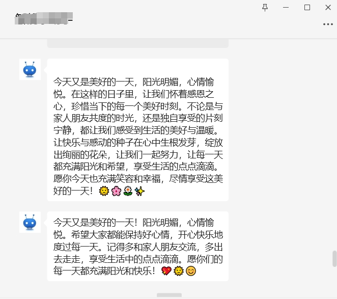
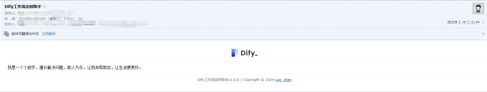
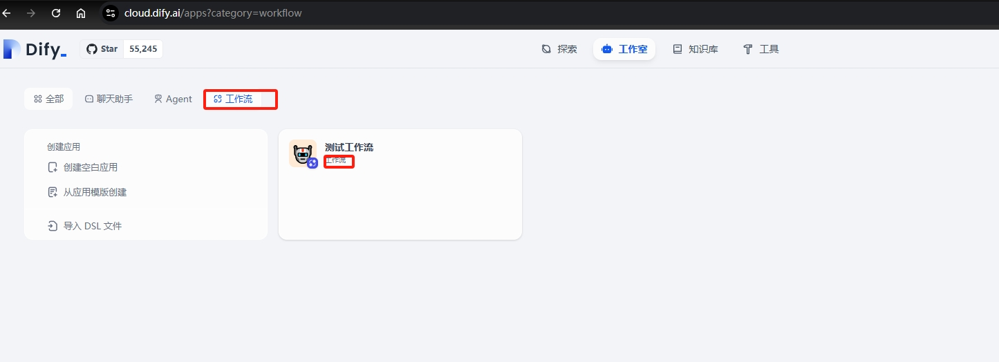
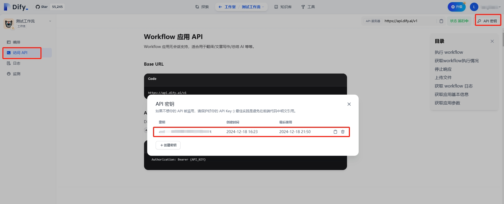

# ⏰ Dify定时任务助手

> 作者：[Leo_chen](https://github.com/leochen-g)，"[Dify Schedule](https://github.com/leochen-g/dify-schedule)" "[智能微秘书](https://github.com/leochen-g/wechat-assistant-pro)" 开源项目作者

## 概述

还在手动执行Dify工作流吗？还在为Dify没有定时任务苦恼吗？ 让我为您的工作流添加一些自动化魔法吧！。通过GitHub Actions，您现在可以设置工作流自动执行，并及时收到执行通知。

## 🌟 功能特点

- 🔄 支持多个Dify工作流同时自动执行
- ⏰ 可自定义执行时间（默认：北京时间 06:30）
- 📱 支持多种消息通知渠道： 微信，钉钉，企微，邮件 ，Server酱，飞书，Pushplus
- 🆓 完全免费使用
- 🔒 基于GitHub Actions的安全可靠执行
- 🐲 青龙面板支持

## 🚀 开始使用

您可以通过以下两种方式使用：
- 🌐 快速使用（在线方式）
- 🐲 青龙面板定时任务

### 🌐 快速开始

让我们通过几个简单的步骤来配置您的自动化工作流！

1. 🍴 首先，[Fork 本仓库](https://github.com/leochen-g/dify-schedule)

2. ⚙️ 配置密钥：
   访问：仓库 Settings -> Secrets -> New repository secret

   | 密钥名称 | 填写内容 | 是否必填 |
   |---------|----------|---------|
   | DIFY_BASE_URL | Dify接口地址（默认：https://api.dify.ai/v1） | 否 |
   | DIFY_TOKENS | Dify工作流API密钥（多个用;分隔） | 是 |
   | DIFY_INPUTS | 工作流所需变量（JSON格式） | 否 |
   
   ### 📱 通知配置（可选但推荐配置）
   
   | 密钥名称 | 填写内容 | 用途 |
   |---------|----------|-----|
   | EMAIL_USER | 发件人邮箱（需开启SMTP） | 邮件通知 |
   | EMAIL_PASS | 邮箱SMTP密码 | 邮件通知 |
   | EMAIL_TO | 收件人邮箱（多个用`, `分隔） | 邮件通知 |
   | PUSHPLUS_TOKEN | [Pushplus](http://www.pushplus.plus/) 的token | 微信通知 |
   | SERVERPUSHKEY | [Server酱](https://sct.ftqq.com/) 的密钥 | 微信通知 |
   | DINGDING_WEBHOOK | 钉钉机器人webhook地址 | 钉钉通知 |
   | WEIXIN_WEBHOOK | 企业微信机器人webhook地址 | 企业微信通知 |
   | FEISHU_WEBHOOK | 飞书机器人webhook地址 | 飞书通知 |
   | AIBOTK_KEY | [智能微秘书](https://wechat.aibotk.com?r=dBL0Bn&f=difySchedule) apikey | 微信通知 |
   | AIBOTK_ROOM_RECIVER | 智能微秘书群聊名称 | 微信群通知 |
   | AIBOTK_CONTACT_RECIVER | 智能微秘书联系人昵称 | 微信私聊通知 |

3. ▶️ 启用工作流：
   前往 Actions 标签页并启用工作流

### 🐲 青龙面板部署

想在自己的服务器上运行？请按照以下步骤操作：

1. 📦 添加订阅：
```shell
ql repo https://github.com/leochen-g/dify-schedule.git "ql_" "utils" "sdk"
```

2. ➕ 安装依赖：
   - 进入【依赖管理】->【NodeJS】
   - 添加 `axios` 依赖包

3. 🔑 配置环境变量：
   - 添加 `DIFY_TOKENS`（必填）
   - 添加 `DIFY_BASE_URL`（选填）
   - 多个token请用`;`分隔

4. 📨 通知将使用青龙面板自带的通知配置

## 📸 效果预览

| 微信通知效果 | 邮件通知效果 |
|:------------:|:------------:|
|  |  |

## ❓ 常见问题

### 🔑 如何获取Dify工作流token？

1. 打开Dify控制台
2. 进入您的工作流应用
3. 找到API参考
4. 复制API密钥

> 💡 注意：仅支持工作流类型的应用！




### 🚫 连接问题？

如果您使用的是私有部署的Dify实例，请确保它可以从公网访问 - GitHub Actions需要能够连接到您的服务器！

### ❌ 执行错误？

1. 🔍 检查您的应用是否为工作流应用
2. ⚙️ 如果工作流需要输入变量，请确保正确配置了`DIFY_INPUTS`（JSON格式）
3. 📝 仔细阅读错误日志，确保所有必需变量都已正确设置

需要更多帮助？欢迎提出issue（记得删除敏感信息）！

## 🤝 参与贡献

欢迎提交PR或者Issue！让我们一起让这个工具变得更好！